# DBMS Interview Preparation — Complete Revision Guide

> A single-file, interview-ready reference covering DBMS theory, SQL, normalization, transactions, indexing, NoSQL, and distributed database design — from first principles to system-design-level scaling patterns.

**How to use this guide:** Each section follows the same shape — a plain-English definition, why it exists, a worked example, a comparison table where relevant, and a *Quick Revision* + *Interview Questions* block for last-minute review. Skim the ⭐ tags to find the highest-frequency interview topics.

---

## Table of Contents

**Part A — DBMS Foundations**
1. [Data, Information & Databases](#1-data-information--databases)
2. [File System vs DBMS](#2-file-system-vs-dbms)
3. [Data Abstraction & Three-Level Architecture](#3-data-abstraction--three-level-architecture)
4. [Schema, Instance & Data Models](#4-schema-instance--data-models)
5. [Database Languages, DBA & Application Architecture](#5-database-languages-dba--application-architecture)

**Part B — Database Design (ER Modeling)**
6. [ER Model: Entities, Attributes, Relationships](#6-er-model-entities-attributes-relationships)
7. [Designing an ER Diagram, Step by Step](#7-designing-an-er-diagram-step-by-step)
8. [Extended ER (EER) Model](#8-extended-er-eer-model)
9. [ER-to-Relational Mapping](#9-er-to-relational-mapping)

**Part C — The Relational Model**
10. [Relational Model Basics](#10-relational-model-basics)
11. [Relational Keys ⭐](#11-relational-keys-)
12. [Integrity Constraints & Referential Actions](#12-integrity-constraints--referential-actions)

**Part D — SQL**
13. [SQL Fundamentals & Data Types](#13-sql-fundamentals--data-types)
14. [SQL Command Categories](#14-sql-command-categories)
15. [DDL: CREATE, ALTER, DROP, TRUNCATE, RENAME](#15-ddl-create-alter-drop-truncate-rename)
16. [SQL Constraints ⭐](#16-sql-constraints-)
17. [DML: INSERT, UPDATE, DELETE, REPLACE](#17-dml-insert-update-delete-replace)
18. [SELECT, DISTINCT, Aliases & DUAL](#18-select-distinct-aliases--dual)
19. [Pattern Matching: LIKE & Wildcards](#19-pattern-matching-like--wildcards)
20. [GROUP BY, HAVING & Aggregate Functions](#20-group-by-having--aggregate-functions)
21. [SQL Execution Order ⭐](#21-sql-execution-order-)
22. [JOINs ⭐](#22-joins-)
23. [Set Operations: UNION, INTERSECT, EXCEPT](#23-set-operations-union-intersect-except)
24. [Subqueries ⭐](#24-subqueries-)
25. [Views & Materialized Views](#25-views--materialized-views)

**Part E — Database Internals**
26. [Normalization ⭐](#26-normalization-)
27. [Transactions & ACID ⭐](#27-transactions--acid-)
28. [Recovery: Logging, Shadow Paging & Checkpoints](#28-recovery-logging-shadow-paging--checkpoints)
29. [Indexing ⭐](#29-indexing-)

**Part F — NoSQL & Distributed Systems**
30. [NoSQL Databases](#30-nosql-databases)
31. [Database Models Compared](#31-database-models-compared)
32. [Clustering & Replication](#32-clustering--replication)
33. [Partitioning & Sharding](#33-partitioning--sharding)
34. [Database Scaling Patterns](#34-database-scaling-patterns)
35. [CAP Theorem ⭐](#35-cap-theorem-)
36. [Master-Slave (Primary-Replica) Architecture](#36-master-slave-primary-replica-architecture)

**[Final Cheat Sheet](#final-cheat-sheet)**

---

## Part A — DBMS Foundations

## 1. Data, Information & Databases

| Term | Definition | Example |
|---|---|---|
| **Data** | Raw facts with no meaning on their own | `John`, `21`, `Delhi` |
| **Information** | Processed, organized data that supports decisions | A table showing John, age 21, lives in Delhi |
| **Database** | An organized collection of related data, stored electronically for easy access and updates | A college DB holding Students, Faculty, Courses, Marks |
| **DBMS** | Software that lets users create, manage, retrieve, update, and delete data in a database — the user never touches the database directly | MySQL, PostgreSQL, Oracle, SQL Server, SQLite |

> **Database vs DBMS:** Database = the data (the books). DBMS = the software that manages it (the librarian).

### Types of Data
1. **Structured** — rows and columns, stored in RDBMS (e.g., an Employee table). Easiest to search.
2. **Semi-structured** — has some organizational markers but no rigid schema (e.g., JSON, XML).
3. **Unstructured** — no predefined format (e.g., images, videos, free text). This makes up roughly 80–90% of the world's data.

### Why Do We Need a DBMS?
Manually handling millions of records — searching, updating, securing, recovering after a crash, serving concurrent users — is impractical with flat files. A DBMS takes over:

- Storage, retrieval, update, deletion
- Security & backup
- Concurrency control
- Integrity checking
- Transaction management

### How Data Is Actually Stored
A common misconception is that a database stores SQL statements — it doesn't. It stores data on disk in an organized hierarchy:

```
Database → Files → Pages/Blocks (4KB, 8KB, 16KB…) → Rows → Columns
```

- Reading one row directly from disk is slow, so the DBMS reads an entire **page** into memory at once.
- Frequently accessed pages are cached in a **Buffer Pool (RAM)** — this is why repeated queries get faster.
- For fast lookups on huge tables, the DBMS builds an **Index** (commonly a B+ Tree) instead of scanning row by row.

> **Interview trap:** "Does a DBMS store data in RAM?" — No. Permanent storage is on disk/SSD; RAM (the buffer pool) is only a cache.

---

## 2. File System vs DBMS

Before DBMSs, applications stored data in separate flat files (e.g., `students.txt`, `fees.txt`), each managed independently with no central coordination. This created predictable problems:

| # | Problem | Description | How DBMS Fixes It |
|---|---|---|---|
| 1 | **Redundancy** | Same data (e.g., a student's city) duplicated across multiple files | Normalization stores each fact once |
| 2 | **Inconsistency** | One copy updated, another forgotten → conflicting values | Single source of truth + constraints |
| 3 | **Difficult Access** | Complex queries require custom code to read and filter files manually | Declarative SQL (`SELECT ... WHERE ...`) |
| 4 | **Data Isolation** | Files in different formats (CSV, TXT, Excel) are hard to combine | Common schema, easy JOINs |
| 5 | **Integrity Problems** | Nothing stops invalid values like `Age = -5` | `CHECK`, `NOT NULL`, `PRIMARY KEY`, `FOREIGN KEY` constraints |
| 6 | **Atomicity Problems** | A multi-step operation (e.g., money transfer) can fail halfway, corrupting data | Transactions with `COMMIT` / `ROLLBACK` |
| 7 | **Concurrent Access Anomalies** | Two users editing the same record simultaneously overwrite each other | Locks, isolation levels, MVCC |
| 8 | **Security Problems** | Anyone with file access can read everything — no fine-grained control | Authentication, roles, `GRANT`/`REVOKE`, encryption, auditing |

### Quick Comparison

| Feature | File System | DBMS |
|---|---|---|
| Redundancy | High | Low (via normalization) |
| Querying | Manual programming | SQL |
| Concurrency | Poor | Built-in concurrency control |
| Atomicity | Not guaranteed | ACID transactions |
| Backup & Recovery | Manual | Built-in |

<details>
<summary><b>Interview Questions</b></summary>

- What problems does a DBMS solve that a plain file system can't?
- Give a real example of data inconsistency in a file-based system.
- Why does atomicity matter for a bank transfer?
- How does a DBMS enforce data integrity that a file system cannot?
</details>

---

## 3. Data Abstraction & Three-Level Architecture

**Data abstraction** is hiding unnecessary implementation detail and showing each type of user only what they need. Just as a driver doesn't need to understand fuel combustion to drive a car, an application developer doesn't need to know how rows are packed into disk blocks to write a query.

Without abstraction, every programmer would need to understand disk management, indexing, and buffer pools before writing a single query — abstraction is what makes databases usable.

DBMS architecture is discussed in **two unrelated senses** — don't conflate them:

1. **Three-Level (ANSI/SPARC) Architecture** — how data is *viewed* (this section).
2. **Application Architecture** — how apps *connect* to the database (1-tier/2-tier/3-tier, [Section 5](#5-database-languages-dba--application-architecture)).

### The Three Levels

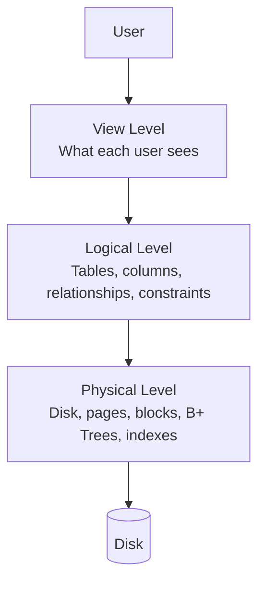

| Level | Answers | Deals With | Who Works Here |
|---|---|---|---|
| **Physical** | *How* is data stored? | Disk/SSD, pages, blocks, indexes, compression | Storage engine / DB engineers |
| **Logical** | *What* data is stored and how is it related? | Tables, columns, relationships, PK/FK, constraints | Database designers, backend devs |
| **View** | What does *this user* see? | A restricted, per-role subset of the logical schema | End users, application developers |

**Example — Employee table:** HR sees `ID, Name, Salary`; Reception sees `ID, Name, Phone`; a customer-facing app sees only `Name`. Same underlying data, different views, for security and simplicity.

> **Key idea (data independence):** If physical storage changes, applications shouldn't need to change — that's exactly what this layering buys you.

<details>
<summary><b>Interview Questions</b></summary>

- What are the three levels of DBMS architecture, and what problem does each solve?
- If the physical storage format changes, should application code change? Why not?
- Why can't every user access the physical storage layer directly?
</details>

---

## 4. Schema, Instance & Data Models

### Schema vs Instance

Think of building a house: the **blueprint** is decided once and rarely changes; the **house itself** (its current furniture, occupants) changes daily. In database terms:

| | Schema | Instance |
|---|---|---|
| Meaning | The overall design/structure — tables, columns, data types, constraints | The actual data stored at a given moment |
| Changes | Rarely | Constantly |
| Example | `Student(ID INT, Name VARCHAR, Age INT)` | The rows currently in that table |

### Data Models
A data model defines *how* data is represented, organized, and related — the "style" of organizing data.

| Model | Idea | Used By |
|---|---|---|
| **Relational** | Data as tables (rows & columns) | MySQL, PostgreSQL, Oracle, SQL Server |
| **Hierarchical** | Tree structure, one parent per child | IBM IMS, file systems |
| **Network** | Graph structure, many parents per child | IDMS, IDS |
| **Object-Oriented** | Stores objects (with methods/identity), not just rows | ObjectDB, GemStone |
| **Entity-Relationship (ER)** | Used at design time, before implementation | Design tool, not a runtime engine |

Data models are also categorized by level of detail:

| Conceptual | Logical | Physical |
|---|---|---|
| Business view — just entities & relationships | Adds attributes, PK/FK, relationships; still DBMS-independent | Actual implementation — data types, indexes, storage |
| No data types | Detailed | Most detailed (actual SQL tables) |

---

## 5. Database Languages, DBA & Application Architecture

### Database Languages

| Category | Full Form | Commands | Purpose |
|---|---|---|---|
| **DDL** | Data Definition Language | `CREATE`, `ALTER`, `DROP`, `TRUNCATE`, `RENAME` | Define/modify structure |
| **DML** | Data Manipulation Language | `INSERT`, `UPDATE`, `DELETE` | Work with data |
| **DQL** | Data Query Language | `SELECT` | Retrieve data |
| **DCL** | Data Control Language | `GRANT`, `REVOKE` | Manage permissions |
| **TCL** | Transaction Control Language | `COMMIT`, `ROLLBACK`, `SAVEPOINT`, `START TRANSACTION` | Manage transactions |

**Real flow in a web app:** DDL sets up tables at project setup → DML handles day-to-day writes → DQL powers reads → DCL secures access → TCL keeps multi-step operations (like payments) safe.

### Database Administrator (DBA)
The DBA is the "manager" of the database — usually **not** responsible for writing application business logic. Core responsibilities:

1. **Schema definition** — designing tables, relationships, keys, constraints.
2. **Storage & access methods** — deciding indexes, file organization, partitioning for performance.
3. **Schema/physical modifications** — evolving structure as requirements change, with minimal disruption.
4. **Authorization control** — who can see/do what (users, roles, permissions).
5. **Runtime maintenance** — backups, restores, patching, upgrades, performance tuning.

### Application (Tier) Architecture

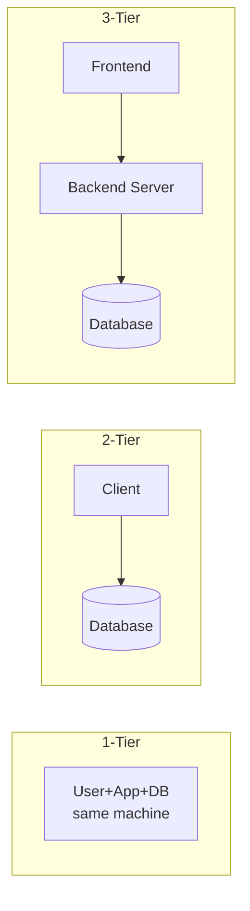

| | 1-Tier | 2-Tier | 3-Tier |
|---|---|---|---|
| Description | Everything on one machine | Client talks directly to DB | Frontend → backend → DB |
| Example | SQLite desktop app | Java desktop app + MySQL | Any modern web/mobile app |
| Complexity | Very low | Low | High |
| Security | Poor | Moderate (DB credentials often on client) | Excellent (DB hidden behind backend) |
| Scalability | Poor | Moderate | Excellent |
| Typical use | Personal apps | Small business apps | Modern web/mobile apps |

<details>
<summary><b>Interview Questions</b></summary>

- Difference between DDL, DML, DQL, DCL, and TCL — give one command from each.
- Is a DBA responsible for writing application code? Why or why not?
- Why is 3-tier architecture preferred over 2-tier for modern web apps?
</details>

---

## Part B — Database Design (ER Modeling)

## 6. ER Model: Entities, Attributes, Relationships

The **ER (Entity-Relationship) Model** is a high-level design tool used *before* writing any SQL. Given a requirement like "Build a Hospital Management System," you first identify what entities exist (Doctor, Patient, Appointment) and how they relate — that's ER modeling. The **ER Diagram** is just the graphical representation of that model.

### Entities

| Term | Meaning | Example |
|---|---|---|
| **Entity** | A real-world object that can be identified independently | Student, Employee, Car |
| **Entity Set** | A collection of similar entities | The Student table as a whole |
| **Strong Entity** | Exists independently, has its own primary key | Student, Department |
| **Weak Entity** | Cannot exist without a related strong entity, has no independent PK | Dependent (of an Employee) |

### Attributes

| Type | Meaning | Example | ER Notation |
|---|---|---|---|
| Simple | Cannot be divided further | `Age`, `Gender` | Oval |
| Composite | Can be broken into parts | `Name` → First/Middle/Last | Oval with sub-ovals |
| Single-valued | Exactly one value | `DOB` | Oval |
| Multi-valued | Can hold multiple values | `PhoneNumbers` | Double oval |
| Derived | Computed from another attribute — not stored | `Age` (from `DOB`) | Dashed oval |
| Null-capable | May legitimately be unknown/unavailable | `MiddleName`, `PassportNumber` | — |

> **NULL vs 0:** `NULL` means unknown/unavailable. `0` is an actual value. Never treat them as equivalent.
>
> **Why store DOB instead of Age?** DOB never changes; age can always be *derived* from it. Storing a derived value risks staleness and redundancy.

### Relationships

A relationship expresses an association between entities (e.g., `Student —Enrolls→ Course`).

**By identification:**
- **Identifying relationship** — connects a weak entity to its owning strong entity (notation: double diamond).
- **Non-identifying relationship** — connects two independent strong entities (notation: single diamond).

**By degree** (how many entity types participate):
- **Unary** — one entity type (`Employee manages Employee`)
- **Binary** — two entity types (most common: `Student enrolls in Course`)
- **Ternary** — three entity types (`Doctor prescribes Medicine to Patient`)

**By mapping cardinality** (*maximum* participation):

| Cardinality | Meaning | Example |
|---|---|---|
| 1:1 | One-to-one | Employee ↔ Locker |
| 1:N | One-to-many | Department → Employees |
| N:1 | Many-to-one | Employees → Department (reverse view) |
| M:N | Many-to-many | Students ↔ Courses (needs a junction table) |

**By participation** (*minimum* participation):

| Type | Meaning | ER Notation |
|---|---|---|
| Total (mandatory) | Every entity instance must participate | Double line |
| Partial (optional) | Some instances may not participate | Single line |

> **Weak entities always have total participation** in their identifying relationship (a Dependent can't exist without an Employee) — but the owning strong entity typically has only *partial* participation (an Employee may have zero dependents).

### ER Notation Cheat Sheet

| Symbol | Meaning |
|---|---|
| Rectangle | Strong entity |
| Double rectangle | Weak entity |
| Oval | Attribute |
| Double oval | Multi-valued attribute |
| Dashed oval | Derived attribute |
| Diamond | Relationship |
| Double diamond | Identifying relationship |
| Underlined attribute | Primary key |
| Dashed underline | Partial key (weak entity discriminator) |
| Single line | Partial participation |
| Double line | Total participation |

<details>
<summary><b>Interview Questions</b></summary>

- What's the difference between a strong and weak entity?
- Are "strong" and "weak" valid *relationship* types? *(Common textbook error — see callout below.)*
- Which relationship degree is most common in practice? *(Binary)*
- Give an example each of a composite, multi-valued, and derived attribute.
- What's the difference between mapping cardinality and participation constraint?
</details>

> ⚠️ **Common misconception worth correcting in an interview:** "Strong" and "weak" describe **entities**, not relationships. Relationships are properly classified by identification (identifying/non-identifying), cardinality (1:1, 1:M, M:N), degree (unary/binary/ternary), and participation (total/partial). Pointing this out signals real conceptual clarity.

---

## 7. Designing an ER Diagram, Step by Step

Interviewers rarely ask ER theory in isolation — they hand you a prompt like *"Design an ER diagram for a Library Management System"* and expect you to reason through it live. Use this checklist:

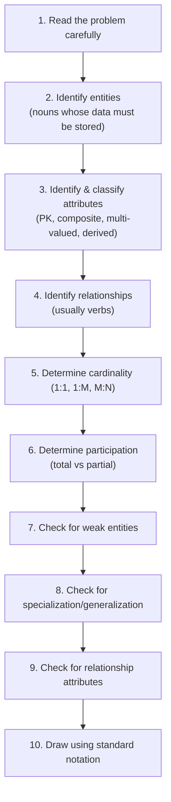

**Rule of thumb for step 2:** Not every noun is an entity. Ask: *"Does the system need to store information about this object?"* In "A student writes an exam using a pen," `Pen` is not an entity — the system has no reason to store data about pens. Actions like *Borrow*, *Enroll*, *Purchase* are usually relationships, not entities.

### Worked Example

**Problem:** *"A student enrolls in courses. Every course is taught by one teacher. Students have an ID, Name, and Phone Numbers (which can be multiple). Age is calculated from DOB."*

| Step | Result |
|---|---|
| Entities | `Student`, `Course`, `Teacher` |
| Attributes | Student: `StudentID (PK)`, `Name`, `DOB`, `Age (derived)`, `Phone (multi-valued)`. Course: `CourseID (PK)`, `CourseName`. Teacher: `TeacherID (PK)`, `TeacherName` |
| Relationships | `Student —Enrolls→ Course`, `Teacher —Teaches→ Course` |
| Cardinality | Student↔Course = M:N; Teacher↔Course = 1:N |
| Participation | Every course must have a teacher (total); students may not enroll immediately (partial) |

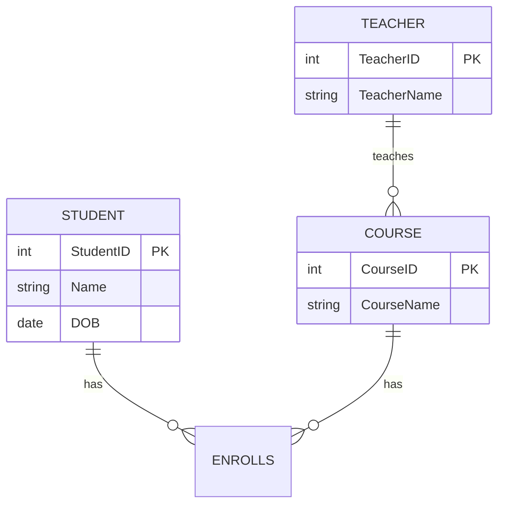

### Common Mistakes

- ❌ Turning every noun into an entity (only model what the system needs to *store*).
- ❌ Treating actions (`Borrow`, `Purchase`, `Enroll`) as entities — they're usually relationships.
- ❌ Forgetting to identify a primary key for every strong entity.
- ❌ Ignoring cardinality — always ask "is this 1:M or M:N?"
- ❌ Ignoring participation — "can this entity exist without the relationship?"

---

## 8. Extended ER (EER) Model

Plain ER can model entities, attributes, and relationships — but real-world objects often have categories, shared properties, and parent-child hierarchies that plain ER can't express elegantly. EER adds **Specialization, Generalization, Attribute/Participation Inheritance, and Aggregation**:

> EER = ER Model + Object-Oriented concepts (inheritance, hierarchies)

### Specialization (Top-Down)
Dividing one general entity into specialized sub-entities based on distinguishing characteristics.

**Why not just use one table with every possible column?** Suppose `Employee` has `Professor`, `Accountant`, and `Security Guard` subtypes, each with different extra attributes (`Subject`, `TaxDept`, `Shift`). Cramming everything into one table produces rows full of `NULL`s. Specialization avoids that:
- Reduces NULLs
- Better organization, easier maintenance
- Closer to real-world structure

| Sub-type | Meaning |
|---|---|
| **Disjoint** | An entity belongs to *only one* subclass (Employee is Professor OR Security, never both) |
| **Overlapping** | An entity can belong to *multiple* subclasses (a Teacher can be both Professor and Researcher) |
| **Total** | Every parent instance must belong to *some* subclass |
| **Partial** | Some parent instances may remain in the base class without specializing |

### Generalization (Bottom-Up)
The reverse process — combining multiple similar entities that share attributes into one general superclass. Example: `Car` + `Bike` → `Vehicle`. Reduces redundancy, improves organization.

### Attribute & Participation Inheritance
- **Attribute inheritance** — a subclass automatically inherits all attributes of its superclass (e.g., `Car` inherits `VehicleID`, `Manufacturer`, `Color` from `Vehicle`) without redeclaring them.
- **Participation inheritance** — if the superclass participates in a relationship, subclasses inherit that participation too (if `Employee —WorksIn→ Department`, then `Professor` — a subclass of Employee — also participates). Subclasses can also have *additional* relationships of their own (`Professor —Teaches→ Course`).

### Aggregation
Ordinary ER can model Entity↔Relationship, but not Relationship↔Relationship. **Aggregation treats a relationship as a higher-level entity** so it can participate in another relationship.

**Example:** `Employee —WorksOn→ Project` is a relationship. Now a `Manager` needs to *supervise that relationship itself* (not the Employee alone, not the Project alone — the fact that this employee is working on this project). Without aggregation this is impossible to model directly; aggregation lets you box the relationship and connect it to `Manager` via `SupervisedBy`.

Other real-world examples: `Student Enrolls Course` aggregated so an `Instructor` can evaluate the enrollment; `Doctor Treats Patient` aggregated so `Insurance` can approve the treatment.

### Specialization vs Generalization vs Aggregation

| | Specialization | Generalization | Aggregation |
|---|---|---|---|
| Direction | Top-down | Bottom-up | — |
| Goal | Divide one entity into subtypes | Combine entities into a superclass | Model a relationship-to-relationship interaction |
| Uses inheritance | Yes | Yes | No |
| Example | Employee → Professor | Car + Bike → Vehicle | Manager supervises (Employee WorksOn Project) |

<details>
<summary><b>Interview Questions</b></summary>

- Why does specialization reduce NULL values?
- Difference between disjoint and overlapping specialization?
- Can a subclass have relationships the superclass doesn't have?
- Why can't ordinary ER diagrams model relationship-to-relationship interactions? Give a real-world aggregation example.
</details>

---

## 9. ER-to-Relational Mapping

A DBMS stores tables, not diagrams — so every ER diagram must be transformed into relational tables via a fixed set of rules.

| ER Component | Relational Mapping |
|---|---|
| Strong entity | Becomes a table; PK stays PK |
| Weak entity | Becomes a table with a **composite PK** = (owning strong entity's PK + partial key) |
| Simple attribute | Becomes a column |
| Composite attribute | Broken into multiple atomic columns (e.g., `Address` → `HouseNo, Street, City, State, Pincode`) |
| Multi-valued attribute | Becomes a **separate table**; PK = (entity PK + the attribute) — required because SQL columns must hold atomic values (1NF) |
| Derived attribute | **Not stored** — recomputed when needed |
| 1:1 relationship | FK placed in either table (commonly the side with total participation), marked `UNIQUE` |
| 1:N relationship | FK placed on the **"many"** side |
| M:N relationship | Becomes a **new junction table** holding both PKs (often plus relationship attributes) |
| Generalization | **Method 1** (preferred): parent table + child tables sharing the parent's PK as both PK and FK. **Method 2**: attributes folded entirely into child tables — only valid when specialization is both disjoint *and* total |
| Aggregation | Becomes a separate relation holding the PKs of all participating entities plus any relationship attributes |

**Example — Weak entity:** `Employee(EmpID PK)` and `Dependent(EmpID, DependentName, Age)` with `PRIMARY KEY (EmpID, DependentName)` — a composite key is required because `DependentName` alone isn't unique across employees.

<details>
<summary><b>Interview Questions</b></summary>

- How do you convert an M:N relationship into relational tables?
- Where does the foreign key go in a 1:N relationship?
- Why can't a multivalued attribute stay in one column?
- Which generalization mapping method is most commonly used, and why?
</details>

---

## Part C — The Relational Model

## 10. Relational Model Basics

Proposed by **Edgar F. Codd in 1970**, the relational model stores data as **relations (tables)** made of **tuples (rows)** and **attributes (columns)** — replacing the more rigid hierarchical and network models.

| Term | Meaning |
|---|---|
| Relation | A table |
| Tuple | One row |
| Attribute | One column |
| **Degree** | Number of **columns** (grows horizontally) |
| **Cardinality** | Number of **rows** (grows vertically) |
| Relational Schema | The structure definition — e.g., `Student(StudentID, Name, Age)` — no actual data |
| Relation Instance | The current data snapshot |

> **Memory trick:** Degree = columns, Cardinality = rows. Tables are "related" because separate relations (Student, Course, Enrollment) are connected via keys.

---

## 11. Relational Keys ⭐

The single highest-frequency DBMS topic in interviews — everything in a relational database revolves around keys.

| Key | Definition | Example | Notes |
|---|---|---|---|
| **Super Key** | Any set of one or more attributes that uniquely identifies a row (may include unnecessary extra attributes) | `ID`, `ID+Name`, `ID+Email+Phone` | Uniqueness is preserved even with redundant attributes |
| **Candidate Key** | A *minimal* super key — remove any attribute and uniqueness breaks | `ID`, `Email`, `Phone` (each alone) | All are eligible to become the Primary Key |
| **Primary Key** ⭐ | One candidate key chosen to uniquely identify every row | `StudentID` | Must be unique, **never NULL**, one per table (can span multiple columns) |
| **Alternate Key** | Candidate keys *not* chosen as primary | `Email`, `Phone` (if `ID` was chosen) | Still unique identifiers |
| **Foreign Key** ⭐ | An attribute in one table referencing the primary key of another | `Enrollment.StudentID → Student.StudentID` | *Can* contain duplicates; *can* be NULL unless restricted |
| **Composite / Compound Key** | A key made of multiple attributes because no single one suffices | `Enrollment(StudentID, CourseID)` | Neither column alone is unique |
| **Surrogate Key** | An artificial key with no business meaning, usually auto-incremented | `CustomerID: 1, 2, 3…` | Immune to business-data changes (e.g., a changed email) |

> **Interview trap:** Can a Foreign Key be NULL or contain duplicates? **Yes** to both (unless explicitly constrained) — e.g., many employees can share the same `DepartmentID`.
>
> **Why prefer surrogate keys over natural keys (like email)?** If the natural value changes (a customer updates their email), every referencing table would need updating. A surrogate ID never changes.

### Key Summary Table

| Key | Unique | NULL Allowed | Purpose |
|---|---|---|---|
| Super Key | Yes | Depends | Uniquely identify rows (may have extra attributes) |
| Candidate Key | Yes | No | Minimal unique key |
| Primary Key | Yes | **Never** | Main row identifier |
| Alternate Key | Yes | No | Unchosen candidate key |
| Foreign Key | Usually not required | Yes (unless restricted) | Relates tables |
| Composite Key | Yes (combined) | Depends | Multiple attributes together form uniqueness |
| Surrogate Key | Yes | No | Artificial identifier |

<details>
<summary><b>Interview Questions</b></summary>

- Difference between a Super Key and a Candidate Key?
- Difference between a Candidate Key and a Primary Key?
- Can a table have multiple Candidate Keys but only one Primary Key?
- Why do modern schemas prefer surrogate keys over natural keys?
- Can a Foreign Key be NULL? Can it contain duplicates?
</details>

---

## 12. Integrity Constraints & Referential Actions

**Integrity constraints** are rules that keep a database accurate, valid, and consistent across CRUD operations — without them, nothing stops someone from inserting `Age = -5` or `Balance = -100000`.

| Constraint Type | What It Enforces | Example |
|---|---|---|
| **Domain Constraint** | Each attribute's value must fall in its valid domain | `Age` between 0–120; `Gender` only Male/Female/Other |
| **Entity Integrity** | Primary key must be unique and never NULL | No two rows share the same `StudentID` |
| **Referential Integrity** ⭐ | A foreign key value must either match an existing PK in the referenced table, or be NULL (if allowed) | `Enrollment.StudentID` must exist in `Student` |

### Referencing vs Referenced Table

```
Student (has the Primary Key)     → Referenced Table
Enrollment (has the Foreign Key)  → Referencing Table
```

> **Easy trick:** *Referenced* table owns the primary key; *referencing* table stores the foreign key.

### What Happens on Delete/Update?

| Action | Behavior | Used When |
|---|---|---|
| **ON DELETE CASCADE** | Deleting the parent row automatically deletes all matching child rows | Child data is meaningless without the parent (Order → Order Items) |
| **ON DELETE SET NULL** | Deleting the parent leaves child rows, but their FK becomes NULL | Child data can exist independently (Employee leaves → their Tasks remain, `EmployeeID = NULL`) |
| **RESTRICT / NO ACTION** (common default) | Parent deletion is blocked while child rows still reference it | Prevent deleting a Customer with active Orders |
| **ON UPDATE CASCADE** | Updating the parent's PK automatically updates matching FK values in child rows | Keeping references consistent when a key changes |

```sql
CREATE TABLE Orders (
  order_id INT PRIMARY KEY,
  cust_id INT,
  FOREIGN KEY (cust_id) REFERENCES Customer(id) ON DELETE CASCADE
);
```

### Key SQL Constraints at a Glance

| Constraint | Purpose | Example |
|---|---|---|
| `NOT NULL` | Prevent missing values | `Name VARCHAR(100) NOT NULL` |
| `UNIQUE` | Prevent duplicates | `Email VARCHAR(100) UNIQUE` |
| `DEFAULT` | Auto-fill a value when none supplied | `Status VARCHAR(20) DEFAULT 'Pending'` |
| `CHECK` | Validate a condition | `CHECK (Age >= 18)` |
| `PRIMARY KEY` | Unique row identifier (`UNIQUE` + `NOT NULL`) | `StudentID INT PRIMARY KEY` |
| `FOREIGN KEY` | Maintain relationships | `FOREIGN KEY(StudentID) REFERENCES Student(StudentID)` |

<details>
<summary><b>Interview Questions</b></summary>

- What happens if you try to insert a foreign key value that doesn't exist in the parent table?
- Explain `ON DELETE CASCADE` vs `ON DELETE SET NULL` with an example.
- Difference between entity integrity and referential integrity?
- Why are CHECK constraints preferable to validating everything in application code?
</details>

---

## Part D — SQL

## 13. SQL Fundamentals & Data Types

**SQL** (Structured Query Language) is the standard **declarative** language for relational databases — you state *what* you want, not *how* to get it. **MySQL** is one specific RDBMS product that implements SQL (plus its own extensions); SQL is the language, MySQL is one engine that speaks it.

**RDBMS** (Relational DBMS) is a DBMS that stores data specifically in related tables and enforces the relational model (keys, constraints, normalization). Not every DBMS is an RDBMS.

### SQL Data Types

| Category | Type | Notes |
|---|---|---|
| Numeric | `INT`, `BIGINT` | Whole numbers; `BIGINT` for very large values (IDs, phone numbers) |
| | `DECIMAL(p,s)` | Exact decimal — **use for money** (`Salary DECIMAL(10,2)`) |
| | `FLOAT` / `DOUBLE` | Approximate decimal — has precision issues, avoid for currency |
| Character | `CHAR(n)` | Fixed length, space-padded — slightly faster, but wastes space if lengths vary |
| | `VARCHAR(n)` | Variable length — stores only what's needed, preferred for most text |
| | `TEXT` | For very large strings (articles, comments, descriptions) |
| Binary | `BLOB` | Binary Large Object — images, audio, PDFs |
| Structured | `JSON` ⭐ | Flexible nested data — configs, product specs, API responses |
| Date/Time | `DATE` | `YYYY-MM-DD` |
| | `TIME` | `HH:MM:SS` |
| | `DATETIME` | `YYYY-MM-DD HH:MM:SS` — doesn't auto-update, good for DOB/appointments |
| | `TIMESTAMP` | Similar, but often used for auto-updating fields like `created_at`/`updated_at`, with a smaller supported range |
| Enumerated | `ENUM('a','b')` | Exactly **one** value from a predefined list |
| | `SET('a','b')` | **Multiple** values from a predefined list |
| Boolean | `BOOLEAN` | Internally often stored as 1/0 |
| Bit | `BIT(n)` | Raw bit storage, rarely used in application code |

> **Why VARCHAR over CHAR?** A `CHAR(100)` column always consumes 100 characters per row, even to store "John." Multiply that waste across a million rows. `VARCHAR` stores only what's needed. Use `CHAR` only for genuinely fixed-length data (e.g., a 2-letter country code).
>
> **Why JSON?** Lets you store flexible/nested data (e.g., a product's variable spec sheet) without a rigid predefined column-per-field structure.

<details>
<summary><b>Interview Questions</b></summary>

- Why is VARCHAR generally preferred over CHAR?
- Difference between DATETIME and TIMESTAMP?
- Difference between TEXT and BLOB?
- Difference between ENUM and SET?
- Is every DBMS an RDBMS? Why not?
</details>

---

## 14. SQL Command Categories

| Category | Purpose | Commands |
|---|---|---|
| **DDL** | Structure | `CREATE`, `ALTER`, `DROP`, `TRUNCATE`, `RENAME` |
| **DML** | Modify data | `INSERT`, `UPDATE`, `DELETE` |
| **DQL** | Retrieve data | `SELECT` |
| **DCL** | Permissions | `GRANT`, `REVOKE` |
| **TCL** | Transactions | `START TRANSACTION`, `COMMIT`, `ROLLBACK`, `SAVEPOINT` |

```sql
-- TCL example
START TRANSACTION;
UPDATE Accounts SET Balance = Balance - 100 WHERE ID = 1;
UPDATE Accounts SET Balance = Balance + 100 WHERE ID = 2;
COMMIT;               -- or ROLLBACK; if something went wrong
```

---

## 15. DDL: CREATE, ALTER, DROP, TRUNCATE, RENAME

```sql
CREATE DATABASE IF NOT EXISTS school;
USE school;                             -- selects the active database

CREATE TABLE Student (
  id   INT PRIMARY KEY,
  name VARCHAR(50)
);

SHOW DATABASES;                         -- list all databases
SHOW TABLES;                            -- list tables in the current DB

DROP TABLE Student;                     -- deletes table AND its data
DROP DATABASE IF EXISTS school;         -- deletes everything

TRUNCATE TABLE Student;                 -- empties all rows, keeps structure
ALTER TABLE Student RENAME TO Students; -- renames the table only
```

### TRUNCATE vs DELETE vs DROP

| | TRUNCATE | DELETE | DROP |
|---|---|---|---|
| Removes | All rows | Rows matching WHERE (or all) | Table + data + structure |
| Structure survives? | Yes | Yes | No |
| Supports WHERE? | No | Yes | No |
| Speed | Fast (deallocates data pages) | Slower (removes row by row, may fire triggers) | — |

> **Why is TRUNCATE faster than DELETE?** DELETE removes rows individually (and can fire per-row triggers); TRUNCATE deallocates the underlying data pages directly. Implementation details vary by DBMS.

### Typical DDL Execution Order in a Project
```
CREATE DATABASE → USE → CREATE TABLE → INSERT (DML) → SELECT (DQL)
→ ALTER TABLE (as requirements change) → TRUNCATE (clear data) → DROP TABLE/DATABASE
```

<details>
<summary><b>Interview Questions</b></summary>

- Difference between DROP and TRUNCATE? Between DROP DATABASE and DROP TABLE?
- What does `IF NOT EXISTS` protect against?
- Why is TRUNCATE generally faster than DELETE?
</details>

---

## 16. SQL Constraints ⭐

One of the highest-weight SQL topics — every constraint below protects against a specific class of bad data.

### PRIMARY KEY

```sql
CREATE TABLE Student (
  StudentID INT PRIMARY KEY,
  Name VARCHAR(50),
  Age INT
);

-- Composite primary key
CREATE TABLE Enrollment (
  StudentID INT,
  CourseID  INT,
  PRIMARY KEY (StudentID, CourseID)
);
```
Rules: must be unique · cannot be NULL · only one PK per table (though it may span multiple columns) · rarely updated once set, since other tables may reference it.

### FOREIGN KEY

```sql
CREATE TABLE Enrollment (
  StudentID INT,
  Course    VARCHAR(50),
  FOREIGN KEY (StudentID) REFERENCES Student(StudentID)
);
```
May contain duplicates and NULLs (unless restricted) — it must simply match an existing value in the referenced table, or be NULL.

### UNIQUE, NOT NULL, DEFAULT, CHECK

```sql
CREATE TABLE Users (
  ID    INT PRIMARY KEY,
  Email VARCHAR(100) UNIQUE,               -- no duplicates (NULL handling is DBMS-specific)
  Name  VARCHAR(50) NOT NULL,               -- always required
  Status VARCHAR(20) DEFAULT 'Pending',     -- auto-filled if omitted
  Age   INT CHECK (Age >= 18)               -- validates a condition
);
```

| | PRIMARY KEY | UNIQUE |
|---|---|---|
| Per table | Only one | Multiple allowed |
| NULL | Never | Database-dependent (many allow multiple NULLs) |
| Role | Main identifier | Alternate unique value |

### AUTO_INCREMENT

```sql
CREATE TABLE Customer (
  CustomerID INT AUTO_INCREMENT,
  Name VARCHAR(50),
  PRIMARY KEY (CustomerID)
);
-- Restart the counter:
ALTER TABLE Customer AUTO_INCREMENT = 1000;
```

### Putting It Together

```sql
CREATE TABLE Employee (
  EmpID INT AUTO_INCREMENT,
  Email VARCHAR(100) UNIQUE,
  Name  VARCHAR(50) NOT NULL,
  Salary DECIMAL(10,2) DEFAULT 0 CHECK (Salary >= 0),
  DepartmentID INT,
  PRIMARY KEY (EmpID),
  FOREIGN KEY (DepartmentID) REFERENCES Department(DepartmentID)
);
```

### Constraint Summary

| Constraint | Allows NULL? | Allows Duplicate? |
|---|---|---|
| PRIMARY KEY | ❌ No | ❌ No |
| FOREIGN KEY | ✅ Yes (unless NOT NULL) | ✅ Yes |
| UNIQUE | DB-dependent | ❌ No |
| NOT NULL | ❌ No | ✅ Yes |
| CHECK | Depends on other constraints | Depends on condition |

<details>
<summary><b>Interview Questions</b></summary>

- Difference between PRIMARY KEY and UNIQUE? Between PRIMARY KEY and FOREIGN KEY?
- Difference between NOT NULL and CHECK?
- Can a CHECK constraint reference another table? *(No — it validates only the current row; cross-table rules need foreign keys, triggers, or app logic.)*
- Why is AUTO_INCREMENT preferred over manually assigning IDs?
</details>

---

## 17. DML: INSERT, UPDATE, DELETE, REPLACE

```sql
-- INSERT
INSERT INTO Student (id, name, age) VALUES (1, 'John', 20);
INSERT INTO Student (id, name, age) VALUES (1,'A',20), (2,'B',21);  -- multi-row

-- UPDATE
UPDATE Student SET age = 21 WHERE id = 1;
UPDATE Student SET standard = standard + 1;      -- update every row

-- DELETE
DELETE FROM Student WHERE id = 1;
DELETE FROM Student;                             -- deletes all rows (structure remains)

-- REPLACE (MySQL-specific)
REPLACE INTO Student VALUES (1, 'David', 22, 'CSE');
```

**REPLACE** behaves like an UPSERT: if a row with that primary/unique key already exists, MySQL **deletes it and inserts a new one**; otherwise it behaves exactly like `INSERT`.

| | UPDATE | REPLACE |
|---|---|---|
| Existing row | Modifies it in place | Deletes it, then inserts a new row |
| Side effects | None extra | Can trigger delete + insert side effects (e.g., triggers, regenerated auto-increment values) |

### ON UPDATE CASCADE / ON DELETE CASCADE / ON DELETE SET NULL

```sql
CREATE TABLE Orders (
  order_id INT PRIMARY KEY,
  cust_id  INT,
  FOREIGN KEY (cust_id) REFERENCES Customer(id) ON DELETE CASCADE
);
```
If the parent's primary key is updated, `ON UPDATE CASCADE` automatically propagates that change to every referencing foreign key. See [Section 12](#12-integrity-constraints--referential-actions) for the full referential-action table.

<details>
<summary><b>Interview Questions</b></summary>

- Difference between DELETE and TRUNCATE?
- Why is specifying column names in INSERT recommended over relying on column order?
- Difference between UPDATE and REPLACE — why is REPLACE considered a delete+insert?
</details>

---

## 18. SELECT, DISTINCT, Aliases & DUAL

```sql
SELECT Name, Department FROM Student;              -- prefer explicit columns...
SELECT * FROM Student;                              -- ...over SELECT *
```
> **Why avoid `SELECT *`?** It retrieves unnecessary columns, wastes bandwidth, can hurt performance, and makes application code brittle against schema changes.

### DUAL Table
A special one-row, one-column dummy table (from Oracle; also supported in MySQL) that lets you run expressions without referencing a real table:
```sql
SELECT 10 + 20;              -- 30, works directly in MySQL
SELECT 10 + 20 FROM DUAL;    -- equivalent, more portable across DBMSs
SELECT NOW();
```

### Aliases (AS)
```sql
SELECT Name AS StudentName FROM Student;             -- column alias
SELECT Salary * 12 AS AnnualSalary FROM Employee;
SELECT * FROM Student AS s;                          -- table alias, very common in joins
```
Aliases are temporary — scoped to that one query only.

### DISTINCT
```sql
SELECT DISTINCT Department FROM Student;             -- removes duplicate rows
SELECT DISTINCT Name, Department FROM Student;        -- distinct on the (Name, Department) combination
```

| DISTINCT | UNIQUE |
|---|---|
| A query keyword — removes duplicate rows from a *result* | A constraint — prevents duplicate values in a *table* |

<details>
<summary><b>Interview Questions</b></summary>

- Why is `SELECT *` discouraged in production code?
- Can SELECT be used without FROM? How?
- Does DISTINCT operate per-column or across the whole selected row? *(Whole row.)*
</details>

---

## 19. Pattern Matching: LIKE & Wildcards

```sql
SELECT * FROM Student WHERE Name LIKE 'John%';   -- starts with "John"
SELECT * FROM Student WHERE Name LIKE '%n';       -- ends with "n"
SELECT * FROM Student WHERE Name LIKE '%oh%';     -- contains "oh" anywhere
```

| Wildcard | Meaning | Example | Matches |
|---|---|---|---|
| `%` | Zero or more characters (like `*` in regex) | `'J%'` | John, Johnny, James |
| `_` | Exactly one character | `'Ra_'` | Ram, Raj (not Ravi) |

```sql
-- Combine both
WHERE Name LIKE 'A_%'     -- starts with A, then exactly 1 char, then anything
WHERE Name LIKE '%100\%'  -- escape a literal % using ESCAPE
```

> **Interview trap:** `LIKE 'John%'` (starts with John) is very different from `LIKE '%John%'` (contains John anywhere) — leading-wildcard searches (`%abc%`) generally **cannot** use a standard B-Tree index efficiently, while prefix searches (`abc%`) often can.

<details>
<summary><b>Interview Questions</b></summary>

- Difference between `%` and `_`?
- When would you use `ESCAPE`?
- Why can prefix searches (`LIKE 'abc%'`) use an index but leading-wildcard searches (`LIKE '%abc%'`) usually can't?
</details>

---

## 20. GROUP BY, HAVING & Aggregate Functions

```sql
SELECT Department, AVG(Salary)
FROM Employee
WHERE Salary > 45000
GROUP BY Department
HAVING AVG(Salary) > 55000
ORDER BY AVG(Salary);
```

**GROUP BY** buckets rows sharing the same value(s), then aggregate functions (`COUNT`, `SUM`, `AVG`, `MIN`, `MAX`) run *per group* instead of over the whole table.

| WHERE | HAVING |
|---|---|
| Filters individual **rows** | Filters **groups** (after aggregation) |
| Runs *before* GROUP BY | Runs *after* GROUP BY |
| Cannot use aggregate functions | Can use aggregate functions |
| Usually faster | Requires GROUP BY to have run first |

- `COUNT(*)` counts all rows; `COUNT(column)` counts only non-NULL values.
- `SUM`, `AVG`, `MIN`, `MAX` all ignore NULLs.
- `COUNT(DISTINCT column)` combines deduplication with counting.
- If you use `GROUP BY` on a column with no aggregate function selected, SQL effectively behaves like `DISTINCT` on that column.

<details>
<summary><b>Interview Questions</b></summary>

- Difference between WHERE and HAVING?
- Can HAVING be used without GROUP BY?
- Why is WHERE usually faster than HAVING?
- Difference between DISTINCT and GROUP BY?
</details>

---

## 21. SQL Execution Order ⭐

This is arguably **the single most misunderstood SQL concept** — and one of the most-asked. SQL does **not** execute top-to-bottom in the order you type it.


| Step | Clause | What Happens |
|---|---|---|
| 1 | `FROM` | Load the table(s) |
| 2 | `WHERE` | Filter individual rows |
| 3 | `GROUP BY` | Bucket remaining rows into groups |
| 4 | `HAVING` | Filter groups |
| 5 | `SELECT` | Choose columns, compute expressions, create aliases |
| 6 | `DISTINCT` | Remove duplicate result rows |
| 7 | `ORDER BY` | Sort |
| 8 | `LIMIT` | Return first N rows |

### Why an Alias Doesn't Work in WHERE (but Does in ORDER BY)

```sql
-- ❌ Error: alias doesn't exist yet at WHERE-time
SELECT Salary*12 AS AnnualSalary FROM Employee WHERE AnnualSalary > 500000;

-- ✅ Correct: repeat the expression
SELECT Salary*12 AS AnnualSalary FROM Employee WHERE Salary*12 > 500000;

-- ✅ Works fine — ORDER BY runs after SELECT, so the alias already exists
SELECT Salary*12 AS AnnualSalary FROM Employee ORDER BY AnnualSalary;
```
`WHERE` executes (step 2) *before* `SELECT` (step 5) creates the alias — so the alias simply doesn't exist yet when `WHERE` runs. `ORDER BY` (step 7) runs after `SELECT`, so it can use the alias. `HAVING` alias support is DBMS-specific (MySQL often allows it; standard SQL, PostgreSQL, and SQL Server generally don't) — avoid relying on it.

> **If you remember only one thing about SQL, remember this order** — it explains nearly every "why doesn't this work" surprise in SQL: why aliases fail in WHERE, why WHERE can't use aggregates, and why HAVING exists at all.

<details>
<summary><b>Interview Questions</b></summary>

- What is the actual execution order of a SQL query?
- Why doesn't an alias work in WHERE but does in ORDER BY?
- Why can't WHERE use aggregate functions?
- At which stage is LIMIT applied?
</details>

---

## 22. JOINs ⭐

JOINs combine rows from two or more tables based on a related column — almost always a foreign-key relationship.

**Sample data:**
```
Student                    Course
+----+-------+---------+   +----+--------+
| ID | Name  | CourseID|   | ID | Name   |
+----+-------+---------+   +----+--------+
| 1  | John  | 101     |   | 101| DBMS   |
| 2  | Alice | 102     |   | 102| OS     |
| 3  | Bob   | NULL    |   | 103| CN     |
+----+-------+---------+   +----+--------+
```

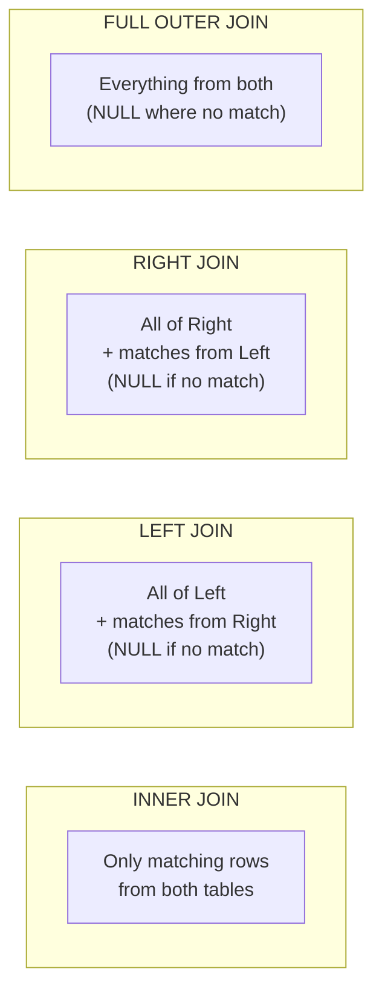

```sql
-- INNER JOIN: only rows with a match on both sides
SELECT s.Name, c.Name
FROM Student s
INNER JOIN Course c ON s.CourseID = c.ID;
-- Result: John-DBMS, Alice-OS  (Bob is excluded — CourseID is NULL)

-- LEFT JOIN: everything from Student, matched Course data (or NULL)
SELECT s.Name, c.Name
FROM Student s
LEFT JOIN Course c ON s.CourseID = c.ID;
-- Result: John-DBMS, Alice-OS, Bob-NULL

-- RIGHT JOIN: everything from Course, matched Student data (or NULL)
SELECT s.Name, c.Name
FROM Student s
RIGHT JOIN Course c ON s.CourseID = c.ID;
-- Result: John-DBMS, Alice-OS, NULL-CN

-- FULL OUTER JOIN: everything from both sides (MySQL: emulate via UNION of LEFT+RIGHT)
SELECT s.Name, c.Name FROM Student s LEFT JOIN Course c ON s.CourseID = c.ID
UNION
SELECT s.Name, c.Name FROM Student s RIGHT JOIN Course c ON s.CourseID = c.ID;

-- CROSS JOIN: cartesian product — every row of A with every row of B
SELECT s.Name, c.Name FROM Student s CROSS JOIN Course c;   -- 3 x 3 = 9 rows

-- SELF JOIN: a table joined with itself (e.g., employee-manager)
SELECT e.Name AS Employee, m.Name AS Manager
FROM Employee e
JOIN Employee m ON e.ManagerID = m.ID;
```

### Comparison Table

| JOIN | Returns |
|---|---|
| INNER JOIN | Only matching rows on both sides |
| LEFT JOIN | All left rows + matched right (NULL if none) |
| RIGHT JOIN | All right rows + matched left (NULL if none) |
| FULL OUTER JOIN | Everything from both sides |
| CROSS JOIN | Every combination of rows (Cartesian product) |
| SELF JOIN | A table joined to itself, via aliases |

<details>
<summary><b>Interview Questions</b></summary>

- Difference between INNER JOIN and LEFT JOIN?
- How do you emulate FULL OUTER JOIN in MySQL (which lacks native support)?
- When would you deliberately use CROSS JOIN?
- Give a real use case for SELF JOIN.
- If Table A has 5 rows and Table B has 4 rows, how many rows does `CROSS JOIN` return? *(20)*
</details>

### Common Mistakes
- ❌ Forgetting the `ON` condition → accidental cartesian product.
- ❌ Using INNER JOIN when you actually need to preserve unmatched rows (use LEFT JOIN instead).
- ❌ Confusing LEFT/RIGHT direction — LEFT keeps everything from the table listed *first* (or explicitly marked LEFT).

---

## 23. Set Operations: UNION, INTERSECT, EXCEPT

Set operations combine the **results of two full queries** (vertically), unlike JOINs which combine **columns** (horizontally).

**Golden Rule:** Both queries must have the **same number of columns**, in **compatible data types**, in the **same order**.

```sql
-- UNION: combines results, removes duplicates
SELECT Name FROM Employees
UNION
SELECT Name FROM Managers;

-- UNION ALL: combines results, KEEPS duplicates (faster — no dedup step)
SELECT Name FROM Employees
UNION ALL
SELECT Name FROM Managers;

-- INTERSECT: rows present in BOTH queries (MySQL 8.0.31+; emulate earlier via INNER JOIN/IN)
SELECT Name FROM Employees
INTERSECT
SELECT Name FROM Managers;

-- EXCEPT / MINUS: rows in the first query but NOT in the second
SELECT Name FROM Employees
EXCEPT                    -- MINUS in Oracle
SELECT Name FROM Managers;
```

| Operation | Meaning | Duplicates |
|---|---|---|
| `UNION` | Combine + dedupe | Removed |
| `UNION ALL` | Combine, keep everything | Kept (faster) |
| `INTERSECT` | Common rows only | Removed |
| `EXCEPT` / `MINUS` | Rows in A not in B | Removed |

### JOIN vs UNION

| | JOIN | UNION |
|---|---|---|
| Direction | Combines **columns** (horizontal) | Combines **rows** (vertical) |
| Requirement | A relationship between tables | Same column count/types |
| Use case | "Get student name + their course name" | "Get all names from two separate tables" |

<details>
<summary><b>Interview Questions</b></summary>

- Why is UNION ALL generally faster than UNION?
- What must be true about two queries before you can UNION them?
- Difference between JOIN and UNION — when would you use each?
</details>

---

## 24. Subqueries ⭐

A **subquery** (or nested/inner query) is a query inside another query, always evaluated first, with its result fed into the outer query.

### Types by Result Shape

| Type | Returns | Where Used |
|---|---|---|
| **Scalar** | A single value | `WHERE Salary > (SELECT AVG(Salary) FROM Employee)` |
| **Multi-row (column)** | Multiple values, one column | `WHERE DeptID IN (SELECT DeptID FROM Dept WHERE Location='NY')` |
| **Multi-column** | Multiple columns, one or more rows | `WHERE (DeptID, Role) IN (SELECT DeptID, Role FROM ...)` |
| **Correlated** | References a column from the outer query — re-evaluated per outer row | `WHERE Salary > (SELECT AVG(Salary) FROM Employee e2 WHERE e2.DeptID = e1.DeptID)` |
| **Nested (uncorrelated)** | Runs independently of the outer query, only once | Any of the above without a back-reference |

```sql
-- Scalar subquery
SELECT Name FROM Employee
WHERE Salary > (SELECT AVG(Salary) FROM Employee);

-- IN — multi-row subquery
SELECT Name FROM Employee
WHERE DeptID IN (SELECT DeptID FROM Department WHERE Budget > 100000);

-- EXISTS — checks only for presence (often faster: short-circuits on first match)
SELECT Name FROM Department d
WHERE EXISTS (SELECT 1 FROM Employee e WHERE e.DeptID = d.DeptID);

-- Correlated subquery — inner query depends on the outer row
SELECT Name, Salary FROM Employee e1
WHERE Salary > (
  SELECT AVG(Salary) FROM Employee e2 WHERE e2.DeptID = e1.DeptID
);

-- ANY / ALL
SELECT Name FROM Employee WHERE Salary > ANY (SELECT Salary FROM Employee WHERE Dept='HR');  -- > at least one
SELECT Name FROM Employee WHERE Salary > ALL (SELECT Salary FROM Employee WHERE Dept='HR');  -- > every one
```

### IN vs EXISTS

| | IN | EXISTS |
|---|---|---|
| Checks | Membership in a value list | Whether any row satisfies a condition |
| NULLs | Can behave unexpectedly if the subquery result contains NULL | Not affected by NULLs the same way |
| Performance | Better for small, static result sets | Often better for large tables — can stop at first match |

<details>
<summary><b>Interview Questions</b></summary>

- Difference between a correlated and a non-correlated subquery?
- Why can EXISTS outperform IN on large datasets?
- Difference between ANY and ALL?
- Can a subquery return multiple columns? Where would that be used?
- Why can `IN` with a subquery behave incorrectly if the subquery returns NULL values?
</details>

---

## 25. Views & Materialized Views

A **view** is a virtual table — a saved, named `SELECT` query. It stores no data of its own; every time you query it, the underlying query re-runs.

```sql
CREATE VIEW HighEarners AS
SELECT Name, Salary FROM Employee WHERE Salary > 80000;

SELECT * FROM HighEarners;             -- query it just like a table
DROP VIEW HighEarners;
```

### Why Use Views?
- **Security** — expose only certain columns/rows (e.g., hide `Salary` from a general-purpose view).
- **Simplicity** — hide a complex multi-join query behind a simple name.
- **Reusability** — write the logic once, reuse everywhere.
- **Logical data independence** — underlying tables can be restructured while the view's interface stays stable.

### Updatable Views
A view is generally updatable only if it's based on a **single table**, with no `GROUP BY`, `DISTINCT`, aggregate functions, or `UNION`. Views built from joins or aggregates are typically **read-only**.

### Views vs Materialized Views

| | View | Materialized View |
|---|---|---|
| Storage | No data stored — just the query | Stores the actual computed result |
| Freshness | Always live/current | Can go stale until refreshed |
| Speed | Slower (re-runs the query each time) | Faster (pre-computed) |
| Use case | Simple abstraction, always-fresh data needed | Expensive aggregations, analytics dashboards |
| MySQL support | Native (`CREATE VIEW`) | Not natively supported — must be emulated with a real table + scheduled refresh |

<details>
<summary><b>Interview Questions</b></summary>

- Does a view store data?
- When does a view become non-updatable?
- Difference between a view and a materialized view — when would you pick each?
- How would you simulate a materialized view in MySQL, which lacks native support?
</details>

---

## Part E — Database Internals

## 26. Normalization ⭐

**Normalization** is the process of organizing tables to reduce **data redundancy** and eliminate **update anomalies**, by systematically applying **Functional Dependencies (FDs)**.

### Functional Dependency (FD)
`A → B` ("A determines B") means: for a given value of A, B's value is always the same. Example: `StudentID → Name` — knowing the ID always tells you the exact name.

**Armstrong's Axioms** (rules for deriving new FDs from known ones):
- **Reflexivity:** if B ⊆ A, then A → B
- **Augmentation:** if A → B, then AC → BC
- **Transitivity:** if A → B and B → C, then A → C

### The Three Anomalies Normalization Prevents

| Anomaly | Problem | Example |
|---|---|---|
| **Insertion Anomaly** | Can't add certain data without unrelated data also being present | Can't add a new Course unless a Student is currently enrolled in it |
| **Update Anomaly** | Same fact stored in multiple rows — updating one and missing another creates inconsistency | A professor's department changes; must update every row mentioning that professor |
| **Deletion Anomaly** | Deleting one fact accidentally deletes another, unrelated fact | Deleting the last student in a course deletes all record that the course exists |

### Normal Forms

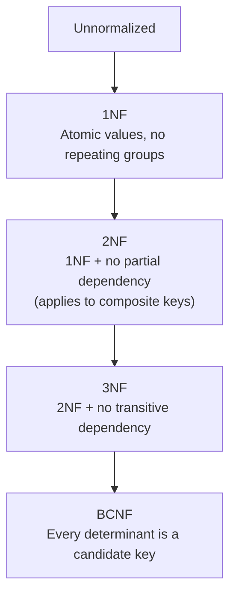

| Normal Form | Rule | Fixes |
|---|---|---|
| **1NF** | Every column holds a single, atomic value; no repeating groups/arrays in a cell | Multi-valued columns like `Phones: "999,888"` |
| **2NF** | Must be in 1NF + **no partial dependency** — every non-key attribute depends on the *entire* composite primary key, not just part of it | A non-key column depending on only half a composite key |
| **3NF** | Must be in 2NF + **no transitive dependency** — non-key attributes depend only on the key, not on other non-key attributes | `StudentID → DeptID → DeptName` (DeptName depends on DeptID, not directly on StudentID) |
| **BCNF** | Stricter version of 3NF — for *every* FD `A → B`, A must be a **candidate key** | Edge cases 3NF misses, involving overlapping candidate keys |

**Worked example (2NF violation):**
```
Enrollment(StudentID, CourseID, StudentName, CourseName)
PK = (StudentID, CourseID)
```
`StudentName` depends only on `StudentID` (part of the key) — partial dependency, violates 2NF. Fix by splitting:
```
Student(StudentID, StudentName)
Course(CourseID, CourseName)
Enrollment(StudentID, CourseID)
```

**Worked example (3NF violation):**
```
Employee(EmpID, DeptID, DeptName)
```
`DeptName` depends on `DeptID`, which depends on `EmpID` — a transitive dependency. Fix:
```
Employee(EmpID, DeptID)
Department(DeptID, DeptName)
```

> **Normalization vs Denormalization:** Normalization reduces redundancy (good for OLTP/write-heavy systems with correctness needs). **Denormalization** deliberately reintroduces some redundancy to speed up reads (common in analytics/reporting and NoSQL systems) — a classic space-vs-speed trade-off.

<details>
<summary><b>Interview Questions</b></summary>

- What's the difference between 2NF and 3NF in one sentence? *(2NF removes partial dependency on a composite key; 3NF removes transitive dependency on non-key attributes.)*
- Give a real example of an update anomaly.
- Why does BCNF exist if 3NF already removes transitive dependencies?
- When would you deliberately denormalize a schema?
- Can a table be in 3NF but not in BCNF?
</details>

---

## 27. Transactions & ACID ⭐

A **transaction** is a sequence of one or more operations treated as a **single logical unit of work** — either the entire unit succeeds, or none of it does.

**Classic example — bank transfer:**
```sql
START TRANSACTION;
UPDATE Accounts SET Balance = Balance - 500 WHERE ID = 'A';   -- debit
UPDATE Accounts SET Balance = Balance + 500 WHERE ID = 'B';   -- credit
COMMIT;
```
If the system crashes between the two `UPDATE`s, money vanishes — unless the transaction guarantees both happen together or neither does.

### ACID Properties

| Property | Guarantees | Failure Without It |
|---|---|---|
| **Atomicity** | All operations succeed, or all are rolled back — no partial execution | Money deducted from A but never credited to B |
| **Consistency** | A transaction moves the database from one valid state to another, respecting all constraints | A `CHECK (Balance >= 0)` constraint gets violated |
| **Isolation** | Concurrent transactions don't interfere with each other's intermediate state | Transaction 2 reads uncommitted (potentially rolled-back) data from Transaction 1 |
| **Durability** | Once committed, changes survive even a crash immediately afterward | A confirmed payment disappears after a server restart |

### How Atomicity & Durability Are Actually Implemented
The DBMS doesn't just "hope" for atomicity — it uses **logging**: before modifying actual data, it writes each operation's before/after image to a **transaction log** on durable storage. On crash recovery, the log is replayed to redo committed transactions and undo incomplete ones. (Full details in [Section 28](#28-recovery-logging-shadow-paging--checkpoints).)

### Transaction States

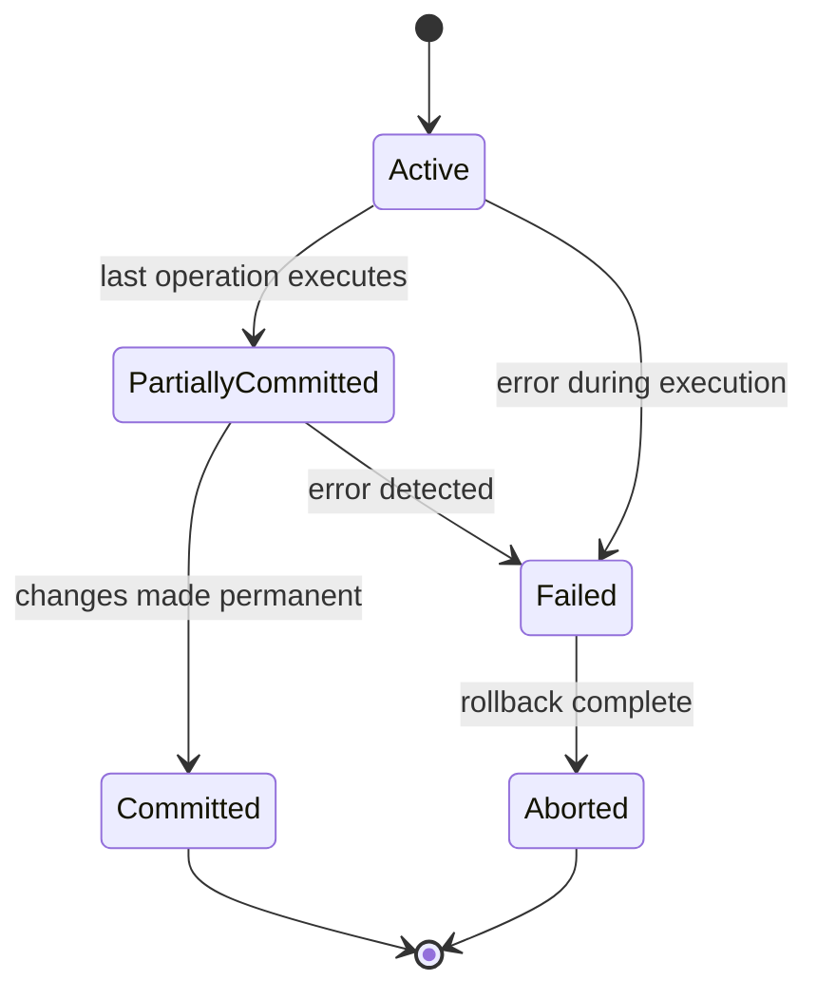

| State | Meaning |
|---|---|
| Active | Transaction is executing |
| Partially Committed | Last statement executed, but not yet flushed to permanent storage |
| Committed | Changes are permanent and durable |
| Failed | Something went wrong — normal execution can't continue |
| Aborted | Rolled back to the pre-transaction state |

<details>
<summary><b>Interview Questions</b></summary>

- Explain ACID with a real-world example (not just definitions).
- What's the difference between "Failed" and "Aborted" transaction states?
- How does a DBMS guarantee Durability even if the server crashes right after COMMIT?
- Give an example where Isolation failure causes a bug (e.g., a "dirty read").
</details>

---

## 28. Recovery: Logging, Shadow Paging & Checkpoints

Crash recovery answers one question: *if the DBMS crashes mid-transaction, how do we return to a correct state?*

### Log-Based Recovery (WAL — Write-Ahead Logging) ⭐
**Rule:** Every change is written to a log **before** it's applied to the actual database. On restart, the DBMS replays the log to redo committed work and undo incomplete work.

| Strategy | Behavior |
|---|---|
| **Deferred Update** | Changes are logged but **not written to disk** until the transaction commits. On crash before commit, nothing needs undoing — just discard the log. |
| **Immediate Update** | Changes are written to disk *as they happen*, before commit. On crash, the log is used to **undo** uncommitted changes and **redo** committed ones. |

### Shadow Paging
An alternative to logging. The DBMS keeps two page tables — a **shadow (old) page table** pointing to the last consistent state, and a **current page table** for in-progress changes. On commit, the current table atomically replaces the shadow table; on crash, the shadow table (untouched) is simply used, so no undo is needed. Drawback: causes data fragmentation over time and complicates concurrent transactions, so it's less common in modern high-throughput systems than logging.

### Checkpoints
Replaying the *entire* log after every crash is expensive. A **checkpoint** periodically flushes all committed changes to disk and records a marker — recovery only needs to replay the log **from the last checkpoint onward**, not from the beginning of time.

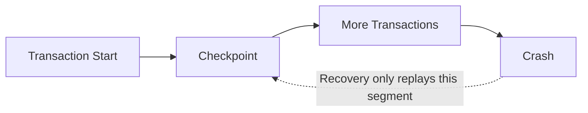

<details>
<summary><b>Interview Questions</b></summary>

- What is Write-Ahead Logging, and why "write-ahead"?
- Difference between Deferred and Immediate Update recovery techniques?
- Why do checkpoints speed up crash recovery?
- What's the main trade-off of Shadow Paging vs logging-based recovery?
</details>

---

## 29. Indexing ⭐

An **index** is an auxiliary data structure that lets the DBMS find rows without scanning the entire table — the database equivalent of a book's index, sacrificing extra storage for far faster reads.

```sql
CREATE INDEX idx_name ON Employee(Name);
DROP INDEX idx_name ON Employee;
```

### Why Not Index Every Column?
Indexes speed up reads but slow down writes — every `INSERT`/`UPDATE`/`DELETE` must also update every index on that table, and each index consumes additional storage. Index only the columns actually used in `WHERE`, `JOIN`, and `ORDER BY` clauses.

### Types of Indexes

| Type | Meaning |
|---|---|
| **Primary Index** | Built automatically on the primary key |
| **Secondary Index** | Built explicitly on a non-key column to speed up specific queries |
| **Dense Index** | One index entry for **every** search key value in the table |
| **Sparse Index** | One index entry for only **some** values (e.g., one per data block); relies on data being sorted |
| **Clustered Index** | The table's actual data rows are physically sorted/stored in index order — only **one** per table (often the PK) |
| **Non-Clustered Index** | A separate structure holding pointers to the actual rows — a table can have **many** |

| Clustered | Non-Clustered |
|---|---|
| Data physically ordered by the index | Data unsorted; index has pointers to actual rows |
| One per table | Many per table |
| Faster range queries | Extra lookup step (index → pointer → row) |

### B+ Tree — the Default Index Structure
Most relational databases implement indexes as **B+ Trees**: balanced, sorted, disk-friendly trees where all actual data lives in leaf nodes, and leaves are linked for fast range scans. This keeps search, insert, and delete operations at O(log n) even on huge tables.

<details>
<summary><b>Interview Questions</b></summary>

- Why does indexing speed up reads but slow down writes?
- Difference between a clustered and non-clustered index?
- Why can a table have only one clustered index but multiple non-clustered indexes?
- Difference between a dense and sparse index?
- Why are B+ Trees preferred over plain Binary Search Trees for database indexes? *(Disk-friendly — fewer, wider nodes mean fewer disk reads; leaves are linked for fast range scans.)*
</details>

---

## Part F — NoSQL & Distributed Systems

## 30. NoSQL Databases

**NoSQL** = "Not Only SQL" — not a replacement for relational databases, but an alternative way of storing data for workloads where rigid schemas and vertical scaling don't fit.

### Why NoSQL Emerged
Before ~2005, most software (banking, ERP) had structured, slow-changing data — SQL was a perfect fit. After 2005, internet-scale applications (Facebook, YouTube) began generating massive volumes of **semi-structured/unstructured** data (images, JSON, chat logs) that needed to scale across hundreds of cheap servers, not one expensive one. Storage also got dramatically cheaper, reducing the pressure to normalize everything.

### Vertical vs Horizontal Scaling

| | Vertical Scaling (Scale-Up) | Horizontal Scaling (Scale-Out) |
|---|---|---|
| Approach | Add more CPU/RAM to one machine | Add more machines |
| Cost curve | Expensive at high end | Cheaper, linear-ish |
| Ceiling | Hard hardware limit | Practically unlimited |
| Typical of | Traditional RDBMS | NoSQL |

### Four Types of NoSQL Databases

| Type | Stores | Example | Best For |
|---|---|---|---|
| **Key-Value** | Simple key → value pairs (like a giant hash map) | Redis, DynamoDB | Caching, sessions, shopping carts |
| **Document** | JSON-like documents with nested fields, arrays | MongoDB, CouchDB | E-commerce, CMS, mobile apps |
| **Wide-Column** | Column-family storage — read only the columns you need | Cassandra, HBase, Redshift | Analytics, time-series, data warehouses |
| **Graph** | Nodes + edges, optimized for relationship traversal | Neo4j, Amazon Neptune | Social networks, fraud detection, recommendations |

```json
// Document store example — flexible, nested, no fixed schema
{
  "id": 1,
  "name": "John",
  "skills": ["C++", "Python"],
  "address": { "city": "Delhi", "country": "India" }
}
```

### SQL vs NoSQL

| Feature | SQL | NoSQL |
|---|---|---|
| Schema | Fixed | Flexible/schema-free |
| Scaling | Vertical (primarily) | Horizontal |
| Joins | Common, well-supported | Usually avoided by design |
| Consistency | Strong (ACID) | Varies — many favor availability; some (e.g., modern MongoDB) support ACID transactions |
| Data | Structured | Structured, semi-structured, unstructured |
| Best for | Banking, ERP, transactional systems | Social media, IoT, real-time apps, rapidly changing schemas |
| Examples | MySQL, PostgreSQL, Oracle | MongoDB, Redis, Cassandra, Neo4j |

### NoSQL Advantages / Disadvantages

| Advantages | Disadvantages |
|---|---|
| Flexible schema — no `ALTER TABLE` needed | Data redundancy (denormalized by design) |
| Horizontal scaling via sharding | Updates/deletes can be costly (same fact duplicated across many documents) |
| High availability via replication | No single NoSQL type fits every workload |
| Fast reads — related data embedded together (no joins needed) | ACID support varies by product |
| Cloud/distributed-friendly | Fewer built-in constraints (e.g., no native FK enforcement) |

> **Common misconception:** "NoSQL can't model relationships" — false; MongoDB models them via embedding or references. "NoSQL never supports ACID" — also false; modern MongoDB supports multi-document ACID transactions, though guarantees vary across NoSQL products.

<details>
<summary><b>Interview Questions</b></summary>

- Why was NoSQL introduced despite SQL databases already existing?
- Would you choose SQL or NoSQL for a banking system? For a social media feed? Justify both.
- What is sharding, and how does it relate to horizontal scaling?
- Does MongoDB support ACID transactions?
- Name the 4 types of NoSQL databases with one example and one use case each.
</details>

---

## 31. Database Models Compared

The evolution of database models, each solving the previous model's limitations:

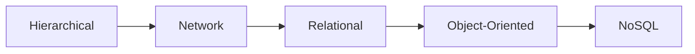

| Model | Structure | Key Limitation | Key Strength |
|---|---|---|---|
| **Hierarchical** | Tree — each child has exactly **one** parent | Can't represent many-to-many relationships | Very fast traversal for tree-shaped data (file systems, org charts) |
| **Network** | Graph — a child can have **multiple** parents | Complex to design and maintain | Naturally supports many-to-many |
| **Relational** | Tables connected via keys | Traditionally scales vertically more naturally (though sharding/distributed SQL exist) | Standardized SQL, strong ACID, mature tooling |
| **Object-Oriented** | Stores objects directly (avoids ORM overhead) | Smaller ecosystem, less mature tooling | Naturally fits OOP languages, inheritance |
| **NoSQL** | Documents/key-value/wide-column/graph | Weaker built-in constraints, variable ACID support | Flexible schema, horizontal scaling |

**Where each model is used today:**

| Application | Best Choice |
|---|---|
| Banking, Payroll, Hospital Systems | Relational |
| Engineering/CAD Design | Object-Oriented |
| File Systems, Org Charts | Hierarchical |
| Manufacturing/Supply Chain Networks | Network (largely superseded by relational/graph today) |
| Modern Social Media | Graph NoSQL (e.g., Neo4j) rather than the classic Network model |

<details>
<summary><b>Interview Questions</b></summary>

- Why did Relational databases replace Hierarchical and Network models?
- Why didn't Object-Oriented databases replace Relational databases despite solving the ORM problem?
- What's the core limitation of a Hierarchical database that Network databases fixed?
</details>

---

## 32. Clustering & Replication

### Why Clustering?
One database server has a ceiling. As traffic grows (10 → 10 million users), a single machine's CPU, RAM, and disk eventually saturate and the server crashes. **Database Clustering** connects multiple database servers so they work together and appear as one logical database to the application.

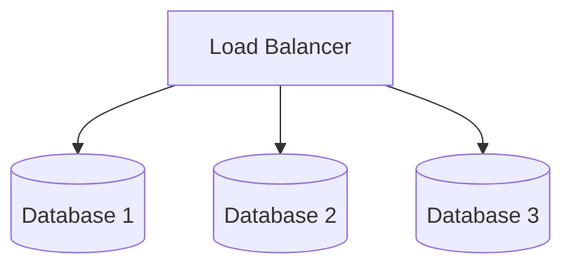

### Replication vs Clustering

| | Replication | Clustering |
|---|---|---|
| What | Copies the **same data** to multiple servers | Multiple servers working together as one system |
| Goal | Reliability, fault tolerance | Availability + performance + scalability |
| Relationship | One technique commonly used *inside* a cluster | Broader architecture — may combine replication, load balancing, and failover |

### Key Concepts

| Term | Meaning |
|---|---|
| **Replica Set** | A group of servers holding copies of the same data (e.g., MongoDB: one Primary + multiple Secondaries) |
| **Load Balancer** | Distributes incoming requests across servers so none gets overloaded (e.g., NGINX, HAProxy, cloud LBs) |
| **High Availability (HA)** | The system stays operational (near-)all the time, even if individual nodes fail |
| **Failover** | Automatic promotion of a healthy replica to Primary when the current Primary fails |

### Clustering vs Replication vs Sharding

| Feature | Clustering | Replication | Sharding |
|---|---|---|---|
| Purpose | Servers work together | Copy data | Split data |
| Data | Same or distributed, depending on design | Same data everywhere | Different data per server |
| Goal | Availability | Fault tolerance | Storage & write scalability |

<details>
<summary><b>Interview Questions</b></summary>

- Difference between clustering and replication?
- What is a replica set, and how does automatic failover work?
- If replication already provides multiple copies of data, why do we still need clustering as a broader concept?
</details>

---

## 33. Partitioning & Sharding

### Why Partitioning?
A table with billions of rows becomes hard to manage even with indexes — backups, maintenance, and some queries get slower and more resource-intensive. **Partitioning** splits one large logical table into smaller physical pieces.

### Vertical vs Horizontal Partitioning

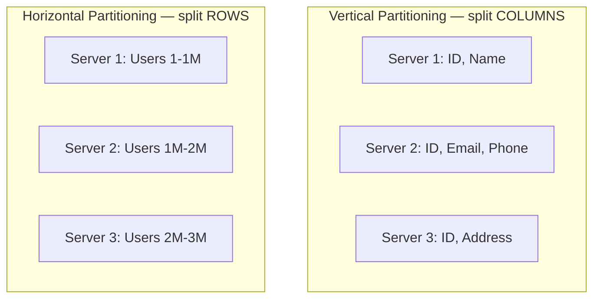

| | Vertical Partitioning | Horizontal Partitioning |
|---|---|---|
| Splits | Columns | Rows |
| Example | Login page needs only ID/Email/Password — store those separately from Address/Salary | Users 1–1M on Server1, 1M–2M on Server2 |
| Trade-off | Full-record retrieval needs reconstruction across partitions | Simpler queries but needs a routing strategy |

**Advantages of partitioning:** parallelism (multiple servers search simultaneously), availability (one partition failing doesn't take down the rest), better performance, easier per-partition maintenance/backup, lower cost than one giant machine.

### Sharding
**Sharding is a specific implementation of horizontal partitioning across multiple database *servers*, combined with a routing layer.**

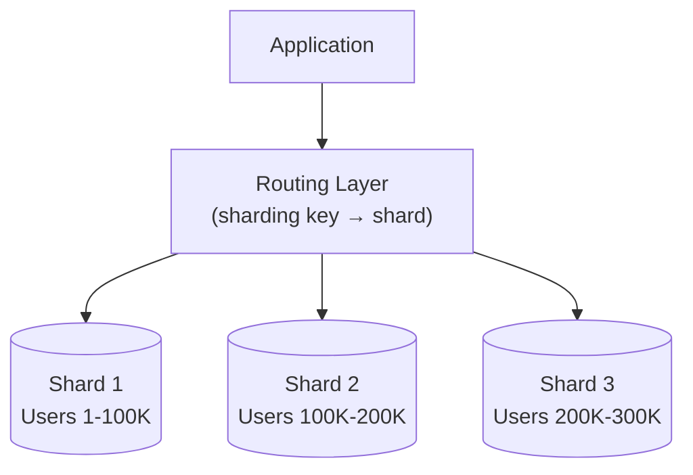

The **routing layer** maps each request to the correct shard using a sharding key (e.g., `UserID % NumberOfShards`) — without it, the application would have to query every shard for every request.

| Advantages | Disadvantages |
|---|---|
| Practically unlimited storage/throughput scaling | High complexity — routing, shard mapping, rebalancing |
| A failing shard only affects its own data | **Re-sharding** is difficult when traffic outgrows the current shard count |
| | **Scatter-Gather problem**: a query needing data from every shard (e.g., `COUNT(*)`) must query all shards and merge results — expensive |

### Partitioning vs Sharding — the Key Distinction

> ✅ Every sharded database uses horizontal partitioning.
> ❌ **Not** every partitioned database is sharded — partitioning can happen within a *single* server (e.g., monthly table partitions), while sharding specifically means splitting data across multiple *servers* with routing.

| Distributed Database | A single logical database, physically spread across multiple servers via clustering, partitioning, and/or sharding |

<details>
<summary><b>Interview Questions</b></summary>

- Difference between Vertical and Horizontal Partitioning?
- Is every partitioned table sharded? Explain.
- What is the Scatter-Gather problem, and why does it hurt analytical queries?
- What role does the routing layer play in sharding?
- Can Sharding and Replication be combined? *(Yes — shard for scale, replicate each shard for fault tolerance.)*
</details>

---

## 34. Database Scaling Patterns

A system-design favorite: how does a database architecture evolve as traffic grows, from a 10-user startup to a global company? The core lesson interviewers look for: **engineers add complexity only when the current architecture can no longer cope** — sharding is not the first move.

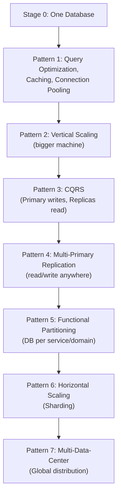

| Pattern | Idea | Trade-off Introduced |
|---|---|---|
| **1. Query Optimization + Caching + Connection Pooling** | Add indexes, cache non-dynamic reads (Redis), reuse pooled DB connections instead of opening new ones per request | Cheapest fix — always do this first |
| **2. Vertical Scaling** | Upgrade CPU/RAM/SSD on the same machine | Simple, but cost rises steeply and there's a hardware ceiling |
| **3. CQRS (Command Query Responsibility Segregation)** | Split reads and writes onto different physical machines — writes to Primary, reads to Replicas | Introduces **replication lag** (a replica may briefly serve stale data) |
| **4. Multi-Primary Replication** | Every node can accept both reads and writes, in a logical ring | Introduces **write conflicts** needing resolution (timestamps, version vectors) |
| **5. Functional Partitioning** | Split databases by business domain (Users DB, Payments DB, Trips DB) — aka *database-per-service* | Cross-database joins become the application's responsibility |
| **6. Horizontal Scaling (Sharding)** | Split the *same* type of data across many servers by a sharding key | High complexity — routing, rebalancing, scatter-gather queries |
| **7. Multi-Data-Center Partitioning** | Deploy full stacks in multiple geographic regions, replicate across them | Complex cross-region replication, but minimizes latency and adds disaster recovery |

**Case study — Cab Booking App:** 10 users, 1 booking/5 min → one DB is fine. Growth to 30 bookings/min causes latency spikes and deadlocks → apply Pattern 1 (caching, connection pooling). Growth to 100/min → Pattern 2 (bigger machine). 300/min → Pattern 3 (CQRS with read replicas). And so on, through Pattern 7 as the business goes global.

<details>
<summary><b>Interview Questions</b></summary>

- Why shouldn't a startup jump straight to sharding?
- What is replication lag, and which pattern introduces it?
- Difference between Functional Partitioning and Sharding?
- Why do multiple data centers help with both latency *and* disaster recovery?
- Walk through how you'd scale a read-heavy social media app from 100 to 100 million users.
</details>

---

## 35. CAP Theorem ⭐

One of the most-tested distributed-systems concepts in backend/system-design interviews. **Applies only to distributed databases** — a single-node database has nothing to be "partitioned," so CAP doesn't apply to it.

### The Three Properties

| Letter | Property | Meaning |
|---|---|---|
| **C** | Consistency | Every client sees the same, most-recent data, no matter which node they query |
| **A** | Availability | Every request receives *a* response (not necessarily the freshest data) — the system never simply refuses to answer |
| **P** | Partition Tolerance | The system keeps working even when network communication between nodes breaks down |

> A **network partition** means some nodes can't talk to others due to a network failure — it has nothing to do with disk partitioning.

### The Theorem
**During a network partition, a distributed system must choose between Consistency and Availability — it cannot guarantee both simultaneously.**

Since real-world networks *will* eventually fail (cables break, regions lose connectivity), **Partition Tolerance is treated as mandatory** in any real distributed system — so the practical, everyday trade-off engineers actually make is **C vs A**.

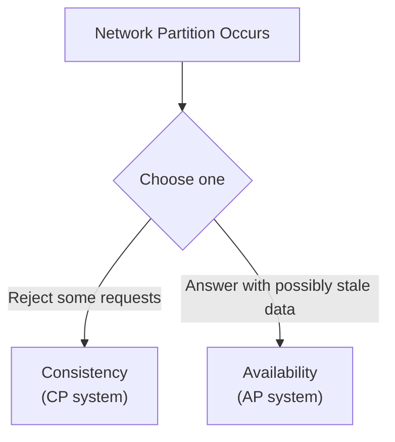

| System Type | Guarantees | Gives Up | Example | Typical Use Case |
|---|---|---|---|---|
| **CA** | Consistency + Availability | Partition Tolerance | Traditional single-node RDBMS (no cross-node partition to worry about) | Non-distributed deployments |
| **CP** | Consistency + Partition Tolerance | Availability | MongoDB (rejects/limits writes without a reachable Primary) | Banking, payments, stock trading |
| **AP** | Availability + Partition Tolerance | Consistency | Cassandra, DynamoDB (in typical configurations) | Social media feeds, likes, view counts |

### Eventual Consistency
In AP systems, replicas **temporarily diverge** during/after a partition but **converge to the same value once communication resumes** — e.g., a WhatsApp message delivered later once a phone reconnects, or an Instagram like count settling to the same number across devices after a few seconds.

### CAP Consistency vs ACID Consistency — a Classic Trick Question

| ACID Consistency | CAP Consistency |
|---|---|
| A transaction leaves the database in a state that satisfies all integrity constraints | All nodes return the same, latest committed value |
| About a single database's correctness rules | About synchronization across distributed replicas |
| Applies to one database/transaction | Applies to distributed systems |

**These are different concepts that happen to share the word "Consistency" — never conflate them in an interview.**

### Real-World Choices

| Application | Choice | Reasoning |
|---|---|---|
| Banking / UPI Payments | **CP** | An incorrect balance is unacceptable — better to reject a request than corrupt data |
| Stock Trading | **CP** | A wrong price is unacceptable |
| Facebook Feed / Instagram Likes | **AP** | Slightly stale data is a fine trade-off for always staying responsive |
| YouTube View Counts | **AP** | Exact real-time accuracy isn't critical |

<details>
<summary><b>Interview Questions</b></summary>

- Why does CAP theorem only apply to distributed systems?
- Why is Partition Tolerance treated as non-negotiable in real systems, making C-vs-A the actual trade-off?
- Is MongoDB CP or AP? Is Cassandra CP or AP? Justify each.
- Difference between ACID Consistency and CAP Consistency — a classic trick question.
- Would you choose CP or AP for a banking system? For a social media app? Why?
</details>

---

## 36. Master-Slave (Primary-Replica) Architecture

Also called **Primary-Replica** or **Leader-Follower** in modern terminology (companies increasingly avoid "master/slave" wording, though the underlying concept is identical) — this is essentially [CQRS](#34-database-scaling-patterns) (Pattern 3) explained in depth.

### The Problem
A single database handling **both** reads and writes for a high-traffic app becomes a bottleneck — CPU and disk contend for two very different workloads simultaneously.

### The Solution

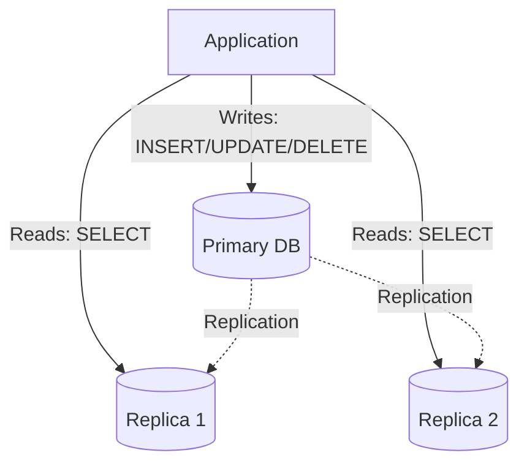

- **Primary (Master)** — handles all writes. Having only one writable node avoids write-write conflicts entirely.
- **Replicas (Slaves)** — handle reads. Since most applications are read-heavy (often far more reads than writes), this offloads the bulk of traffic away from the Primary.

### Synchronous vs Asynchronous Replication

| | Synchronous | Asynchronous |
|---|---|---|
| Behavior | Primary waits for replica acknowledgment before confirming success | Primary confirms immediately; replication happens afterward |
| Consistency | Strong — all copies match on commit | Possible **replication lag** — replicas briefly stale |
| Speed | Slower | Faster, higher throughput |
| Best for | Banking (correctness > speed) | Social media (speed > perfect freshness) |

**Replication lag** = the delay between the Primary committing a write and a Replica receiving it. This is why a user who updates their profile and *immediately* refreshes might briefly see old data if their read hits a lagging replica. Production systems often solve this with a **"read-your-writes"** strategy — temporarily routing that user's reads to the Primary right after their own write, then switching back to replicas once replication catches up.

### Failover
If the Primary crashes, a Replica is automatically promoted to become the new Primary so writes can resume — this requires an election/consensus mechanism among the remaining nodes.

### Master-Slave vs Multi-Primary vs Sharding

| | Master-Slave | Multi-Primary | Sharding |
|---|---|---|---|
| Writes | Only Primary | Any node | Only to the shard owning that data |
| Data | Same everywhere (replicated) | Same everywhere (replicated) | Different per shard |
| Conflicts | None (single writer) | Possible (needs resolution) | None (each shard is independent) |
| Solves | Read scalability | Write scalability | Storage + write scalability |

<details>
<summary><b>Interview Questions</b></summary>

- Why are writes restricted to only the Primary node?
- Difference between Synchronous and Asynchronous replication — which would a bank use?
- What is replication lag, and how do production systems mitigate its user-facing effects?
- What happens when the Primary crashes? What's this process called?
- What's the biggest long-term limitation of Master-Slave architecture? *(All writes still funnel through one node — eventually a write bottleneck, motivating multi-primary or sharding.)*
</details>

---

## Final Cheat Sheet

A last-look, high-density summary for the morning of the interview.

### Core Definitions in One Line Each

| Term | One-Line Definition |
|---|---|
| DBMS | Software layer between users and the database that manages storage, retrieval, and integrity |
| Primary Key | Uniquely identifies a row; never NULL, one per table |
| Foreign Key | References another table's primary key; can repeat, can be NULL |
| Normalization | Organizing tables to remove redundancy and anomalies |
| Denormalization | Deliberately adding redundancy back for read speed |
| Transaction | A group of operations that succeed or fail as one unit |
| ACID | Atomicity, Consistency, Isolation, Durability |
| Index | An auxiliary structure that speeds up lookups at the cost of slower writes and extra storage |
| View | A saved virtual query with no data of its own |
| Sharding | Horizontal partitioning across multiple *servers*, plus a routing layer |
| Replication | Copying the same data to multiple servers for fault tolerance |
| CAP Theorem | During a network partition, choose Consistency or Availability |
| NoSQL | Schema-flexible, horizontally-scalable alternative to relational databases |

### Complexity / Behavior Quick Table

| Operation | Typical Complexity (B+ Tree Index) |
|---|---|
| Search | O(log n) |
| Insert | O(log n) |
| Delete | O(log n) |
| Full table scan (no index) | O(n) |

### The 5 Most-Asked "Difference Between" Pairs

| Pair | One-Line Distinction |
|---|---|
| DELETE vs TRUNCATE vs DROP | DELETE removes rows (WHERE-able); TRUNCATE empties the table fast; DROP removes the table entirely |
| WHERE vs HAVING | WHERE filters rows before grouping; HAVING filters groups after |
| Primary Key vs Foreign Key | PK uniquely identifies its own row; FK references another table's PK |
| Clustered vs Non-Clustered Index | Clustered physically sorts the table data; non-clustered stores separate pointers |
| Sharding vs Partitioning | All sharding is horizontal partitioning across servers; not all partitioning is sharding |

### Common Mistakes Checklist

- [ ] Confusing "strong/weak" as relationship types instead of entity types
- [ ] Assuming a Foreign Key can't be NULL or duplicated (it can, by default)
- [ ] Believing SQL executes in the order it's typed (it doesn't — `FROM → WHERE → GROUP BY → HAVING → SELECT → ORDER BY`)
- [ ] Using `SELECT *` in production code
- [ ] Forgetting that `WHERE` cannot use aggregate functions
- [ ] Assuming NoSQL never supports ACID (modern MongoDB does)
- [ ] Treating CAP's "Consistency" as the same thing as ACID's "Consistency"
- [ ] Jumping straight to sharding instead of exhausting caching/indexing/vertical scaling first
- [ ] Assuming DISTINCT works per-column instead of across the whole row
- [ ] Forgetting that a view built on a JOIN or aggregate is usually not updatable

### The Golden Interview Sequence
If asked to design a database from scratch, walk through it in this order — it mirrors how real systems are built and matches how this guide is organized:

```
Requirements → Identify Entities/Attributes/Relationships → Draw ER Diagram
→ Map ER to Relational Tables → Apply Normalization → Define Keys & Constraints
→ Write DDL → Add Indexes on hot query paths → Wrap multi-step writes in Transactions
→ (At scale) Cache → Read Replicas → Partition/Shard → Consider CAP trade-offs
```

---

<p align="center"><i>Good luck with your interview 🚀</i></p>
