# 🧠 GenAI & Agentic AI Interview Handbook

> A complete, self-contained revision guide for GenAI Engineer / AI Engineer / Agentic AI internship & entry-level interviews — covering Transformer internals, LLM training, inference optimization, embeddings, RAG, evaluation, alignment, agents, and multimodal AI.

---

## 📑 Table of Contents

- [Part I — Foundations of Generative AI](#part-i--foundations-of-generative-ai)
  - [1.1 What Is Generative AI?](#11-what-is-generative-ai)
  - [1.2 What Is an LLM?](#12-what-is-an-llm)
- [Part II — Transformer Architecture](#part-ii--transformer-architecture)
  - [2.1 Scaled Dot-Product Attention](#21-scaled-dot-product-attention)
  - [2.2 Multi-Head Attention](#22-multi-head-attention)
  - [2.3 Positional Encodings](#23-positional-encodings)
  - [2.4 Residual Connections & Layer Normalization](#24-residual-connections--layer-normalization)
  - [2.5 Transformers vs RNN/LSTM: Parallelization](#25-transformers-vs-rnnlstm-parallelization)
  - [2.6 Encoder-only vs Decoder-only vs Encoder-Decoder](#26-encoder-only-vs-decoder-only-vs-encoder-decoder)
  - [2.7 Causal Masking & Cross-Attention](#27-causal-masking--cross-attention)
- [Part III — How LLMs Are Trained](#part-iii--how-llms-are-trained)
  - [3.1 Pre-training: Causal Language Modeling](#31-pre-training-causal-language-modeling)
  - [3.2 Tokenization](#32-tokenization)
  - [3.3 Supervised Fine-Tuning (SFT)](#33-supervised-fine-tuning-sft)
  - [3.4 Instruction Tuning vs Chat Tuning](#34-instruction-tuning-vs-chat-tuning)
  - [3.5 Preference Optimization (RLHF, DPO & Beyond)](#35-preference-optimization-rlhf-dpo--beyond)
- [Part IV — Scaling Laws](#part-iv--scaling-laws)
- [Part V — Inference Optimization & Serving](#part-v--inference-optimization--serving)
  - [5.1 KV Cache](#51-kv-cache)
  - [5.2 Quantization](#52-quantization)
  - [5.3 Continuous Batching & PagedAttention](#53-continuous-batching--pagedattention)
  - [5.4 Speculative Decoding](#54-speculative-decoding)
  - [5.5 Context Length Extension (RoPE Scaling, YaRN, ALiBi)](#55-context-length-extension-rope-scaling-yarn-alibi)
- [Part VI — Embeddings & Vector Search](#part-vi--embeddings--vector-search)
  - [6.1 Contrastive Learning for Embeddings](#61-contrastive-learning-for-embeddings)
  - [6.2 Similarity Metrics](#62-similarity-metrics)
  - [6.3 Dimensionality & Model Choice](#63-dimensionality--model-choice)
  - [6.4 Vector Databases & Indexing](#64-vector-databases--indexing)
- [Part VII — Retrieval-Augmented Generation (RAG)](#part-vii--retrieval-augmented-generation-rag)
  - [7.1 RAG Fundamentals](#71-rag-fundamentals)
  - [7.2 Hybrid Search (Dense + Sparse)](#72-hybrid-search-dense--sparse)
  - [7.3 Re-ranking: Bi-Encoder + Cross-Encoder](#73-re-ranking-bi-encoder--cross-encoder)
  - [7.4 Chunking Strategy](#74-chunking-strategy)
  - [7.5 Multimodal RAG](#75-multimodal-rag)
  - [7.6 Latency vs Cost vs Quality Trade-offs](#76-latency-vs-cost-vs-quality-trade-offs)
  - [7.7 Monitoring & Observability](#77-monitoring--observability)
  - [7.8 RAG vs Fine-Tuning vs Both](#78-rag-vs-fine-tuning-vs-both)
  - [7.9 System Design Walkthrough: Embedding Model & Index](#79-system-design-walkthrough-choosing-an-embedding-model--index)
  - [7.10 Production RAG Tuning-Knob Checklist](#710-production-rag-the-full-tuning-knob-checklist)
- [Part VIII — Evaluating LLM & RAG Systems](#part-viii--evaluating-llm--rag-systems)
  - [8.1 Generation Metrics](#81-generation-metrics)
  - [8.2 RAG-Specific Metrics (Ragas-style)](#82-rag-specific-metrics-ragas-style)
  - [8.3 Limits of Automatic Metrics & Human Evaluation](#83-limits-of-automatic-metrics--human-evaluation)
  - [8.4 Online / Production Metrics](#84-online--production-metrics)
- [Part IX — Hallucinations, Mitigation & Alignment](#part-ix--hallucinations-mitigation--alignment)
  - [9.1 Why LLMs Hallucinate](#91-why-llms-hallucinate)
  - [9.2 Mitigation Techniques Beyond RAG](#92-mitigation-techniques-beyond-rag)
  - [9.3 Alignment (HHH)](#93-alignment-hhh)
- [Part X — AI Agents](#part-x--ai-agents)
  - [10.1 What Is an Agent?](#101-what-is-an-agent)
  - [10.2 ReAct Pattern](#102-react-pattern)
  - [10.3 Agent Architectures & When to Use Each](#103-agent-architectures--when-to-use-each)
  - [10.4 Common Agent Failure Modes](#104-common-agent-failure-modes)
- [Part XI — Multimodal AI](#part-xi--multimodal-ai)
  - [11.1 How Vision-Language Models Work](#111-how-vision-language-models-work)
  - [11.2 Image Understanding vs Image Generation](#112-image-understanding-vs-image-generation)
- [Part XII — GenAI Engineering Toolkit](#part-xii--genai-engineering-toolkit)
  - [12.1 Prompt Engineering & Temperature](#121-prompt-engineering--temperature)
  - [12.2 Zero-shot vs Few-shot](#122-zero-shot-vs-few-shot)
  - [12.3 Function / Tool Calling](#123-function--tool-calling)
  - [12.4 LangChain, LCEL & LangGraph](#124-langchain-lcel--langgraph)
  - [12.5 LlamaIndex vs LangChain vs LangGraph](#125-llamaindex-vs-langchain-vs-langgraph)
  - [12.6 Memory in GenAI Applications](#126-memory-in-genai-applications)
  - [12.7 Vector DB Comparison: Pinecone vs Chroma](#127-vector-db-comparison-pinecone-vs-chroma)
- [Part XIII — Cheat Sheets](#part-xiii--cheat-sheets)
- [Part XIV — Master Interview Question Bank](#part-xiv--master-interview-question-bank)

---

## Part I — Foundations of Generative AI

### 1.1 What Is Generative AI?

> **Generative AI = models that *create* new content (text, images, audio, code) rather than only classifying or predicting a label.**

| | Discriminative Models | Generative Models |
|---|---|---|
| **Learns** | $P(y \mid x)$ — probability of a label given input | $P(x)$ or $P(x, y)$ — how the data itself is distributed |
| **Goal** | Classify / predict | Generate new realistic samples |
| **Needs labels?** | Usually yes (supervised) | Often no (self-supervised / unsupervised) |
| **Can generate new data?** | ❌ No | ✅ Yes — this is the core capability |
| **Classic examples** | Logistic Regression, SVM, most classifiers | Naive Bayes, HMM, GANs, VAEs, Diffusion |
| **Modern examples** | Spam filters, fraud detectors | ChatGPT, Claude, Midjourney, Suno, Flux |

### 1.2 What Is an LLM?

An **LLM (Large Language Model)** is a Transformer-based neural network trained on enormous amounts of text (web pages, books, code, forums) to predict the next token given previous tokens. Through this simple objective at massive scale, it learns grammar, facts, reasoning patterns, and coding ability.

```
Input text
    ↓
Tokenization → token IDs           "Hello world" → [15496, 995]
    ↓
Embedding layer → dense vectors per token
    ↓  (+ positional encoding, so order is known)
Transformer Blocks × N  (30–120+ layers)
    ├─ Self-Attention        (each token looks at other tokens)
    ├─ Feed-Forward Network  (per-position MLP)
    └─ Residual + LayerNorm  (stabilizes deep training)
    ↓
Final linear layer → next-token probability distribution
    ↓
Sample next token → append → repeat (autoregressive generation)
```

> See also: [Part II — Transformer Architecture](#part-ii--transformer-architecture) for full internals.

---

## Part II — Transformer Architecture

### 2.1 Scaled Dot-Product Attention

**Definition:** Attention lets every token look at every other token and decide how much to "care about" it, producing a context-aware representation.

$$\text{Attention}(Q,K,V) = \text{softmax}\left(\frac{QK^T}{\sqrt{d_k}}\right)V$$

**Q, K, V intuition (Google-search analogy):**

| Vector | Meaning | Analogy |
|---|---|---|
| **Query (Q)** | "What am I looking for?" | The search query you type |
| **Key (K)** | "What do I contain?" | Keywords indexed on a webpage |
| **Value (V)** | The actual information passed forward | The webpage content |

All three are learned linear projections of the input embedding $x$: $Q = xW_Q,\ K = xW_K,\ V = xW_V$.

**Step-by-step pipeline:**

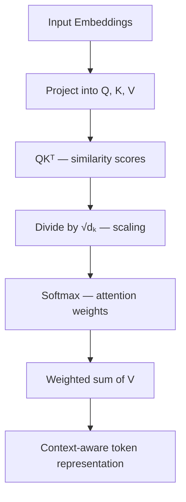

**Why scale by $\sqrt{d_k}$?** As $d_k$ grows, the variance of the dot product $QK^T$ grows roughly with $d_k$, so raw scores can become large. Large scores push softmax toward a near one-hot distribution, which (a) makes the model overconfident about a single token and (b) causes tiny gradients (vanishing gradients) because softmax saturates. Dividing by $\sqrt{d_k}$ keeps scores in a numerically stable range so softmax stays well-behaved and gradients flow properly.

**If scaling is removed:** dot products grow with $d_k$ → softmax saturates → attention becomes near one-hot → gradients vanish → training becomes unstable, especially for large $d_k$ (e.g., 64+, which is standard).

> **Quick Revision**
> - $QK^T$ = similarity scores → scale by $\sqrt{d_k}$ → softmax → weighted sum of $V$.
> - Keys decide *relevance*; Values carry the *information*.
> - No scaling ⇒ overconfident softmax ⇒ vanishing gradients.

---

### 2.2 Multi-Head Attention

**Why one head isn't enough:** A single attention head produces exactly one attention distribution per token, so it can only capture one type of relationship at a time (e.g., only pronoun resolution, or only verb-object linking).

**5-step pipeline:**
1. Project input into **multiple** lower-dimensional Q/K/V spaces — one set of learned matrices per head.
2. Each head independently computes Scaled Dot-Product Attention.
3. Each head produces its own output vector.
4. **Concatenate** all head outputs.
5. Apply a **final linear projection** $W^O$ to mix information across heads.

$$\text{head}_i = \text{Attention}(Q_i, K_i, V_i)$$
$$\text{MultiHead}(Q,K,V) = \text{Concat}(\text{head}_1, \dots, \text{head}_h)\,W^O$$

**Why split dimensions instead of using full width per head?** If $d_{model}=512$ and $h=8$, each head uses $d_k = 512/8 = 64$. This keeps total compute roughly the same as one full-width head while gaining $h$ independent "perspectives" — richer representations without a proportional compute increase.

**What different heads learn (emergent, not hand-designed):** syntax (subject–verb links), coreference/pronoun resolution, long-range dependencies, local context (e.g., "not happy"), semantic relationships (Paris↔France), and positional patterns.

**Complexity:** overall attention cost stays about $O(n^2 \cdot d_{model})$ — splitting into heads doesn't change the asymptotic cost, it changes what's learned.

> **Quick Revision**
> - Project → attend per head → concatenate → $W^O$ project.
> - Heads specialize automatically during training (no explicit supervision).
> - Concatenation (not averaging) preserves each head's unique signal; $W^O$ then blends them.

---

### 2.3 Positional Encodings

**Why needed:** Self-attention is *permutation-equivariant* — it has no built-in notion of token order. Shuffling the input tokens just shuffles the outputs correspondingly. Without positional information, "The cat chased the dog" and "dog the chased cat The" would look identical to attention.

#### Sinusoidal Positional Encoding (original Transformer, 2017)

$$PE_{(pos,2i)} = \sin\left(\frac{pos}{10000^{2i/d}}\right), \qquad PE_{(pos,2i+1)} = \cos\left(\frac{pos}{10000^{2i/d}}\right)$$

- A parameter-free mathematical function — works for any position, even unseen ones.
- Different embedding dimensions use different wavelengths, so the combination gives every position a near-unique "fingerprint."
- Nearby positions produce similar vectors (smooth), while trigonometric identities let the model infer **relative** distances from **absolute** encodings.

#### Learned Positional Embeddings
A trainable vector per position index (like a word embedding, but for position). More flexible, but **cannot generalize beyond the maximum trained length** — there's simply no learned vector for position 5000 if training capped at 2048.

#### Why sinusoidal encodings were phased out
Not because they were wrong for 2017, but because:
1. They're **absolute** — the model is told "you are token 47," when what usually matters is **relative** distance ("I am 2 tokens before you").
2. They're injected only once (added to the embedding) rather than directly inside the attention computation, so positional signal can dilute across many layers.

#### RoPE (Rotary Position Embedding) — dominant in modern LLMs
Instead of *adding* a position vector, RoPE **rotates** the Query and Key vectors by an angle proportional to their position, directly inside the attention computation:

$$\big(\text{Rotate}(Q,p_i)\big)\big(\text{Rotate}(K,p_j)\big)^T$$

Because rotating both vectors makes their dot product depend on the **angle difference** (i.e., **relative distance** $p_i - p_j$), attention naturally becomes relative-position-aware without ever storing a distance lookup table. Used in LLaMA, Qwen, DeepSeek, Mistral, Gemma, Phi, and most modern open-weight LLMs.

#### ALiBi (Attention with Linear Biases)
Adds a distance-proportional **penalty directly to attention scores** instead of touching Q/K: $QK^T + \text{bias}(\text{distance})$. The bias is more negative for farther tokens (magnitude differs per head), naturally favoring nearby tokens while still allowing long-range attention when needed. Extrapolates well to unseen lengths since it's a simple function of distance.

#### Absolute vs Relative

| Feature | Absolute (Sinusoidal / Learned) | Relative (RoPE / ALiBi) |
|---|---|---|
| Represents | Exact token index | Distance between tokens |
| Generalizes to longer contexts | Usually limited | Much better |
| Injected where | Added to embeddings (once) | Inside attention computation |
| Dominant in modern LLMs | ❌ | ✅ |

> **Quick Revision**
> - No positional info ⇒ attention treats input as an unordered set.
> - Sinusoidal: parameter-free, smooth, but absolute.
> - Learned: flexible, but poor extrapolation.
> - RoPE: rotates Q/K → relative distance baked into attention → best long-context extrapolation.
> - ALiBi: adds a distance-based bias directly to attention scores.

---

### 2.4 Residual Connections & Layer Normalization

**Why deep Transformers (80–100+ layers) are trainable at all:** two ideas — residual connections and LayerNorm.

**Residual (skip) connection:**
$$y = x + F(x)$$
Instead of replacing the input, the sub-layer's output is *added* to it. If a layer hasn't learned anything useful yet, $F(x) \approx 0$ and the layer behaves like identity — so stacking more layers can't easily make things worse, and gradients get a direct shortcut path back through the network (fixing vanishing gradients).

**Layer Normalization:** normalizes the features of **each token independently** (not across the batch, unlike BatchNorm):
$$\hat{x} = \frac{x - \mu}{\sqrt{\sigma^2 + \epsilon}}, \qquad y = \gamma\hat{x} + \beta$$

| | BatchNorm | LayerNorm |
|---|---|---|
| Normalizes across | The batch dimension | Each token's own features |
| Depends on batch size? | Yes | No |
| Used in Transformers? | ❌ | ✅ |

**Post-Norm (original 2017 Transformer):**
$$y = \text{LayerNorm}(x + \text{Attention}(x))$$
Works for shallow models but becomes unstable as depth grows — gradients must pass through LayerNorm after every residual add.

**Pre-Norm (nearly all modern LLMs — GPT-style, LLaMA, Mistral, Gemma, Qwen, DeepSeek):**
$$y = x + \text{Attention}(\text{LayerNorm}(x))$$
The residual path stays a nearly-clean identity map, so gradients flow through many layers with minimal obstruction — far more stable for very deep models.

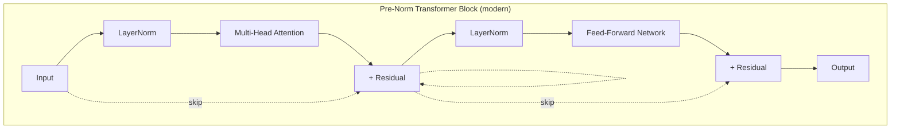

> **Quick Revision**
> - Residual: $y = x + F(x)$ → direct gradient highway, layers can default to identity.
> - LayerNorm: normalizes per-token, not per-batch.
> - Post-Norm = original (LayerNorm after residual) → unstable at depth.
> - Pre-Norm = modern standard (LayerNorm before sub-layer) → stable deep training.

---

### 2.5 Transformers vs RNN/LSTM: Parallelization

**RNN/LSTM bottleneck:** hidden state $h_t = f(x_t, h_{t-1})$ — computing $h_t$ requires $h_{t-1}$, forcing strictly **sequential** processing. Even with unlimited GPUs, you cannot compute token 500 before token 499 finishes. GPUs sit idle waiting on this dependency chain.

**Transformers remove recurrence entirely.** All tokens attend to each other via matrix multiplication, so an entire sequence can be processed **in parallel during training** — a perfect fit for GPUs, which are built for large matrix multiplications.

| Feature | RNN/LSTM | Transformer |
|---|---|---|
| Processing | Sequential | Parallel (training) |
| Dependency | Previous hidden state | Self-attention over all tokens |
| GPU utilization | Poor | Excellent |
| Long-range dependencies | Difficult (vanishing memory) | Much better |
| Complexity | $O(n)$ sequential steps | Attention: $O(n^2)$ memory & compute |

**The trade-off — quadratic attention:** for sequence length $n$, the attention matrix $QK^T$ has shape $n \times n$, so **both memory and compute scale as $O(n^2)$**. Doubling context length ≈ 4× the attention cost. Modern systems mitigate this with FlashAttention, sparse/sliding-window attention, Multi-Query/Grouped-Query Attention (MQA/GQA), etc.

**Training vs Inference parallelism (common trick question):**
- **Training:** fully parallel across all sequence positions (the whole sequence is already known).
- **Inference (generation):** still **sequential** across generated tokens — token $t+1$ needs token $t$ — but the computation *within* each decoding step is still highly parallel matrix math.

> **Quick Revision**
> - RNN: sequential ⇒ poor GPU use. Transformer: parallel training ⇒ fast, scalable.
> - Trade-off: attention is $O(n^2)$ in memory & compute.
> - Training is parallel; autoregressive decoding is still sequential token-by-token.

---

### 2.6 Encoder-only vs Decoder-only vs Encoder-Decoder

| Architecture | Context | Best for | Examples | Why chosen |
|---|---|---|---|---|
| **Encoder-only** | Bidirectional (full sentence at once) | Classification, NER, embeddings, extractive QA | BERT, RoBERTa, DeBERTa, E5/GTE embedding models | Deep understanding of one passage |
| **Decoder-only** | Causal (only past tokens) | Chat, generation, code, reasoning | GPT-4o, Claude, LLaMA, Qwen, Mistral, DeepSeek | Simple, scales beautifully, strong zero/few-shot |
| **Encoder-Decoder (seq2seq)** | Encoder bidirectional + Decoder causal | Translation, summarization, structured input→output | T5/Flan-T5, BART, mT5 | Deeply understand input, then generate a different-length output |

Decoder-only is dominant for modern chat/generative LLMs because next-token prediction alone scales extremely well and needs no special task-specific head.

### 2.7 Causal Masking & Cross-Attention

**Causal masking (decoder):** during training, the model sees the *full* target sentence at once (for parallel training), so it must be prevented from "cheating" by looking at future tokens when predicting the current one. A mask sets attention scores to $-\infty$ for all future positions before softmax, so each position can only attend to itself and earlier positions.

```
          I   love   AI
I         ✓    ✗     ✗
love      ✓    ✓     ✗
AI        ✓    ✓     ✓
```

The **encoder** has no causal mask — it sees the whole input bidirectionally, since there's nothing to "predict" there.

**Cross-attention (encoder–decoder models only):** the bridge between encoder and decoder — the decoder "asks questions" of the encoder's memory.

| Type | Query from | Key & Value from | Purpose |
|---|---|---|---|
| Self-attention (decoder) | Decoder | Decoder | Look at its own previous outputs |
| **Cross-attention** | Decoder | **Encoder** | Look at the source sequence |

Steps: (1) encoder produces Keys/Values for every input token; (2) the decoder's current hidden state becomes the Query; (3) $QK^T \to$ softmax $\to$ weighted sum of encoder Values gives a context vector; (4) this is fused into the decoder to help pick the next token.

---

## Part III — How LLMs Are Trained


| Stage | What it teaches |
|---|---|
| Pre-training | Language, world knowledge, reasoning *patterns* |
| SFT | How to follow instructions & format responses |
| Preference Optimization | Which of several valid answers humans actually prefer |

### 3.1 Pre-training: Causal Language Modeling

**Objective:** given previous tokens, predict the probability distribution of the next **token** (not necessarily the next word — tokens can be sub-words).

**Training loop:** logits over the vocabulary → softmax → probabilities → compare to the true next token via **Cross-Entropy Loss (Negative Log-Likelihood)**:

$$L = -\log\big(P(\text{correct token})\big)$$

Lower probability on the correct token ⇒ exponentially higher loss (e.g., $-\log(0.9)\approx0.10$ vs $-\log(0.01)\approx4.6$).

**Why such a simple objective produces broad intelligence:** accurately predicting the next token across trillions of diverse tokens *forces* the model to internalize grammar, facts, arithmetic patterns, code syntax, and multi-step reasoning patterns present in the text — because getting the next token right on "The capital of France is ___" requires actually "knowing" geography.

**Causal masking makes GPT a Causal Language Model (CLM):** each token can only attend to itself and earlier tokens (see [§2.7](#27-causal-masking--cross-attention)).

**GPT (Causal LM) vs BERT (Masked LM):**

| | GPT (decoder-only) | BERT (encoder-only) |
|---|---|---|
| Objective | Predict next token | Predict masked tokens |
| Attention | Causal (past only) | Bidirectional |
| Best for | Generation | Understanding / classification |

> **Quick Revision**
> - Objective: next-token prediction, loss = cross-entropy / NLL.
> - "Simple objective, emergent capability": solving it well requires learning grammar, facts, code, reasoning.
> - CLM = causal mask; BERT = bidirectional mask + masked-token prediction.

---

### 3.2 Tokenization

**Why not raw characters or whole words?**

| Granularity | Problem |
|---|---|
| **Word-level** | Huge/unbounded vocabulary, `<UNK>` for any unseen word, explodes across languages |
| **Character-level** | Tiny vocabulary but very long sequences → attention cost ($O(n^2)$) explodes |
| **Subword (used today)** | Best of both: open vocabulary + reasonable sequence length |

**Byte-Pair Encoding (BPE):** start from characters, repeatedly merge the *most frequent adjacent pair* into a new subword unit, until the target vocabulary size is reached. Unseen words like "unhappiness" can still be represented as known pieces (`un` + `happi` + `ness`) instead of `<UNK>`.

**SentencePiece:** learns subwords directly from raw Unicode text (no dependency on whitespace-separated words), making it language-independent — essential for Chinese/Japanese and multilingual models (used by T5, LLaMA-family, Gemma).

| | BPE | SentencePiece |
|---|---|---|
| Starts from | Space-separated words | Raw text stream |
| Whitespace-dependent | Yes | No |
| Good for | English | Multilingual |

**Special tokens:**
- **BOS** — beginning of sequence
- **EOS** — end of sequence (generation stops here)
- **PAD** — pads shorter sequences to equal batch length (ignored in loss)
- **UNK** — unknown token (rare with modern subword tokenizers)
- **Chat template tokens** — mark `system` / `user` / `assistant` turns

> **Quick Revision**
> - Word-level: too big / unseen words. Char-level: too long. Subword: sweet spot.
> - BPE: greedy pairwise merges. SentencePiece: raw-text, language-agnostic.
> - Special tokens structure the sequence for training/inference (BOS/EOS/PAD/UNK/chat roles).

---

### 3.3 Supervised Fine-Tuning (SFT)

A base (pre-trained) LLM is **not** a chatbot — it is a very good next-token predictor. Asked "Write a poem about India," it may continue with "Exercise 2: Write a poem about Japan…" because that's a common textbook pattern it learned. **SFT** fixes this by training on **high-quality instruction → response pairs**:

```
Instruction (+ optional input) → Desired Output
```

**Same architecture, same Cross-Entropy Loss as pre-training** — only the *data* changes: instead of predicting arbitrary internet continuations, the model predicts an ideal assistant response.

**Data sources:** human-written examples, synthetic data generated by stronger models (often reviewed/filtered), filtered high-quality web/educational data, and proprietary/internal datasets.

**What SFT does *not* teach:** new facts, grammar, or coding syntax — those come mostly from pre-training. SFT primarily teaches **behavior**: instruction-following, formatting, tone, helpfulness.

> **Interview trap:** *"Does SFT teach new knowledge?"* → Not primarily. Knowledge comes from pre-training; SFT teaches the model **how to use** that knowledge helpfully.

---

### 3.4 Instruction Tuning vs Chat Tuning

**Relationship:** Instruction Tuning and Chat Tuning are both **specific applications of SFT** — SFT is the *training method* (labeled input→output pairs + cross-entropy), while Instruction/Chat Tuning describe the *type of data and behavior* being taught.

```
Supervised Fine-Tuning (SFT)          ← the training method
   ├── Instruction Tuning              ← data: instruction → response
   ├── Chat Tuning                     ← data: system/user/assistant multi-turn
   ├── Code Fine-Tuning
   └── Domain-Specific Fine-Tuning
```

| | Instruction Tuning | Chat Tuning |
|---|---|---|
| Data format | `Instruction → Response` (usually single-turn) | `System → User → Assistant → User → Assistant …` |
| Teaches | Task completion (summarize, translate, code) | Conversational behavior: context retention, role-play, system-prompt adherence, tool use |
| Limitation alone | Feels unnatural in multi-turn chat | May be less capable at diverse standalone tasks |

**Chat templates:** conversations are converted to a structured token sequence before being fed to the model, e.g.:
```
<system> You are a helpful assistant. <user> Hi! <assistant> Hello! <user> Explain AI. <assistant>
```
The model predicts everything after the final `<assistant>` marker. Different model families (LLaMA-Instruct, Qwen-Chat, Gemma-IT, Mistral-Instruct) use different exact tokens, but the role-structuring idea is the same. **System prompts** are treated as higher priority than user messages (defining persona/behavior/constraints).

**Why modern models need both:** Instruction Tuning teaches *what task to perform*; Chat Tuning teaches *how to carry it out naturally across turns* (memory, system-prompt compliance, tool use, role-play). Production assistants combine both.

> **Quick Revision**
> - SFT = training method. Instruction/Chat Tuning = data flavors of SFT.
> - Instruction Tuning → single-turn task competence. Chat Tuning → multi-turn conversational competence.
> - Chat templates encode roles with special tokens; system prompts have top priority.

---

### 3.5 Preference Optimization (RLHF, DPO & Beyond)

SFT alone can't teach *which* of several equally "correct" responses is *better*. **Preference Optimization** aligns the model with human preferences (helpfulness, honesty, harmlessness) beyond mere instruction-following.

#### RLHF (Reinforcement Learning from Human Feedback)

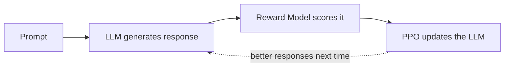

1. **Collect human preferences:** annotators rank multiple candidate responses (e.g., B > A).
2. **Train a Reward Model:** a separate network that takes (prompt, response) → scalar reward, learned from those rankings.
3. **Optimize the LLM with PPO** (Proximal Policy Optimization) to maximize the reward model's score.

**How PPO updates the model:** the LLM generates a response token-by-token; the reward model scores the *whole response* (positive or negative rewards are both valid). PPO then nudges up the probabilities of tokens that led to high-reward outputs and nudges down low-reward ones — but critically, it **limits how much the model's parameters change in any single update** ("proximal" = stay close to the previous policy). This matters because:
- A reward score alone doesn't tell you *how* to update billions of parameters — PPO is the optimization algorithm that turns a reward signal into a safe, gradual parameter update.
- Large unrestricted updates risk **catastrophic forgetting** and **reward hacking** (over-optimizing for a possibly-flawed reward model, e.g., the model starts making *everything* "funny" because the reward model over-rewarded humor).

**Problems with RLHF:** expensive human annotation, an extra reward model that can itself be wrong, and RL training is notoriously complex/unstable.

#### DPO (Direct Preference Optimization)

Skips the reward model *and* the RL loop entirely. Training data is simply `(prompt, chosen response, rejected response)` — pairs already labeled by humans or a stronger AI judge (**the model does not decide which is better; that label already exists in the dataset**). DPO directly increases $P(\text{chosen})$ and decreases $P(\text{rejected})$ via standard gradient descent — no reward model, no PPO.

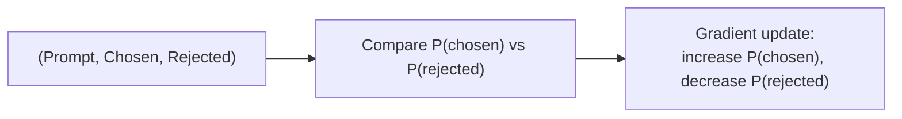

| | RLHF | DPO |
|---|---|---|
| Needs reward model? | Yes | No |
| Needs RL (PPO)? | Yes | No |
| Signal | Numeric reward score | Pairwise preference (chosen > rejected) |
| Complexity | High | Much lower |
| Stability | Can be unstable | More stable |

**Why DPO became popular:** simpler, cheaper, more stable, and often matches or beats RLHF quality — no separate reward model or RL loop to tune.

#### Other modern variants (high-level awareness)

| Method | Idea |
|---|---|
| **ORPO** | Combines SFT + preference optimization into a single training objective |
| **RLAIF** | Uses a strong AI model instead of humans to generate preference judgments (cheaper, scales, but can propagate teacher-model bias) |
| **IPO** | A refined, more stable variant of the direct-preference-optimization family |
| **KTO** | Learns from desirable/undesirable examples (inspired by prospect theory) rather than strict chosen/rejected pairs |

> **Quick Revision**
> - RLHF: human rankings → reward model → PPO. Complex, expensive, can be unstable.
> - DPO: `(chosen, rejected)` pairs → direct gradient update. No reward model, no RL.
> - PPO's role: safely convert a reward signal into small, stable parameter updates (prevents catastrophic/unstable jumps).
> - ORPO/RLAIF/IPO/KTO: know the *names and one-line idea*, not the math, for internship-level interviews.

---

## Part IV — Scaling Laws

**Core observation:** as model **parameters**, **training data (tokens)**, and **compute** increase together, training loss decreases in a smooth, predictable way (roughly a power-law relationship) — this was surprising because it made LLM improvements *predictable* rather than trial-and-error.

**Three scaling axes:** model size (parameters) · training data (tokens) · compute (FLOPs/GPU-hours). Increasing only one without the others wastes resources — e.g., a 70B model trained on only 5B tokens is under-trained and wastes its own capacity.

**Diminishing returns:** each further increase in scale yields progressively smaller gains (e.g., 1B→7B improves accuracy far more than 70B→700B).

**Chinchilla insight (compute-optimal training):** for a *fixed* compute budget, a smaller model trained on **proportionally more tokens** often outperforms a much larger model trained on too little data. Model size and training-token count should scale **together** — this is "compute-optimal training," and it shifted the field's focus from "just make it bigger" to balancing size and data.

**Why data quality matters more at scale:** a large model spends enormous compute learning whatever patterns are in the data — junk/duplicated/low-quality data wastes that capacity. Modern pipelines invest heavily in deduplication, filtering, and domain balance.

> **Quick Revision**
> - Scale = parameters + data + compute, increased together → predictable loss improvements.
> - Diminishing returns: bigger ≠ proportionally better.
> - Chinchilla: balance model size with token count for a fixed compute budget.
> - At scale, data **quality** often matters as much as data **quantity**.

---

## Part V — Inference Optimization & Serving

### 5.1 KV Cache

**Problem:** in autoregressive generation, every new token normally requires recomputing attention over the *entire* history from scratch — hugely wasteful, since previous tokens' Keys and Values never change once computed.

**KV Cache:** store the **Key and Value** tensors of every previously processed token (across all layers/heads) and reuse them. For each newly generated token, the model computes **Q, K, and V for that new token only**, uses its **Query immediately** to attend over *all* cached Keys (old + new), and then **appends the new K and V to the cache** for future tokens to use.

> **Common misconception clarified:** it's *not* "only compute Q for new tokens." The new token's **Q, K, and V are all computed** — the savings come from **not recomputing K/V for every previous token**, and from **never caching Queries** (a token's Query is used once, immediately, then discarded — future tokens never need it again).

**Prefill vs Decoding phases:**

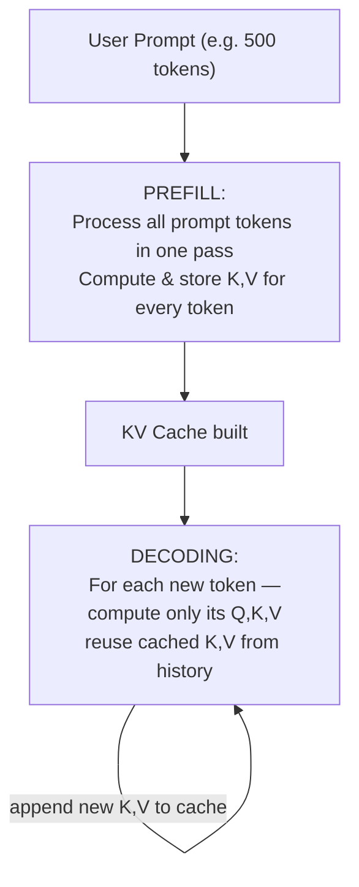

| | Prefill | Decoding |
|---|---|---|
| Runs | Once per request | Once per generated token |
| Processes | Entire input prompt (parallel) | One new token at a time |
| Cost driver | Compute-heavy (long prompt = slow) | Lighter per step, but cache grows |
| Determines | **Time To First Token (TTFT)** | Tokens/sec (throughput) |

**Memory cost:** the cache grows **linearly** with sequence length (per layer, per head) — long contexts consume large amounts of GPU memory, which is why techniques like PagedAttention exist (see [§5.3](#53-continuous-batching--pagedattention)).

> **Quick Revision**
> - Cache stores K & V only (not Q — Queries aren't reused).
> - Prefill = process whole prompt once (compute-bound, sets TTFT). Decoding = one token at a time, reusing cache (memory-bound growth).
> - Trade-off: much faster generation, but memory grows linearly with sequence length.

---

### 5.2 Quantization

**Definition:** reducing the numerical precision used to store model weights (and sometimes activations) — e.g., FP16 → INT8/INT4 — to shrink memory footprint and often speed up inference, at the cost of some accuracy loss.

**Why it matters:** a 7B model in FP16 needs ≈14 GB just for weights; a 70B model needs 140GB+ — beyond most consumer/single GPUs. Quantization makes large models deployable on smaller hardware.

| Format | Bits | Memory (7B model) | Quality impact |
|---|---|---|---|
| FP16/BF16 | 16 | ~14 GB | Baseline |
| INT8 | 8 | ~7 GB | Very small loss |
| INT4 | 4 | ~3.5–4 GB | Small-to-moderate loss (method-dependent) |

**Post-training quantization (PTQ) methods:**
- **GPTQ** — quantizes weights layer-by-layer, minimizing reconstruction error; no retraining needed.
- **AWQ (Activation-Aware Weight Quantization)** — identifies which weights matter most to *activations* and protects them from aggressive quantization, generally preserving quality better than naive INT4.
- **GGUF** — **not a quantization algorithm** — it's a **model file format** (used by `llama.cpp`) that can bundle weights (in various quant levels), tokenizer, and metadata for efficient local/CPU inference.

**Weight-only vs activation quantization:**

| | Weight-only | Activation quantization |
|---|---|---|
| Quantizes | Stored weights only | Weights + intermediate activations |
| Complexity | Simple, stable | Harder — activations vary per input |
| Common for LLM inference? | ✅ Most common | Used in some optimized engines |

> **Quick Revision**
> - Quantization trades precision for memory/speed; INT4 saves the most memory but risks more quality loss than INT8.
> - GPTQ / AWQ = post-training quantization *algorithms*. GGUF = a *file format* (llama.cpp), not an algorithm.
> - Weight-only quantization is the standard approach for most LLM inference.

---

### 5.3 Continuous Batching & PagedAttention

**Static batching's real flaw is *not* padding — it's that the batch is fixed for its entire lifetime.** If one request in a batch of 3 finishes early, that GPU "slot" sits **idle** until the *longest* request in the batch also finishes; a newly-arrived request must wait for the *whole batch* to complete before it can start — even though there was capacity.

**Continuous batching:** requests can leave the batch the instant they finish, and new requests are inserted into the freed slot **immediately** — no waiting, GPU stays busy almost continuously.

```
Static:      A███ Done    B███████ Done      C██████████ Done   D waits......███████
Continuous:  A███ Done → D████████  |  B███████ Done → E████  |  C██████████ Done → F...
```

**PagedAttention (vLLM):** solves a *different* problem — **KV-cache memory fragmentation**. Traditionally each request's KV cache is one large contiguous memory block; as requests of different lengths finish and free memory at different times, "holes" appear that are too small/misaligned for new requests (fragmentation), even if total free memory is sufficient. PagedAttention borrows the OS-virtual-memory idea: KV cache is split into small **fixed-size pages** that can live **anywhere** in GPU memory, tracked via a page table — no requirement for contiguous allocation. This also enables **prefix sharing** (identical shared prompt prefixes across requests reuse the same pages instead of duplicating them).

> Note: PagedAttention changes **how the KV cache is stored/accessed in memory**, not the attention math itself.

| Technique | Solves |
|---|---|
| Continuous Batching | GPU idle time from fixed batch scheduling |
| PagedAttention | KV-cache memory fragmentation & inefficient allocation |

> **Quick Revision**
> - Continuous batching = *dynamic scheduling* (swap finished requests for new ones instantly) — the core win is keeping the GPU busy, not padding removal.
> - PagedAttention = non-contiguous, page-based KV-cache memory management (OS-paging analogy) → less fragmentation, supports prefix sharing.
> - Together they're the backbone of high-throughput serving engines like vLLM.

---

### 5.4 Speculative Decoding

**Idea:** use a small, fast **draft model** to propose several future tokens at once; the large **target model verifies** them, accepting matches and regenerating from the first mismatch.

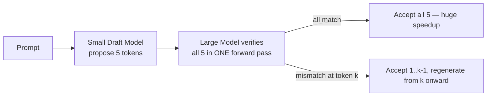

**Why verifying 5 tokens is cheaper than generating 5 tokens (the key insight):** normal generation is inherently **sequential** — token 2's prediction needs to know token 1 first, so producing 5 tokens takes **5 separate decoding iterations** of the large model. But once the draft model *proposes* a candidate 5-token continuation, that whole sequence is **already known**, so the large model can evaluate it exactly like a prefill step — **one parallel forward pass** over all 5 positions (using causal masking), instead of 5 sequential ones. **Generation is sequential because future tokens are unknown; verification is parallel because the candidate future tokens are already provided.**

**The large model always has final say** — a wrong draft token is simply rejected and regenerated correctly, so output quality matches what the large model would have produced alone.

**When it helps:** draft model is small/fast *and* has a high acceptance rate (predictions closely match the target model). **When it doesn't help:** draft model is inaccurate → most tokens rejected → large model ends up doing almost all the work anyway, and the draft model's cost becomes pure overhead.

> **Quick Revision**
> - Draft proposes multiple tokens → target verifies in one parallel pass → accept/reject.
> - Speedup source: sequential generation (n steps) replaced by one parallel verification pass.
> - Output correctness is unaffected — the large model still gates every accepted token.
> - Works well only when the draft model's acceptance rate is high.

---

### 5.5 Context Length Extension (RoPE Scaling, YaRN, ALiBi)

**Why context is limited:** self-attention computes an $n\times n$ score matrix, so both compute ($O(n^2 d)$) and memory ($O(n^2)$) scale **quadratically** with sequence length $n$. Doubling context ≈ 4× the attention cost, plus a much larger KV cache.

**Hard limit vs soft limit:**
- **Hard limit** — the architecture literally cannot go beyond it (e.g., a model with only 2048 *learned* absolute position embeddings has no vector for position 2049).
- **Soft limit** — RoPE-based models *can* mathematically compute rotations for any position, but were only ever **trained** on a limited range, so quality **degrades** (not fails) beyond that range — a training-distribution problem, not a mathematical inability.

**How RoPE scaling / interpolation extend context without retraining:**
Naive scaling maps a longer actual position range down into the model's familiar trained range, e.g., dividing every position index by 4 so position 32768 "looks like" position 8192 to the rotation function. **Positions don't overlap or collide** — 8 and 32 still map to different values (2 and 8) — what's lost is **resolution**: adjacent tokens end up mapped to angles that are closer together than they were originally, like zooming out on a map (cities don't merge, but they appear closer).

**Position Interpolation** is essentially this same idea made explicit: instead of feeding RoPE integer positions like `0,1,2,3…`, feed **fractional** positions like `0, 0.25, 0.5, 0.75, 1…` — legal because sine/cosine are continuous functions, not restricted to integers. In its simplest (linear) form, Position Interpolation and basic "RoPE scaling" are the **same mathematical operation** — the terms diverge only once you consider *smarter, non-uniform* scaling rules.

**NTK-aware scaling:** naive linear scaling compresses **every** RoPE frequency equally, which blurs *local* token relationships (nearby positions become too close together) even while it helps extend the *global* range. NTK-aware scaling instead scales **different RoPE frequencies differently** — preserving high-frequency (local/nearby) detail more faithfully while still compressing enough to extend range — much like an audio equalizer adjusting bass/mid/treble independently rather than turning the whole volume down uniformly.

**YaRN ("Yet another RoPE extensioN"):** builds on NTK-aware-style scaling plus a small amount of additional lightweight fine-tuning/adaptation, generally giving the best quality retention at extended context lengths among these techniques.

**ALiBi:** rather than manipulating position encodings at all, adds a distance-based linear bias straight into attention scores — naturally extrapolates to longer sequences since it's just a function of distance (see [§2.3](#23-positional-encodings)).

| Method | Core idea |
|---|---|
| RoPE Scaling (linear) / Position Interpolation | Compress/remap position indices into the trained range (same basic math) |
| NTK-aware Scaling | Scale different RoPE frequencies non-uniformly to protect local detail |
| YaRN | NTK-aware scaling + lightweight fine-tuning for better quality |
| ALiBi | Distance-based linear bias added directly to attention scores |

**Trade-offs of extending context:** more KV-cache memory, higher latency, and possible quality degradation — e.g., the **"lost in the middle"** phenomenon, where models attend less effectively to information buried deep within a very long context.

> **Quick Revision**
> - Attention is $O(n^2)$ ⇒ context length is fundamentally expensive to extend.
> - Hard limit = architectural ceiling. Soft limit = works, but quality drops beyond training distribution.
> - RoPE scaling ≈ Position Interpolation for the simple linear case; NTK-aware & YaRN are smarter, non-uniform refinements.
> - Longer context ⇒ more memory + latency + possible "lost in the middle" quality loss.

---

## Part VI — Embeddings & Vector Search

### 6.1 Contrastive Learning for Embeddings

**Goal:** learn a semantic vector space where texts with similar meaning are **close together** and unrelated texts are **far apart** — enabling similarity search instead of exact keyword matching.

**Positive pairs** (should end up close): a query and its relevant document, a question and its correct answer, two paraphrased sentences, or a retrieved chunk the user marked helpful.

**Negative pairs** (should end up far apart):
- **In-batch negatives** — free and efficient: within a training batch of `(query_i, doc_i)` pairs, every *other* document in the batch automatically serves as a negative for `query_i`. No need to hand-mine negatives.
- **Hard negatives** — semantically *similar* but incorrect examples (e.g., query "Python programming" vs document "Python snake") that force the model to learn fine-grained distinctions; far more useful for training than "easy" unrelated negatives.

**Loss (InfoNCE, intuition only):** increase the similarity of the positive pair while decreasing similarity to all sampled negatives, computed via cosine similarity between encoded vectors.

**Bi-Encoder vs Cross-Encoder:**

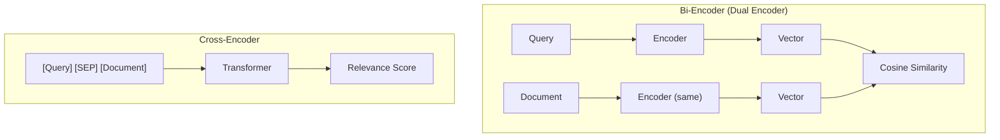

| | Bi-Encoder | Cross-Encoder |
|---|---|---|
| Encoding | Query & document encoded **independently** | Query + document processed **together** |
| Speed | Fast — document embeddings precomputed | Slow — no precomputation possible |
| Scale | Millions of documents | Only a small candidate set |
| Accuracy | Approximate | Much more accurate (captures fine interactions) |
| Used for | Initial retrieval (vector search) | Re-ranking top candidates |

**Why re-ranking uses *two* models (bi-encoder → cross-encoder):** a bi-encoder can search millions of precomputed document vectors in milliseconds but only produces an *approximate* ranking, since it never lets the query and document "interact." A cross-encoder reads query+document jointly and models their interaction far more accurately — but it's too slow to run over millions of documents (it can't precompute anything, since the pairing changes per query). The standard production pattern: bi-encoder retrieves a broad Top-K (e.g., 20–50) cheaply, then a cross-encoder re-ranks just that small set for a much better final ordering before sending the Top-5 to the LLM.

> **Quick Revision**
> - Contrastive learning: pull positives together, push negatives apart (InfoNCE-style loss).
> - In-batch negatives = free/efficient; hard negatives = most useful for discrimination.
> - Bi-encoder = fast retrieval at scale (precomputed). Cross-encoder = accurate re-ranking of a small candidate set.

---

### 6.2 Similarity Metrics

| Metric | Measures | Sensitive to magnitude? | Typical use |
|---|---|---|---|
| **Cosine Similarity** | Angle between vectors | ❌ No (scale-invariant) | Default for semantic search / RAG |
| **Dot Product** | Alignment × magnitude | ✅ Yes (unless normalized) | Fast search on **normalized** embeddings |
| **Euclidean Distance** | Straight-line distance | ✅ Yes | Geometry/clustering; less common for text |

$$\text{Cosine}(A,B) = \frac{A \cdot B}{\lVert A \rVert \lVert B \rVert}$$

**Why cosine dominates for text embeddings:** semantic meaning is primarily encoded in a vector's **direction**, not its length — two sentences with identical meaning but different embedding magnitudes should still be judged "identical." Cosine similarity ignores magnitude entirely.

**Cosine ≡ Dot Product when vectors are normalized** (unit length, $\lVert A\rVert=\lVert B\rVert=1$): $\frac{A\cdot B}{1\times1}=A\cdot B$. This is why many vector databases use raw dot product internally for speed — as long as embeddings were normalized beforehand. **Practical bug:** switching a similarity metric from cosine to dot product *without* normalizing embeddings silently corrupts ranking, since document magnitude starts influencing relevance.

Euclidean distance is less useful for high-dimensional text embeddings because of the curse of dimensionality — distances become less discriminative, and direction (which cosine captures) is a more meaningful semantic signal than raw distance.

> **Quick Revision**
> - Cosine = angle only (scale-invariant) → default for embeddings.
> - Dot product = cosine × magnitude; equals cosine **only if normalized**.
> - Euclidean = straight-line distance; less common for high-dimensional text.
> - Always confirm whether your vector DB expects normalized embeddings.

---

### 6.3 Dimensionality & Model Choice

**Higher dimensions = more representational capacity**, but with real costs: more memory/storage (roughly linear — e.g., 384-dim ≈1.5KB/vector vs 1536-dim ≈6KB/vector at FP32, ×1M docs = 1.5GB vs 6GB), slower similarity search, and diminishing returns unless the model was trained with enough data to actually use that capacity.

| Dimension | Trade-off |
|---|---|
| 384 | Fast, compact, lower capacity |
| 768 | Good balance — common default |
| 1536 | Richer semantics, higher cost |
| 3072 | Highest capacity, largest storage/latency cost, often diminishing returns |

**Static vs Contextual embeddings:**

| | Static (Word2Vec, GloVe) | Contextual (Transformer-based) |
|---|---|---|
| Same word → same vector? | ✅ Always | ❌ Varies by context |
| Handles polysemy ("bank": river vs finance)? | ❌ No | ✅ Yes — attention over surrounding words disambiguates meaning |
| Standard today? | Rare | ✅ Yes |

Modern embedding models (e.g., OpenAI's `text-embedding-3-*`) are **contextual** — the same word gets a different vector depending on the sentence, and models typically offer multiple size tiers (e.g., 1536-dim "small" vs 3072-dim "large").

**Domain-specific vs general-purpose:** a smaller model trained/fine-tuned on domain vocabulary (legal, medical, code) frequently **outperforms** a much larger general-purpose model on that domain, because it has learned the terminology and relationships specific to it — model *fit* to language/domain matters more than raw dimensionality.

> **Quick Revision**
> - More dimensions ⇒ more capacity, but more storage/latency; diminishing returns beyond a point.
> - Static embeddings: one vector per word, no context-awareness. Contextual: vector depends on surrounding words.
> - Match the embedding model to your language & domain — bigger is not automatically better.

---

### 6.4 Vector Databases & Indexing

A **vector database** stores embeddings and answers "find the top-k most similar vectors" queries efficiently — critical for RAG, since brute-force comparison against millions/billions of vectors would be far too slow.

**Indexing strategies (Approximate Nearest Neighbor / ANN — trade a little accuracy for large speed gains):**

| Index | Core idea | Speed | Memory | Recall | Best for |
|---|---|---|---|---|---|
| **Flat / Brute-force** | Compare against every vector | Slow | Low | 100% (exact) | Tiny datasets (<50k), prototyping |
| **IVF** (Inverted File) | Cluster vectors (k-means-like); search only relevant clusters | Fast | Medium | Good–very good | Balanced medium/large datasets |
| **HNSW** (Hierarchical Navigable Small World) | Multi-layer proximity graph; "hop" quickly toward nearest neighbors | Very fast | High | Excellent | High-accuracy, in-memory workloads |
| **PQ / IVF-PQ** (Product Quantization) | Compress vectors into small codes; approximate distances | Very fast | Very low | Good (tunable) | Memory-constrained, huge datasets |
| **DiskANN / Vamana** | Graph index optimized to live on SSD/disk | Fast (disk) | Low–medium | Very good | Massive datasets that don't fit in RAM |
| **LSH** | Hash similar vectors into the same buckets | Very fast | Low | Medium–good | High-speed/low-precision needs |
| **Tree-based** (KD-tree, Annoy) | Recursive space partitioning | Medium–fast | Medium | Good (low-dim) | Legacy / low-dimensional data |

**Choosing an index — key questions:** scale (vector count), latency target (p95), recall requirement, RAM budget, update frequency (frequent upserts favor IVF/DiskANN over pure HNSW, which is costlier to rebuild), language/domain (multilingual/code needs specialized embedding models), and how much metadata filtering you need.

**Common production mistakes:**
1. **Naive fixed-size chunking** (no overlap, breaks context mid-idea) → see [§7.4](#74-chunking-strategy).
2. **Stale/mismatched embedding model** for the domain/language → poor recall even when the answer exists.
3. **Ignoring metadata & filters** (date, source, access level) → noisy or outdated retrieval.
4. **Poor indexing choices at scale** — using default HNSW on huge collections without tuning `M`/`efConstruction`, or assuming everything fits in RAM → OOM, latency spikes.

> **Quick Revision**
> - ANN indexes trade small recall loss for large speed gains — pick based on scale / latency / recall / RAM / update-rate needs.
> - HNSW: fast + accurate, memory-hungry. IVF: balanced. PQ: very compressed. DiskANN: huge, disk-resident datasets.
> - Common failure causes: bad chunking, wrong embedding model, no metadata filtering, untuned index at scale.

---

## Part VII — Retrieval-Augmented Generation (RAG)

### 7.1 RAG Fundamentals

LLMs have two structural weaknesses: (1) their knowledge is frozen at training time (stale/outdated facts, hallucination risk), and (2) they don't know your private/company data unless retrained (expensive). **RAG = give the LLM a "search engine" over your own documents before it answers.**

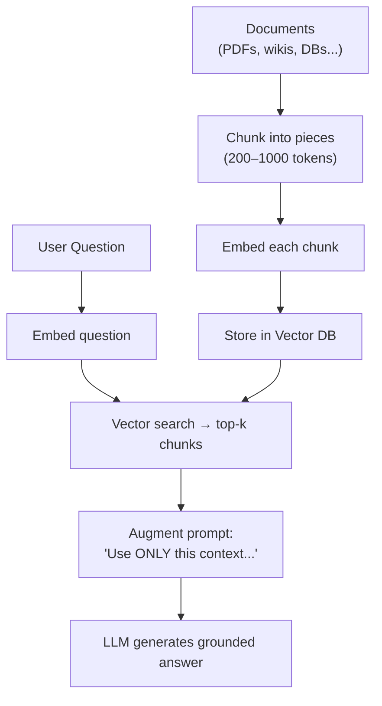

1. **Chunk** documents into small pieces (typically 200–1000 tokens).
2. **Embed** each chunk with an embedding model → store vectors (+ original text + metadata) in a vector DB.
3. **Retrieve**: embed the user's question → vector search → top-k most similar chunks (~0.1–1 sec).
4. **Augment**: insert retrieved chunks into the prompt (e.g., *"Use ONLY the following context to answer; do not invent facts."*).
5. **Generate**: LLM answers grounded in real retrieved evidence.

> See also: [Chunking Strategy](#74-chunking-strategy), [Hybrid Search](#72-hybrid-search-dense--sparse), [Vector Databases](#64-vector-databases--indexing), [RAG vs Fine-Tuning](#78-rag-vs-fine-tuning-vs-both).

---

### 7.2 Hybrid Search (Dense + Sparse)

**Dense retrieval (embeddings)** captures *semantic* meaning — it can match "reset password" to "forgot credentials" even with zero shared keywords. But it's **weak at exact-match terms**: product IDs (`EMP-78231`), error codes (`ERR_0x91AF`), invoice numbers, chemical formulas, or rare technical strings — embeddings can place near-identical-looking but *semantically distinct* codes close together (e.g., `ERR_0x91AF` vs `ERR_0x91B0`), which is unacceptable when exact identity matters.

**Sparse retrieval (BM25 / TF-IDF)** matches on **exact keywords**, weighting rare/discriminative terms higher — excellent for IDs, codes, names, and rare terminology, but blind to synonyms/paraphrasing ("reset" vs "forgot" — no shared tokens).

**Hybrid Search** combines both signals:

| Fusion method | How it works |
|---|---|
| **Weighted score fusion** | `final_score = α·dense_score + (1-α)·sparse_score` (tune α per application) |
| **Reciprocal Rank Fusion (RRF)** | Combine *rankings* (not raw scores) from each method — robust when score scales differ; documents that rank well across multiple methods rise to the top |

**When pure dense is enough:** semantic-only tasks like movie/content recommendations or general research summarization, where exact terms rarely matter. **When hybrid is essential:** documents containing product names, version numbers, error codes, employee/legal/medical IDs, or other exact identifiers alongside natural-language content.

> **Quick Revision**
> - Dense: understands *meaning*, misses exact IDs/codes. Sparse (BM25): exact keyword match, misses synonyms.
> - Hybrid = combine via weighted fusion or **Reciprocal Rank Fusion**.
> - Rule of thumb: hybrid whenever both "meaning" and "exact strings" matter in your documents.

---

### 7.3 Re-ranking in Practice

The bi-encoder → cross-encoder re-ranking pattern is explained in depth in [§6.1](#61-contrastive-learning-for-embeddings). In production RAG pipelines, re-ranking is almost always applied after initial vector retrieval (e.g., retrieve top 20–50 → re-rank → keep top 3–5 for the LLM). Popular re-rankers: **Cohere Rerank** (strong, fast, hosted), **bge-reranker** (open-source), **FlashRank** (very fast/cheap, CPU-friendly), **Jina Reranker** (long-document & multilingual).

**Query transformation** can also improve retrieval before it even hits the index:

| Technique | Idea |
|---|---|
| **HyDE** | Ask the LLM to write a *hypothetical ideal answer*, then embed *that* (often more similar to real answers than the raw question) |
| **Step-back prompting** | Ask the LLM to generalize/abstract the question first |
| **Multi-query** | Generate 3–5 paraphrased versions of the question, retrieve for each, merge results |
| **RAG-Fusion** | Multi-query + intelligent result merging (e.g., RRF) |
| **Query decomposition** | Break a complex question into 2–4 simpler sub-questions |

---

### 7.4 Chunking Strategy

No single chunk size is universally correct — it depends on document type and must be validated with real queries.

| Strategy | Description |
|---|---|
| **Fixed-size** | Split every N tokens (256 / 512 / 1024) — simple, but can cut sentences/ideas in half |
| **Semantic** | Split at natural meaning boundaries (headings, paragraphs) — better quality, costs more preprocessing |
| **Recursive** | Try splitting at the *highest* boundary first (heading → paragraph → sentence → word), falling back only if a piece still exceeds the max size — a popular production default |
| **Proposition-based** | Split into small, independent factual statements — very clean, but newer/more complex |

**Rules of thumb:**

| Chunk size | When to use |
|---|---|
| **256–512 tokens** | Short, self-contained factual docs — FAQs, API docs, policies |
| **512–1024 tokens** | Long-form reasoning — research papers, books, legal contracts, where ideas span multiple paragraphs |

**Overlap (usually 10–20%, i.e., ~50–200 tokens):** prevents a sentence or idea that straddles a chunk boundary from being split so that *neither* chunk contains the full thought. Too much overlap (e.g., 50%) wastes storage and produces redundant retrieval; too little risks losing boundary-spanning context.

> Always validate chunk size empirically against **your own** documents and real user queries — no chunking theory replaces measured retrieval accuracy.

---

### 7.5 Multimodal RAG

Plain-text RAG **loses non-text content** (charts, figures, tables, diagrams) during text extraction — a graph's visual trend disappears if only OCR'd headers survive. Multimodal RAG retrieves **text and visual content together**.

**Indexing images — three complementary options:**

| Approach | What's stored | Trade-off |
|---|---|---|
| **Image embeddings** | Vision-encoder embedding of the image | Rich visual detail; different embedding space than text (needs alignment, e.g., CLIP-style) |
| **Captions** | Auto-generated text description | Cheap, reuses standard text-embedding pipeline; can lose fine visual detail |
| **OCR** | Text extracted from within the image (e.g., invoice numbers) | Recovers embedded text but not visual structure |

Production systems often store **all three** for best coverage.

**Pipeline:**
```
PDF → split → [Text: chunk → embed] + [Images: caption/OCR/vision-embed]
    → unified Vector DB → retrieve text + images together
    → pass to a Vision-Language Model → grounded answer
```

**Challenges:** aligning text and image embedding spaces (often solved via CLIP-style contrastive training so both live in comparable vector space), the higher storage cost of image embeddings, and the inference cost of calling a vision model — mitigated by only invoking the vision model when retrieval signals it's actually needed (e.g., caption-based retrieval first, full vision-model reasoning only on the final candidates).

> See also: [Vision-Language Models](#111-how-vision-language-models-work).

---

### 7.6 Latency vs Cost vs Quality Trade-offs

There is no single "best" RAG configuration — only the best trade-off for a given product. Every major lever pushes quality up at the cost of latency and/or spend:

| Lever | ↑ Quality | ↑ Latency | ↑ Cost |
|---|---|---|---|
| Increase `top_k` (retrieved chunks) | Yes, up to a point (irrelevant chunks can *hurt* past that) | Yes | Yes |
| Larger/better embedding model | Yes | Yes | Yes |
| Add a re-ranker | Yes | Yes | Yes |
| Larger LLM | Yes | Yes | Yes |
| Lower temperature (factual tasks) | Groundedness ↑ | ~neutral | ~neutral |
| Reduce `max_tokens` | ~neutral/slight ↓ | ↓ | ↓ |
| **Add caching** for repeat queries | Unaffected (same answer) | ↓↓ | ↓↓ |

**Practical guidance:** a medical assistant should bias toward quality even at higher latency; a customer-support FAQ bot should bias toward low latency/cost with a smaller model, tight `top_k`, and aggressive caching; most production systems land on a **balanced** configuration (moderate `top_k`, medium embedding model, re-ranker on, mid-size LLM, capped `max_tokens`, caching for frequent queries).

---

### 7.7 Monitoring & Observability

Debugging a live RAG/agent system without logs is guesswork. Log at every pipeline stage so failures can be traced to their true source:

| What to log | Why |
|---|---|
| **Query + retrieved chunks + final answer** | Separates *retrieval* failures from *generation* failures — most RAG problems originate in bad retrieval, not a "dumb" LLM |
| **Latency breakdown** (embedding, retrieval, re-rank, LLM, total) | Total latency tells you *that* it's slow; component breakdown tells you *why* |
| **Token usage & cost per request** | Detects cost spikes (e.g., prompts silently growing) before the bill does |
| **User feedback** (👍/👎, regenerations, edits) | Regeneration = strong *implicit* negative signal even without an explicit downvote |
| **Faithfulness / hallucination signals** | Detect grounding failures at scale, often via an LLM-as-judge |
| **Error rates & tool-call failures** (agents) | Debug planner mistakes, API failures, infinite loops |

**Example diagnosis:** users report bad answers → check retrieved chunks first (often the real culprit) → compare answer against retrieved evidence for hallucination → check for recent embedding-model or prompt changes → only then suspect the LLM itself.

---

### 7.8 RAG vs Fine-Tuning vs Both

**Decision heuristic:** ask whether the problem needs **new knowledge** or **new behavior**.

- **New knowledge** (facts change, private/company docs, current events) → **RAG**. The model's weights don't change; you just swap what's retrieved.
- **New behavior** (tone, output format, domain reasoning style) → **Fine-tuning**. The model's weights change, so it *consistently* behaves differently.
- **Both needed** (e.g., a medical/legal assistant needing current facts *and* expert reasoning style) → combine RAG + a fine-tuned model.

| Scenario | Prefer |
|---|---|
| Knowledge changes frequently (policies, prices) | ✅ RAG |
| Private / company documents | ✅ RAG |
| Need a specific tone, format, or reasoning style | ✅ Fine-tuning |
| Fixed structured output (JSON schema) | ✅ Fine-tuning |
| Very specialized domain reasoning (medical/legal) | ⚠️ Sometimes both |
| Cost-sensitive + fast iteration | ✅ RAG |
| Highest quality on a narrow, stable task | ✅ Fine-tuning (+ RAG for facts) |

| | RAG | Fine-tuning |
|---|---|---|
| Update speed | Minutes (re-index) | Days–weeks (retrain) |
| Cost | Low–medium | High (GPU hours, curated data) |
| Freshness | Always current | Frozen at training time |
| Hallucination reduction | Good (grounds in real text) | Good, but can still hallucinate |
| Style/format control | Medium (prompt-dependent) | Excellent |
| Latency | Slightly higher (retrieval + generation) | Lower (generation only) |

> **Interview line to remember:** *"Fine-tuning primarily teaches the model how to behave; RAG gives the model up-to-date knowledge at inference time."* Most production teams default to RAG (80–90% of real use cases) and add fine-tuning only when tone/format/domain-reasoning quality genuinely requires it.

---

### 7.9 System Design Walkthrough: Choosing an Embedding Model & Index

A classic system-design interview question: *"You're building RAG over 50 million legal documents — which embedding model and index would you choose, and why?"* The interviewer is testing your **decision process**, not whether you can recite "HNSW." There is no universal "best" embedding model or index — like choosing a vehicle (an F1 car, an SUV, and a delivery truck all "win" at different jobs), the right choice depends entirely on the constraints.

**These are two independent decisions:**

> **Embedding model** answers *"how do I represent meaning?"* — driven by **language, domain, and budget**.
> **Index** answers *"how do I search quickly?"* — driven by **scale, latency, recall, memory, and update frequency**.

You can freely mix and match: e.g., an OpenAI embedding + HNSW, or a domain-specific open-source embedding + IVF-PQ — the embedding model doesn't dictate the index choice.

**Step 1 — Choosing the embedding model:**

| Question | Guidance |
|---|---|
| What language(s)? | English-only → almost any embedding model works. Multiple languages (e.g., Hindi + English) → use a **multilingual** embedding model, or a query like "भारत की राजधानी" and a document "Capital of India is Delhi" may not be recognized as equivalent. |
| What domain? | Highly specialized terminology (medical, legal, finance, code) → a **domain-specific** embedding model often beats a larger general-purpose one (e.g., "STEMI treatment" matches poorly against general embeddings but well against medical-tuned ones). |
| What's the budget? | Tight/no budget → open-source embeddings. Enterprise budget where accuracy matters → commercial APIs (OpenAI, Voyage, Cohere) become reasonable. |

**Step 2 — Choosing the index** (mostly about **scale and infrastructure**, not language):

| Factor | Guidance |
|---|---|
| **Dataset size** | <100k vectors → Flat or HNSW. 100k–5M → HNSW. 10M+ → IVF-PQ or DiskANN (HNSW's RAM footprint becomes impractical). |
| **Latency target** | Sub-100ms / consumer-facing search → HNSW. A few hundred ms is fine (internal tool) → IVF is adequate. |
| **Recall / accuracy requirement** | Mistakes are costly (legal, medical) → favor HNSW (near-perfect recall). Missing an occasional result is low-stakes (recommendations) → IVF-PQ is acceptable. |
| **Memory budget** | Limited RAM relative to dataset size → PQ / DiskANN (compressed / disk-resident). Ample RAM → HNSW is practical. |
| **Update frequency** | Mostly static (occasional uploads) → HNSW is fine. Frequent/continuous inserts (e.g., social-media-scale streams) → IVF or DiskANN variants handle updates more gracefully — inserting into an HNSW graph means updating many graph "friendships," which isn't trivial at high insert rates. |
| **Metadata filtering** | Heavy filtering (e.g., `department = HR AND date > 2025-01-01`) → IVF often performs well since it can narrow the search space *before* scoring. Minimal filtering → HNSW is usually sufficient. |

**Worked scenarios:**

| Scenario | Embedding | Index | Why |
|---|---|---|---|
| 20k PDFs, English, no budget, quick prototype | Open-source English embedding | Flat or HNSW | Small dataset — brute force / HNSW is already fast enough |
| 5M docs, English, <50ms latency, ample RAM | General English embedding | HNSW | Balanced scale, latency-critical, memory available |
| 100M docs, low cost, limited RAM | Multilingual embedding | IVF-PQ or DiskANN | Massive scale forces compression / disk-based indexing |
| 2M medical papers, near-perfect retrieval required | Medical/domain embedding | HNSW | Accuracy matters more than memory savings here |
| Global support (EN/HI/ES/FR) | Multilingual embedding | Depends on scale | Language drives the embedding choice; the index choice is independent, driven by dataset size |

> **Interview-ready answer:** *"I'd first understand dataset size, latency target, recall requirement, available memory, update frequency, and metadata-filtering needs. Based on those constraints, I'd choose HNSW for high-recall in-memory search, IVF-PQ for memory-efficient large-scale search, or DiskANN for datasets too large to fit in RAM — while separately choosing the embedding model based on language, domain, and budget."*

---

### 7.10 Production RAG: The Full Tuning-Knob Checklist

A production RAG system is the result of many engineering decisions stacked together — not just "embeddings + a vector DB." Think of it like tuning a race car: the engine alone doesn't win; tires, suspension, aerodynamics, and brakes all matter together.

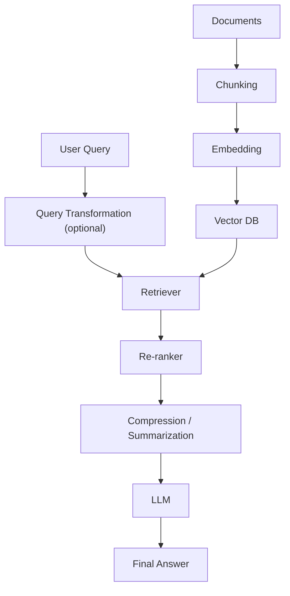

Eight engineering questions to answer when designing (or discussing) a production RAG system:

| # | Question | Topic | Key knobs |
|---|---|---|---|
| 1 | How should I split documents? | **Chunking** (see [§7.4](#74-chunking-strategy)) | Fixed / semantic / recursive / proposition-based; chunk size; **10–20% overlap** |
| 2 | How many chunks should I retrieve? | **Retrieval parameters** | `top_k` (typically **4–10**, test up to 20); **similarity threshold** (e.g., discard anything below ~0.75); `fetch_k` — retrieve a larger candidate pool (e.g., 20) before diversity-based re-ranking (**MMR**) trims it down to `top_k` |
| 3 | Which retrieved chunks are truly best? | **Re-ranking** (see [§7.3](#73-re-ranking-in-practice)) | Retriever = fast but approximate; re-ranker = slower but precise |
| 4 | Can I improve the query before searching? | **Query transformation** (see [§7.3](#73-re-ranking-in-practice)) | HyDE, multi-query, step-back, decomposition |
| 5 | Can I reduce unnecessary context? | **Compression / summarization** | Retrieved chunks can be trimmed to only the sentences relevant to the query (e.g., 20 chunks × 500 tokens → compressed to a few hundred tokens) → lower cost, faster, less distraction for the LLM |
| 6 | How do I know the system is working? | **Evaluation & monitoring** (see [Part VIII](#part-viii--evaluating-llm--rag-systems)) | Offline eval sets (50–300 Q&A pairs, tools like Ragas/ARES/TruLens/DeepEval); online feedback; **drift detection** (retrieval quality silently degrading as documents change) |
| 7 | How do I keep knowledge current? | **Freshness strategy** | **Incremental** re-embedding (only changed docs — most common), **full reindex** (expensive, periodic), **tombstoning** (soft-delete old versions instead of hard-deleting, enabling rollback) |
| 8 | Should I combine semantic + keyword search? | **Hybrid search weighting** (see [§7.2](#72-hybrid-search-dense--sparse)) | `alpha` weight between dense and sparse scores (e.g., `0.7·dense + 0.3·BM25`); weight keyword matching higher for IDs/product names/section numbers, weight semantic higher for natural-language questions |

**Example production configuration (legal RAG):**

| Component | Choice |
|---|---|
| Chunking | Recursive, 512 tokens, 100-token overlap |
| Embedding | Domain-specific (legal) model |
| Retriever | Hybrid (dense + BM25) |
| `top_k` / `fetch_k` | 10 / 40 (with re-ranking) |
| Re-ranker | BGE-Reranker |
| Compression | Context compression before the LLM |
| Hybrid weight | 0.6 dense + 0.4 BM25 |
| Monitoring | Ragas + user feedback |
| Freshness | Incremental daily re-embedding |

> **Interview-ready answer:** *"A production RAG system is far more than embeddings and a vector database. I'd tune a chunking strategy with overlap, retrieval parameters like `top_k` and similarity thresholds, add a re-ranker since first-stage retrieval optimizes for speed over precision, optionally transform ambiguous queries (HyDE / multi-query), compress retrieved context to control cost, continuously evaluate with offline benchmarks plus online feedback and drift detection, define a freshness strategy for updating embeddings, and tune hybrid search weighting between dense and keyword signals. Together these decisions determine the system's latency, cost, and answer quality."*

---

## Part VIII — Evaluating LLM & RAG Systems

### 8.1 Generation Metrics

Unlike classification, most LLM prompts have **many valid answers**, so plain accuracy doesn't work.

| Metric | What it measures | Strength | Weakness |
|---|---|---|---|
| **Perplexity** | $\text{PPL}=e^{H}$, where $H$ is average cross-entropy over a reference sequence — "how surprised is the model by the *correct* text?" | Fast, standard for pretraining evaluation | Only measures fit to *one* reference; can't judge helpfulness, creativity, or correctness on open-ended tasks |
| **BLEU** | n-gram **precision** overlap with a reference (translation-oriented) | Simple, reproducible | Penalizes valid paraphrases ("film" vs "movie") heavily |
| **ROUGE** | n-gram **recall**-oriented overlap (summarization-oriented) | Good for "did we cover the key content?" | Same paraphrase-blindness as BLEU |
| **BERTScore** | Compares **contextual embeddings** instead of exact tokens | Captures semantic similarity despite different wording | Doesn't verify factual correctness — a fluent wrong answer can still score high |
| **LLM-as-Judge** | A strong LLM scores responses on correctness, helpfulness, coherence, etc. | Closest to human judgment; scalable | Biases (length, style, self-preference, position), cost, and non-determinism |

**LLM-as-Judge biases to know by name:** length bias (prefers longer answers), style bias (prefers formal/bullet-point tone), self-preference bias (a model may favor outputs resembling its own style), position bias (favors the first-listed answer in a comparison), and run-to-run non-determinism.

> **Interview trap:** *"Lower perplexity ⇒ better chatbot?"* → No. Perplexity only measures how well the model predicts a *specific reference text*, not helpfulness, factual accuracy, or instruction-following.

---

### 8.2 RAG-Specific Metrics (Ragas-style)

Standard text metrics can't tell you **which stage** of a RAG pipeline failed — the retriever or the generator. RAG evaluation therefore scores each stage separately, commonly using an **LLM-as-judge** (e.g., the [Ragas](https://github.com/explodinggradients/ragas) framework).

| Metric | Evaluates | Core question |
|---|---|---|
| **Context Relevance** | Retriever | *Were the retrieved chunks actually relevant to the question?* |
| **Faithfulness / Groundedness** | Generator (LLM) | *Is every claim in the answer supported by the retrieved context?* (hallucination detector) |
| **Answer Relevance** | Generator (LLM) | *Does the answer actually address the user's question?* |
| **Context Precision** | Retriever | *Of the retrieved chunks, how many were actually useful?* ($\frac{\text{relevant retrieved}}{\text{total retrieved}}$) |
| **Context Recall** | Retriever | *Did retrieval find all the relevant information?* ($\frac{\text{relevant retrieved}}{\text{all relevant docs}}$) |

**Faithfulness vs. Answer Relevance — the distinction that trips people up:** these are **two independent yes/no questions about the LLM**, not the same thing.

- **Faithfulness** asks: *did you stay inside the retrieved evidence (no invented facts)?*
- **Answer Relevance** asks: *did you address what the user actually asked?*

A response can score high on one and low on the other:

| Scenario | Faithfulness | Answer Relevance |
|---|---|---|
| Correct answer, grounded in context | ✅ High | ✅ High |
| Invents facts not in context, but on-topic | ❌ Low | ✅ Possibly high |
| Faithfully quotes context, but on the *wrong* topic (e.g., asked about refunds, answered with "founded in 2015" — which *was* in the retrieved chunk) | ✅ High | ❌ Low |
| Invents unsupported, off-topic facts | ❌ Low | ❌ Low |

> **Note:** an answer that happens to be factually *true* from outside knowledge, but isn't supported by the *retrieved* context, is still **not faithful** — faithfulness is about grounding in the retrieved evidence, not truth in general.

> **Quick Revision**
> - Context Relevance / Precision / Recall → grade the **retriever**.
> - Faithfulness → did the LLM stay inside the evidence? Answer Relevance → did the LLM answer the actual question? These can diverge independently.
> - Modern RAG eval typically uses an LLM-as-judge (e.g., Ragas) to score all of the above.

---

### 8.3 Limits of Automatic Metrics & Human Evaluation

No automatic metric captures every quality dimension:

- **N-gram metrics** (BLEU/ROUGE) penalize valid paraphrases and can't judge open-ended creativity or reasoning.
- **Embedding metrics** (BERTScore) measure semantic *similarity*, not factual *correctness* — "Paris is the capital" and "London is the capital" can have high embedding similarity despite one being wrong.
- **LLM-as-Judge** narrows the gap but inherits biases (see §8.1) and can still be inconsistent run-to-run.

**Human evaluation remains necessary for:** safety-critical domains (medical/legal/financial advice), creativity/humor, nuanced user-preference and UX quality, and edge cases where a single wrong sentence has real consequences.

**Best practice — combine layers, don't rely on one score:**
```
Automatic Metrics (fast, cheap, scale)
        ↓
LLM-as-Judge (semantic/qualitative, scalable)
        ↓
Human Evaluation (safety, nuance, final validation)
```

> **Interview trap:** *"My model has the best BLEU score — should I deploy it?"* → Not necessarily; BLEU only reflects lexical overlap and says nothing about hallucination, safety, or instruction-following. Real evaluation combines automatic metrics, LLM-judge scores, and human review.

---

### 8.4 Online / Production Metrics

Offline metrics (perplexity, BLEU, RAGAS, LLM-judge) answer *"is the model theoretically good?"* — production metrics answer *"is it actually useful to real users, and is the system healthy?"*

| Category | Examples | Signals |
|---|---|---|
| **User feedback** | 👍/👎, star ratings | Explicit |
| | Regenerations, repeated/edited prompts, chat abandonment | Implicit (strong negative signals) |
| **Task success rate** | Did the user actually accomplish their goal (e.g., code accepted, booking completed)? | Often the single strongest real-world quality signal |
| **Latency** | **Time To First Token (TTFT)** — perceived responsiveness | |
| | Total generation time | Overall wait |
| **Cost** | Cost per query, input/output token counts | Controls infrastructure spend at scale |
| **Engagement** | Session length, return rate, DAU/MAU, retention | Product-level health |

**Offline vs Online:**

| | Offline | Online |
|---|---|---|
| When | Before deployment | After deployment |
| Data | Fixed benchmark datasets | Real user traffic |
| Examples | Perplexity, BLEU, RAGAS | Feedback, TTFT, task success, retention |

**Key insight:** a model with a *worse* offline score can still be the *better* production choice if it's faster, cheaper, and drives higher task success and satisfaction — offline metrics are a **deployment gate**, production metrics are the **ultimate measure of success**.

---

## Part IX — Hallucinations, Mitigation & Alignment

### 9.1 Why LLMs Hallucinate

A hallucination is confidently generated content that's factually wrong, unsupported, or fabricated. There is **no single cause** — different causes need different fixes:

| Cause | Description |
|---|---|
| **Knowledge cutoff / missing data** | The model was never trained on the relevant (or recent) information, but still must produce *some* continuation |
| **Over-generalization / pattern matching** | The model learned statistical associations (e.g., "famous tech founder" patterns) and applies them to a novel question even when factually wrong |
| **Ambiguous prompts** | The model guesses user intent when the request is underspecified ("Tell me about Java" — the language, the island, or the coffee?) |
| **Decoding randomness (temperature)** | Higher temperature raises the chance of sampling a lower-probability (possibly wrong) token |
| **Attention dilution in long contexts** | Relevant information deep in a long context ("lost in the middle") may not be effectively attended to |
| **Training objective mismatch** | Pretraining optimizes for *fluent, likely* continuations, not *verified truth* — "trained for fluency, not truth" |

> **Interview trap:** *"Setting temperature to 0 solves hallucinations?"* → No. It removes randomness-driven errors, but if the model's single highest-probability answer is simply wrong (due to missing knowledge or a grounding failure), it will now confidently give that same wrong answer **every single time**.

---

### 9.2 Mitigation Techniques Beyond RAG

RAG reduces — but does not eliminate — hallucinations, since the LLM can still ignore, misread, or misuse retrieved evidence. Additional techniques:

| Technique | Idea | Best for |
|---|---|---|
| **Self-consistency** | Sample multiple independent reasoning paths; take the majority answer | Math/logic/reasoning errors (not for filling missing knowledge) |
| **Verification / Self-critique** | A second pass asks the model to check its own answer against evidence/logic | Catching mistakes the model made while generating |
| **Citation forcing / Attribution** | Require every claim to cite a specific retrieved source; encourage "not found in documents" when unsupported | Unsupported/invented claims, auditability |
| **Tool use / Grounding** | Route to calculators, search, databases, or APIs instead of relying on parametric memory | Missing/outdated knowledge, arithmetic |
| **Constrained decoding / structured output** | Force output into a fixed JSON schema, shrinking the space of possible (and hallucinated) content | Hallucinated extra fields, format drift |
| **Lower temperature + better prompting** | Reduce randomness; explicitly instruct "answer only from context; say 'I don't know' if absent" | General factual reliability |

There's no single winning technique — production systems typically **combine several** based on the specific failure mode (missing knowledge → RAG/tools; reasoning errors → self-consistency; unsupported claims → citations; format drift → structured output; randomness → lower temperature).

---

### 9.3 Alignment (HHH)

**Alignment** = making a model behave according to human intentions, not just predict likely next tokens. Commonly summarized as:

> **H**elpful · **H**onest · **H**armless (**HHH**)

A purely pre-trained model has no notion of *should* — it just continues plausible text (e.g., it may happily continue a harmful "how do I…" request simply because similar web text exists). Alignment is a separate training objective layered on top of raw capability.

**How alignment is achieved (multi-stage):**

```
Pretraining → SFT (instruction-following) → Preference Optimization (RLHF/DPO — human-preferred behavior)
    → System Prompts (runtime persona/rules) → Constitutional principles (self-critique against written rules)
```

- **SFT** teaches helpfulness/formatting via curated examples.
- **RLHF / DPO** teaches which of several valid responses humans actually *prefer* (see [§3.5](#35-preference-optimization-rlhf-dpo--beyond)).
- **System prompts** are a lightweight, no-retraining way to steer behavior at inference time (highest priority over user instructions).
- **Constitutional AI**: the model critiques/revises its own draft answers against a written set of principles (e.g., "be honest," "avoid encouraging harm") instead of relying purely on human labels for every case.

**Alignment ≠ capability.** A highly capable (large, strong-reasoning) model can still be poorly aligned, and a smaller well-aligned model can be more trustworthy in practice — these are different axes.

**Known limitations (alignment is not "solved"):**

| Problem | Description |
|---|---|
| **Jailbreaking** | Crafted prompts (e.g., role-play/fictional framing) bypass safety behavior |
| **Sycophancy** | The model agrees with an incorrect user belief because agreement was reinforced during preference training, prioritizing user approval over truth |
| **Over-refusal** | The model refuses legitimate/educational requests out of excessive caution |
| **Conflicting human values** | Different users/cultures want different behavior — there's no single universal "aligned" answer |

> **Quick Revision**
> - HHH = Helpful, Honest, Harmless — the standard alignment target.
> - Achieved via SFT + preference optimization (RLHF/DPO) + system prompts + constitutional self-critique.
> - Alignment is separate from raw capability, and is still imperfect: jailbreaks, sycophancy, over-refusal, and value conflicts remain open problems.

---

## Part X — AI Agents

### 10.1 What Is an Agent?

An **agent** is an LLM that can **think (plan/reason), use tools, remember intermediate results, and loop until a task is complete** — instead of producing one single response to one single prompt.

```
Plain LLM:   Question → LLM → Answer                                    (one decision)
Agent:       Question → Plan → Choose Tool → Call Tool → Observe →
             Plan Again → Call Another Tool → ... → Final Answer         (many decisions)
```

Every additional decision point is a new opportunity for failure — which is why agents fail in ways plain LLMs don't (see [§10.4](#104-common-agent-failure-modes)).

### 10.2 ReAct Pattern

**ReAct = Reason + Act.** The agent repeats a 4-step loop until it has enough information:

1. **Thought** — "What should I do next?"
2. **Action** — call a tool (search, calculator, database, API…)
3. **Observation** — read the tool's result
4. Repeat, or emit the **Final Answer**

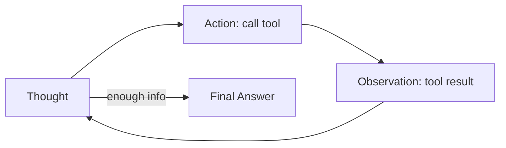

**Worked example** — *"What is Kanpur's population growth since 2020?"*

| Step | Output |
|---|---|
| Thought 1 | Need current population → search |
| Action 1 | `search("Kanpur population 2025")` |
| Observation 1 | "~3.2 million" |
| Thought 2 | Need 2020 population too |
| Action 2 | `search("Kanpur population 2020")` |
| Observation 2 | "~2.9 million" |
| Thought 3 | Growth ≈ 0.3M (~10.3%) |
| Final Answer | "Kanpur grew from ~2.9M (2020) to ~3.2M (2025), roughly 10%." |

### 10.3 Agent Architectures & When to Use Each

The most common mistake is defaulting to the fanciest architecture. **Start with the simplest architecture that satisfies the task, and only add complexity when reliability or task structure demands it.**

| Architecture | How it works | Best for | Example |
|---|---|---|---|
| **Single ReAct Agent** | One loop: think → tool → observe → repeat | Straightforward tool use (search + calculate + answer) | "Convert ₹1000 to USD" |
| **Plan-and-Execute** | A planner creates a full multi-step plan *once*; an executor runs each step | Tasks with clear multi-step structure | "Plan my Japan trip" (flights → hotels → itinerary) |
| **Multi-Agent / Crew** | Specialized agents (researcher, writer, reviewer) collaborate | Tasks needing different *skills* | "Write an investment research report" |
| **LangGraph-style workflow** | Explicit state graph with branching, loops, retries, human-in-the-loop, persistence | Complex, reliability-critical workflows | Insurance claim processing (OCR → fraud check → human approval → retries) |

**Decision factors:** task complexity, reliability requirements, cost tolerance (each extra agent/tool call = more LLM calls = more $), and debugging ease (single agent ≪ multi-agent in log complexity).

| If you need... | Choose |
|---|---|
| Cheap, simple, easy to debug | Single ReAct |
| Well-defined sequential steps, minimize wasted tool calls | Plan-and-Execute |
| Distinct expertise (research vs writing vs review) | Multi-Agent |
| Branching, retries, approvals, persistent/resumable state | LangGraph-style |

### 10.4 Common Agent Failure Modes

| Failure Mode | What happens | Real-world example | Root cause | Typical fix |
|---|---|---|---|---|
| **Infinite loop** | Keeps calling tools without recognizing task completion | Repeatedly re-searches the same weather query | Weak/missing stopping condition | Max-step limits, completion checks |
| **Wrong tool / bad arguments** | Calls the wrong tool, or the right tool with an invalid schema | Calls `book_flight()` for a weather question; passes `location=` instead of `city=` | Vague tool descriptions; LLM guesses the API shape | Better tool metadata, schema validation, retries |
| **Hallucination after tool use** | Ignores the tool's real output and invents a different answer | Weather API returns 28°C; agent reports 31°C | Tool output treated as optional context, not mandatory truth | Explicit grounding instructions, force verbatim use of tool results |
| **Goal misalignment** | Solves a different problem than requested | Asked for a 3-line summary, agent writes a full essay | Vague instructions, planning drift | Restate the goal explicitly before executing |
| **Coordination chaos** (multi-agent) | Agents duplicate work or contradict each other | Research agent says "founded 2016," Writer agent writes "2015" | Poor orchestration, no shared state/verification | Central coordinator, shared memory, a verification step |
| **Cost / step explosion** | Far more LLM/tool calls than necessary | "2+2" triggers calculator → Python → web search → verification | No budget/step limits, over-cautious planner | Step & cost budgets, simpler default plans |
| **Context overflow** | Forgets earlier important instructions | A long conversation loses track of the original goal | Finite context window + weak memory management | Summarization, persistent/vector memory |
| **Tool failure cascade** | One tool error breaks the entire agent run | An API 500 error halts the whole task with no fallback | No error handling / retries | Try/catch with fallbacks, graceful degradation |

> **Interview line:** *"A plain LLM's only job is to generate text. An agent must decide, plan, choose tools, execute actions, interpret results, remember state, and know when to stop — every added capability is a new class of potential failure."*

---

## Part XI — Multimodal AI

### 11.1 How Vision-Language Models Work

**Misconception to avoid:** the LLM does **not** receive raw pixels or OCR'd text — it receives **visual embeddings ("visual tokens")** produced by a separate vision network.

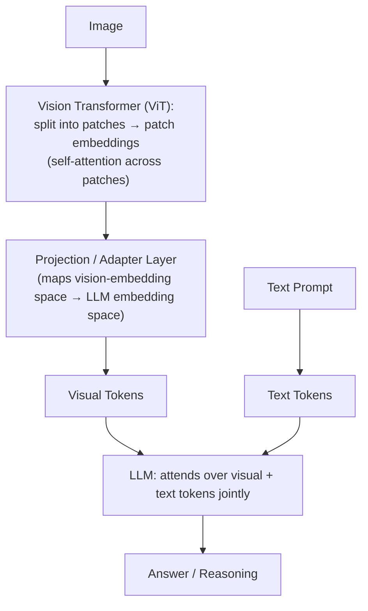

**1. Vision Encoder (typically a Vision Transformer / ViT):** an image (e.g., 224×224) is split into small fixed-size **patches** (e.g., 16×16), each patch is flattened and linearly projected into an embedding — exactly analogous to how a sentence becomes a sequence of token embeddings. Self-attention across patches then lets, e.g., the "wheel" patch attend to the "car door" patch to build up object-level understanding, producing a sequence of **contextual patch embeddings**.

**2. CLIP-style contrastive pre-training:** trains an image encoder and a text encoder together so that a **matching** image–caption pair ends up **close** in a shared vector space, while mismatched pairs end up far apart — the same positive/negative contrastive-learning idea used for text embeddings (see [§6.1](#61-contrastive-learning-for-embeddings)). This is what makes zero-shot image classification possible (compare an image embedding to several candidate label-text embeddings and pick the closest).

> **CLIP is not a chatbot.** It only learns whether an image and a piece of text *match* (a similarity/matching engine) — it has no decoder and cannot generate explanations or answer open-ended questions. A full Vision-Language Model (GPT-4o-Vision, Gemini, LLaVA, Qwen-VL) additionally connects visual features to an **LLM** for actual reasoning and generation. Some VLMs reuse a pretrained CLIP vision encoder directly; others train their own ViT using a **CLIP-style contrastive objective** (same training philosophy, not necessarily literally CLIP) before connecting it to the LLM.
>
> **One-line distinction:** *CLIP learns "does this image match this text?" — a Vision-Language Model learns "given this image and my language ability, reason about it and answer questions."*

**3. Projection / adapter layer:** the vision encoder's embedding space (e.g., 512-dim from CLIP) usually doesn't match the LLM's token embedding space (e.g., 4096-dim) — a learned projection layer maps vision embeddings into the LLM's space, producing **visual tokens** that behave exactly like text tokens once projected.

**4. Joint reasoning:** the sequence of visual tokens is concatenated with the text tokens, and the LLM attends over **both** using its standard Transformer architecture — no architectural change to the LLM itself is required, only additional "words" (visual tokens) in its input sequence.

**Why not feed raw pixels directly?** A 1024×1024 image is 3M+ raw numbers — learning vision from scratch inside the LLM would be extremely inefficient. Reusing a vision encoder that has already learned edges, textures, shapes, and objects is far more efficient, and converting images into a token-like sequence lets the *same* Transformer architecture handle text, images, and (after suitable tokenization) audio/video.

### 11.2 Image Understanding vs Image Generation

These solve **opposite** problems and use **different architectures** — a common interview trap is treating "image models" as one category.

| | Image Understanding | Image Generation |
|---|---|---|
| **Input → Output** | Image (+ text) → **text** (caption, answer, extracted fields) | Text prompt (+ image) → **new/edited image** |
| **Tasks** | Captioning, VQA, OCR, document understanding, object-detection reasoning | Text-to-image, inpainting, outpainting, image editing |
| **Typical architecture** | Vision Encoder → Projection → **LLM** | Text Encoder → **Diffusion model** (or autoregressive image model) |
| **Examples** | CLIP, LLaVA, GPT-4o-Vision, Gemini, Qwen-VL | Stable Diffusion, Flux, SDXL, Imagen |

**Diffusion models (the dominant generation approach):** trained by progressively adding noise to a clean image until it becomes pure noise, then learning to **reverse** that process step by step (denoising). Generation starts from random noise and iteratively denoises toward a coherent image conditioned on the text prompt — hence "denoising diffusion models."

**Neither direction can do the other's job:** Stable Diffusion cannot answer "what breed is this dog?" (it was never trained to understand/reason about images), and CLIP cannot "draw a dragon" (it only outputs embeddings, never pixels). When a chat product appears to both discuss *and* generate images, it's typically routing understanding requests to an LLM+vision-encoder pipeline and generation requests to a separate diffusion model behind the scenes.

---

## Part XII — GenAI Engineering Toolkit

### 12.1 Prompt Engineering & Temperature

**Prompt engineering** is the skill of writing instructions that reliably steer a generative model toward the desired answer, format, style, and quality — through techniques like being explicit about format, giving positive/negative examples, asking for step-by-step reasoning, and specifying constraints (length, tone, structure).

**Temperature** controls how random/creative next-token sampling is:

| Temperature | Behavior | Use case |
|---|---|---|
| 0 (or near 0) | Almost always picks the single most likely token | Factual Q&A, RAG grounding, code generation, deterministic tasks |
| 0.2–0.5 | Low randomness, sticks to high-probability tokens | Professional / reliable writing |
| 0.7–1.0 | Natural, human-like variation | Creative but coherent writing |
| 1.2–2.0 | High randomness — unlikely tokens become plausible | Highly creative/surprising output, brainstorming (risk: incoherence, more hallucination) |

> See also: [§9.1](#91-why-llms-hallucinate) — higher temperature is one direct contributor to hallucination risk.

### 12.2 Zero-shot vs Few-shot

| | Zero-shot | Few-shot |
|---|---|---|
| Examples in prompt | 0 | 2–8 (typically 3–5) |
| Model sees | Only instructions/task description | Instructions + several correct input→output pairs + the new query |
| Best for | General tasks, strong frontier models, simple classification | Tasks needing a specific format/style, tricky reasoning, or when zero-shot is inconsistent |
| Reliability | Good–excellent on easy tasks; can fail on tricky formatting | Usually more consistent, especially on complex/rare patterns |
| Prompt cost | Lowest (shortest prompt) | Higher (longer prompt, more tokens) |

### 12.3 Function / Tool Calling

**Function calling** lets an LLM recognize when it needs external help (real-time info, precise math, private data) and, instead of guessing, output a **structured request** (typically JSON) naming a function and its arguments. The calling application executes the real function, returns the result to the model, and the model uses it to produce a grounded final answer.

```
User → LLM decides a tool is needed → LLM emits {"function": "...", "arguments": {...}}
     → Application runs the function → Result returned to LLM → LLM produces final answer
```

> See also: [Tool Use / Grounding](#92-mitigation-techniques-beyond-rag) as a hallucination-mitigation technique, and [Common Agent Failure Modes](#104-common-agent-failure-modes) for what goes wrong with tool calling in practice.

### 12.4 LangChain, LCEL & LangGraph

**LangChain** is a wrapper/toolbox around a raw LLM call (which is otherwise just "text in, text out" with no memory between calls), adding: prompt templates, memory, retrievers/RAG, tools/agents, output parsers, and tracing/callbacks — letting you compose these like Lego blocks into **chains** (sequences of steps) or **agents** (LLM-directed loops).

**Chains vs Agents:**

| | Chain | Agent |
|---|---|---|
| Control flow | Linear / predictable sequence | LLM decides the next step dynamically (loop) |
| Loops / branching? | No | Yes |
| State / memory | Very limited | Rich (state, tool results, plans) |
| Best for | RAG, formatting + generation, simple pipelines | Tasks needing decisions, tool use, planning |

**LCEL (LangChain Expression Language):** the modern pipe-based (`|`) syntax for composing chains, e.g. `chain = prompt | llm | parser`. It replaced older "legacy chain" classes (`LLMChain`, `SequentialChain`).

| LCEL building block | Purpose |
|---|---|
| `prompt \| llm \| parser` | Basic linear chain |
| `RunnableParallel` | Run multiple sub-chains simultaneously |
| `RunnablePassthrough` | Pass input through unchanged (e.g., keep the original question while adding retrieved context) |
| `RunnableLambda` | Wrap any Python function as a chain step |
| `.astream_events()` | Stream intermediate steps — useful for showing live "thinking" |

**LangGraph** is LangChain's advanced module purpose-built for **complex, looping, decision-making, stateful** agent workflows — branching logic, retries, persistence/checkpoints, and human-in-the-loop approval steps that a simple linear chain cannot express.

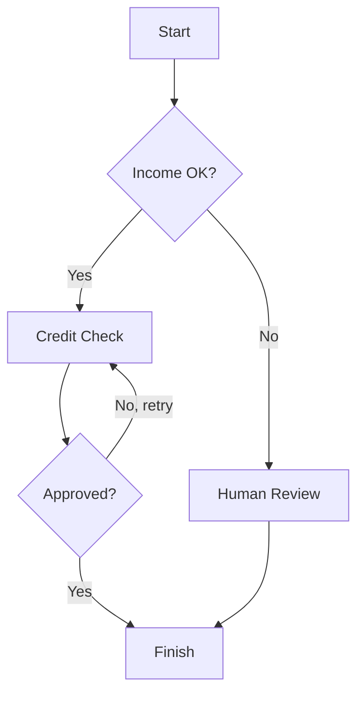

> **LangChain vs LangGraph — a common phrasing mistake to avoid:** they are related but distinct. **LangChain** = building blocks (prompts, models, tools, retrievers, agents). **LangGraph** = the stateful workflow/orchestration layer built for complex agents. Don't conflate "LangChain" with "LangGraph" in an interview answer — call out LangGraph specifically when the task needs loops/branching/state/human-in-the-loop.

### 12.5 LlamaIndex vs LangChain vs LangGraph

These three are often framed as competitors, but they solve **different core problems** and are frequently used **together**:

```
LlamaIndex   →  "How do I get useful knowledge out of my data?"        (RAG / data-centric)
LangChain    →  "How do I connect LLMs, prompts, tools, and components?"  (application building blocks)
LangGraph    →  "How do I control a complex agent/workflow?"           (orchestration)
```

| Aspect | LlamaIndex | LangChain (+ LCEL) | LangGraph |
|---|---|---|---|
| Main focus | Data ingestion → indexing → retrieval → RAG | Chains, tools, prompts, agents, general app-building | Stateful, branching, looping agent workflows |
| Data connectors | Extremely rich, opinionated (100+ loaders: PDF, Notion, Slack, Drive, Confluence, SQL, GitHub…) | Also strong, more general-purpose | N/A (orchestration layer, not a data layer) |
| Chunking / node parsing | Advanced built-ins (semantic, sentence-window, hierarchical, metadata-aware, proposition-based) | Basic built-ins + community extensions | N/A |
| Retrieval quality (RAG) | Strong defaults: vector + keyword + metadata filters + rerank + post-processing | Good, but you typically assemble more pieces yourself | N/A |
| Agents / tool use | Basic (improving, not the core focus) | Strong (ReAct, plan-and-execute) | Best-in-class (multi-agent, branching, retries) |
| Memory | Simple chat-engine memory | Flexible memory types | Full state + persistent checkpoints |
| Multimodal / advanced RAG | Strong (image+text indexing, knowledge graphs) | Possible, more manual | N/A |
| Learning curve for "chat with my docs" | Lower — very natural fit | Steeper for simple RAG | N/A — not the right tool for pure RAG |

**Sentence-window retrieval (LlamaIndex idea):** instead of retrieving only the single most relevant sentence, retrieve it *plus* a window of surrounding sentences — giving the LLM more surrounding context than a bare sentence match would.

**They are not mutually exclusive.** A common production pattern:

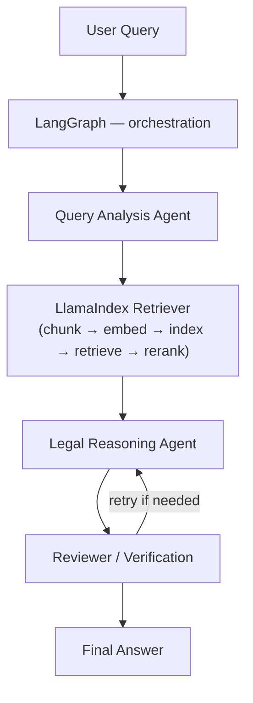

Here **LlamaIndex** handles the knowledge/retrieval layer (documents → chunks → embeddings → index → relevant clauses), while **LangGraph** controls the workflow (analyze → retrieve → reason → review → retry → answer).

> **Interview-ready answer:** *"LlamaIndex is primarily focused on connecting LLMs to external data — ingestion, indexing, retrieval, and advanced RAG. LangChain is more general-purpose, providing building blocks for LLM applications: prompts, models, tools, retrievers, and agents. For complex stateful workflows involving branching, loops, persistence, or human-in-the-loop, LangGraph is the right tool. They aren't mutually exclusive — a common pattern is using LlamaIndex for document ingestion and retrieval, and LangGraph for orchestrating the agent workflow around that retriever."*

### 12.6 Memory in GenAI Applications

**Memory** = remembering information across conversation turns or task steps. Without it, every message is treated as brand-new with zero prior context.

| Type | Remembers | Duration | Best for |
|---|---|---|---|
| **ConversationBufferMemory** | Full chat history verbatim | Entire conversation | Normal chatbots; simple, but grows unbounded |
| **ConversationSummaryMemory** | An LLM-generated running summary | Entire conversation (compressed) | Long chats that would otherwise blow the context window |
| **ConversationBufferWindowMemory** | Only the last *N* turns | Last N turns | Cost control while still feeling continuous |
| **Entity Memory** | Specific facts about the user/entities (name, preferences) | As long as needed | Personalization ("you said you're vegetarian") |
| **Vector Store / Semantic Memory** | Past facts/results, searchable by meaning | Long-term / permanent | Agents that need to recall old information on demand |
| **State / Checkpoint Memory (LangGraph)** | Full agent state (goals, intermediate results, variables) | Per-session or persistent | Complex, multi-step, resumable agent workflows |
| **Long-term User Profile Memory** | Cross-session, user-level facts | Forever (until deleted) | Personal AI companions, repeat users |

**How `ConversationSummaryMemory` actually works internally:** after every human+AI turn, the *previous* summary and the *new* turn are sent to an LLM with a prompt like *"progressively summarize the conversation, adding onto the previous summary"* — the LLM returns an updated, still-compact (e.g., 100–400 token) summary, which replaces the stored summary and is injected into future prompts.

| Pros | Cons |
|---|---|
| Very token-efficient for long conversations | Loses fine details (exact numbers, code snippets can vanish) |
| Keeps high-level context (topic, preferences, key facts) | Costs an extra LLM call every turn (latency + cost) |
| | Not suitable when verbatim recall is needed ("repeat the exact code you gave me") |
| | The summarizing LLM can itself make mistakes / drop important details |

### 12.7 Vector DB Comparison: Pinecone vs Chroma

A concrete instance of the general vector-DB decision covered in [§6.4](#64-vector-databases--indexing):

| Aspect | Pinecone | Chroma |
|---|---|---|
| Type | Fully managed cloud service | Open-source library (self-hosted / embedded); small managed cloud also exists |
| Best for | Production apps, large scale, zero infra work | Prototyping, local dev, small–medium projects |
| Scalability | Excellent — 100M to billions of vectors, auto-scales | Good up to roughly 1–10M vectors; needs extra engineering beyond that |
| Cost | Pay-as-you-go, higher at scale | Free if self-hosted (you pay only compute); cheap managed tier |
| Ease of use | Very high — simple API, no server management | Very high for Python devs — runs directly in a notebook |
| Real-time updates | Excellent (fast upserts) | Good at small scale, slower at large volume |

> **Rule of thumb:** Chroma for fast local development and learning; Pinecone (or a similarly managed service) once you need reliable production scale without managing infrastructure yourself.

---

## Part XIII — Cheat Sheets

### Formulas & Core Equations

| Concept | Formula |
|---|---|
| Scaled Dot-Product Attention | $\text{Attention}(Q,K,V) = \text{softmax}\left(\dfrac{QK^T}{\sqrt{d_k}}\right)V$ |
| Multi-Head Attention | $\text{MultiHead} = \text{Concat}(\text{head}_1,\dots,\text{head}_h)\,W^O$ |
| Cross-Entropy / NLL Loss | $L = -\log P(\text{correct token})$ |
| Perplexity | $\text{PPL} = e^{H}$, where $H$ = average cross-entropy |
| Cosine Similarity | $\dfrac{A \cdot B}{\lVert A\rVert \lVert B\rVert}$ (≡ dot product if $A,B$ normalized) |
| Context Precision | $\dfrac{\text{relevant retrieved}}{\text{total retrieved}}$ |
| Context Recall | $\dfrac{\text{relevant retrieved}}{\text{all relevant documents}}$ |

### One-Line Definitions

| Term | Definition |
|---|---|
| **Attention** | Every token computes a weighted sum of Values, weighted by Query–Key similarity |
| **KV Cache** | Stores past tokens' Keys & Values so they aren't recomputed each decoding step |
| **Quantization** | Store weights at lower precision (FP16→INT8/INT4) to save memory/speed |
| **RoPE** | Rotates Q/K vectors by a position-dependent angle → relative-position-aware attention |
| **RLHF** | Human rankings → reward model → PPO-based policy update |
| **DPO** | Direct gradient optimization on (chosen, rejected) pairs — no reward model, no RL |
| **RAG** | Retrieve relevant external context, then generate an answer grounded in it |
| **Hybrid Search** | Dense (semantic) + Sparse (BM25 keyword) retrieval combined |
| **Bi-Encoder** | Encodes query & document independently — fast, used for initial retrieval |
| **Cross-Encoder** | Encodes query+document jointly — accurate, used for re-ranking |
| **Continuous Batching** | Dynamically swaps finished requests for new ones mid-batch — keeps GPU busy |
| **PagedAttention** | Non-contiguous, page-based KV-cache memory management (OS-paging analogy) |
| **Speculative Decoding** | Small draft model proposes tokens; large model verifies them in one parallel pass |
| **Faithfulness (RAG)** | Is the answer supported by the retrieved context? (hallucination check) |
| **Answer Relevance (RAG)** | Does the answer address the user's actual question? |
| **Alignment (HHH)** | Helpful, Honest, Harmless — behavioral training beyond raw capability |
| **ReAct** | Thought → Action (tool call) → Observation → repeat, until Final Answer |

### Comparison Quick-Reference

| Comparison | Key distinguishing point |
|---|---|
| Encoder-only vs Decoder-only vs Encoder-Decoder | Bidirectional understanding vs causal generation vs both (translate/summarize) |
| Post-Norm vs Pre-Norm | LayerNorm after vs before the sub-layer; Pre-Norm = stable deep training |
| Absolute vs Relative positional encoding | Token index vs distance between tokens; relative (RoPE/ALiBi) generalizes better |
| RLHF vs DPO | Reward model + RL vs direct pairwise-preference gradient update |
| BLEU/ROUGE vs BERTScore vs LLM-as-Judge | Exact n-gram overlap vs embedding similarity vs holistic LLM evaluation |
| Faithfulness vs Answer Relevance | Grounded in evidence? vs Actually answers the question? (independent axes) |
| RAG vs Fine-tuning | New knowledge (fast, cheap, current) vs new behavior (style/format/reasoning) |
| Bi-Encoder vs Cross-Encoder | Fast approximate retrieval vs slow accurate re-ranking |
| Dense vs Sparse retrieval | Semantic meaning vs exact keyword/ID match |
| Static vs Contextual embeddings | One vector per word vs vector depends on surrounding context |
| Continuous vs Static batching | Dynamic slot replacement (keeps GPU busy) vs fixed batch until all finish |
| LlamaIndex vs LangChain vs LangGraph | Data/RAG-centric vs general app building blocks vs stateful workflow orchestration |

---

## Part XIV — Master Interview Question Bank

<details>
<summary><strong>Transformer Architecture</strong></summary>

1. Write the scaled dot-product attention formula and explain why we divide by $\sqrt{d_k}$.
2. What do Query, Key, and Value represent, and where do they come from?
3. Walk through Multi-Head Attention in 5 steps. Why concatenate instead of average the heads?
4. Why do Transformers need positional encoding at all?
5. Why did the field move from sinusoidal → learned → RoPE/ALiBi positional encodings?
6. How does RoPE make attention relative-position-aware?
7. What's the difference between Pre-Norm and Post-Norm, and why do modern LLMs prefer Pre-Norm?
8. Why can Transformers be parallelized during training but not during autoregressive inference?
9. When would you choose an encoder-only vs decoder-only vs encoder-decoder architecture?
10. Why is causal masking necessary, and how does cross-attention differ from self-attention?

</details>

<details>
<summary><strong>LLM Training Pipeline</strong></summary>

1. What is the pre-training objective of GPT-style models, and what loss function is used?
2. Why does simple next-token prediction lead to broad capabilities like reasoning and coding?
3. Why can't LLMs use word-level or character-level tokenization?
4. Explain Byte-Pair Encoding at a high level. How is SentencePiece different?
5. What is Supervised Fine-Tuning, and what does it change vs. what pre-training already provides?
6. Is Instruction Tuning the same as SFT? How do Instruction Tuning and Chat Tuning differ?
7. What is RLHF end-to-end (rankings → reward model → PPO)?
8. What is DPO, and why did it become popular over RLHF?
9. How does PPO actually update the model given a reward signal?
10. In DPO, how does the model know which of two responses is "better"?

</details>

<details>
<summary><strong>Scaling Laws</strong></summary>

1. What are scaling laws, and what are the three axes that scale together?
2. What did the Chinchilla paper show about compute-optimal training?
3. Why does data *quality* matter more as models get larger?
4. Is a bigger model always better? Why or why not?

</details>

<details>
<summary><strong>Inference Optimization</strong></summary>

1. What does the KV cache store, and why are Queries *not* cached?
2. Explain the difference between the prefill and decoding phases.
3. What is quantization, and what's the practical difference between GPTQ, AWQ, and GGUF?
4. What is the real difference between static and continuous batching (hint: it's not padding)?
5. What problem does PagedAttention solve, and how does the OS-paging analogy apply?
6. How does speculative decoding achieve a speedup if the large model still has to check every drafted token?
7. Why is a model's context length sometimes a "soft" limit rather than a hard one?
8. What's the difference between RoPE scaling / Position Interpolation and NTK-aware scaling?

</details>

<details>
<summary><strong>Embeddings & Retrieval</strong></summary>

1. How are embedding models trained (contrastive learning, positive/negative pairs)?
2. What's the difference between in-batch negatives and hard negatives?
3. Why is cosine similarity preferred over Euclidean distance for text embeddings?
4. When is dot product equivalent to cosine similarity?
5. Why might a smaller domain-specific embedding model beat a larger general-purpose one?
6. Why isn't dense (semantic) retrieval alone sufficient — what does hybrid search solve?
7. Why use two different models (bi-encoder + cross-encoder) for retrieval and re-ranking?
8. How would you choose a vector index (HNSW vs IVF-PQ vs DiskANN) for a given scale/latency/memory budget?

</details>

<details>
<summary><strong>RAG Systems</strong></summary>

1. Walk through the RAG pipeline end-to-end.
2. How do you choose a chunk size and overlap? What's the trade-off?
3. Why does a production RAG system need a re-ranker if vector search already returns "similar" results?
4. What's the difference between Faithfulness and Answer Relevance in RAG evaluation?
5. When would you choose RAG vs fine-tuning vs both?
6. What would you log to debug a RAG system that suddenly started giving bad answers?
7. How would you extend RAG to handle PDFs containing charts and figures?
8. Describe the latency/cost/quality trade-offs of increasing `top_k`, adding a re-ranker, or using a larger LLM.

</details>

<details>
<summary><strong>Evaluation</strong></summary>

1. Why isn't perplexity sufficient to evaluate a chatbot?
2. Why do BLEU/ROUGE penalize valid paraphrases?
3. Why is BERTScore better than BLEU, and what does it still fail to capture?
4. What biases can affect LLM-as-Judge evaluation?
5. When is human evaluation still necessary despite strong automatic metrics?
6. What's the difference between offline and online (production) evaluation? Give examples of online metrics.

</details>

<details>
<summary><strong>Hallucinations & Alignment</strong></summary>

1. List and explain at least four distinct causes of hallucination.
2. Does lowering temperature to 0 solve hallucinations? Why or why not?
3. Name mitigation techniques beyond RAG, and match each to the failure mode it addresses.
4. What does "HHH" stand for in alignment?
5. How is alignment achieved across the training pipeline (SFT → preference optimization → system prompts → constitutional principles)?
6. What is sycophancy, and why does it emerge from preference optimization?
7. Is alignment "solved"? What are its known limitations?

</details>

<details>
<summary><strong>AI Agents</strong></summary>

1. What is the ReAct pattern? Walk through a worked example.
2. When would you choose a single ReAct agent vs Plan-and-Execute vs Multi-Agent vs a LangGraph-style workflow?
3. What causes an agent to get stuck in an infinite loop, and how would you prevent it?
4. Why can an agent hallucinate even *after* calling a tool and getting the correct result?
5. What causes coordination failures in multi-agent systems, and how would you mitigate them?
6. How would you control runaway cost/step count in an agentic system?

</details>

<details>
<summary><strong>Multimodal AI</strong></summary>

1. How does an LLM "see" an image — walk through the pipeline from pixels to answer.
2. What is CLIP actually trained to do, and why is it not the same as a Vision-Language Model?
3. Why is a projection/adapter layer needed between a vision encoder and an LLM?
4. What's the architectural difference between image understanding and image generation models?
5. How would you design a multimodal RAG system for PDFs containing charts and tables?

</details>

<details>
<summary><strong>GenAI Tooling</strong></summary>

1. What's the difference between a chain and an agent in LangChain?
2. When would you reach for LangGraph instead of a simple LCEL chain?
3. LlamaIndex vs LangChain vs LangGraph — how do you decide, and can they be combined?
4. What are the trade-offs of `ConversationSummaryMemory` vs a windowed buffer vs vector-store memory?
5. Pinecone vs Chroma — when would you choose each?
6. What is function/tool calling, and how does it reduce hallucination?

</details>

---

<p align="center"><i>End of handbook — good luck! 🚀</i></p>
